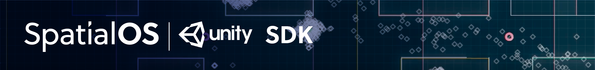

# SpatialOS Unity SDK

* Repository: [github.com/spatialos/UnitySDK](https://github.com/spatialos/UnitySDK)
* By: [Improbable](https://improbable.io/)
* License: This repository is subject to [license](LICENSE.md)

Use the SpatialOS Unity SDK to create games with persistent online worlds.
Together with the SpatialOS [spatial CLI](https://docs.improbable.io/reference/13.0/shared/spatial-cli-introduction), the SpatialOS Unity SDK
allows you to use [Unity](https://www.unity3d.com) to create games for the [SpatialOS](https://improbable.io/games) platform.
To help you get started, there are [tutorials](docs/tutorials/learning-resources.md) to follow and [example games](docs/repositories.md) to
experiment with.  In addition to the [SpatialOS Unity SDK documentation](docs/start-here-table-of-contents.md) in this repository,  you can find out more about
SpatialOS at [docs.improbable.io](https://docs.improbable.io).

## Requirements
**Software:**
To use the UnitySDK, you need the following software:
* The SpatialOS Unity SDK
* Unity
* The `spatial` CLI for SpatialOS

See [System requirements: software](docs/get-started/requirements.md#software) for details.

**Operating system:** [System requirements: Operating systems](docs/get-started/requirements.md#system-requirements#software)

**Hardware:** [System requirements: Hardware](docs/get-started/requirements.md#hardware)

**Network settings:** [System requirements: Network settings](docs/get-started/requirements.md#network-settings)

## Installing and upgrading
**New install:** If you are installing SpatialOS and the SpatialOS Unity SDK for the first time, see:
[Introduction to the SpatialOS Unity SDK](docs/introduction.md).

**Upgrade and migration:** If you have a version of SpatialOS which is earlier than 13.0, you have a combined SpatialOS and Unity SDK bundle.
To get the separated version, see [Upgrading to SpatialOS 13.0 and migrating to the Unity SDK 1.0.0](docs/migration.md).

## Documentation
**Unity SDK documentation:** [This repository in GitHub](docs/start-here-table-of-contents.md)

**SpatialOS documentation:** [docs.improbable.io.](https://docs.improbable.io.)

## Community
**Visit:** Join us at [https://forums.improbable.io](https://forums.improbable.io) for technical questions and issues.
