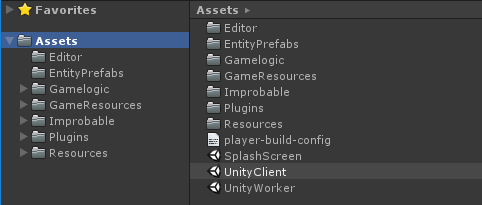

# Loading from multiple scenes

By default, SpatialOS projects that use the SpatialOS SDK for Unity have one scene for the UnityClient, and one scene for the UnityWorker.

However, you can have multiple Unity scenes within a SpatialOS worker. You might want to do this, for example, if you want
to modularise features like the game UI away from the client where entities are spawned.

## Setting up multiple scenes

To use multiple scenes for either UnityClients or UnityWorkers, you need to implement a custom script to override the default
single scene setup. Your script must implement the `IPlayerBuildEvents` interface, and specifically the `GetScenes` method. This
gives lists of Unity scenes to be packaged into each of the UnityClient and UnityWorker zips.

This packaging customization is already implemented in the [Unity Starter Project](https://github.com/spatialos/starterproject/tree/master), or you
can refer to the example below. For more detail on `GetScenes` and customizations of this sort, see
[Customizing the way players are built and packaged] (../customize/configure-build.md#customizing-how-workers-are-built-and-packaged).

Here's an example of how your script, `Assets/Editor/PlayerBuildProcess.cs`, could look:

```csharp
using Assets.Gamelogic.Core;
using Improbable.Unity;
using Improbable.Unity.EditorTools.Build;
using System;
using System.IO;
using System.Linq;
using UnityEditor;

namespace Assets.Editor
{
    [InitializeOnLoad]
    public class PlayerBuildProcess : IPlayerBuildEvents
    {
        // Install the custom event handler
        static PlayerBuildProcess()
        {
            /* Each time you build workers for local or cloud deployments, SimpleBuildSystem.CreatePlayerBuildEventsAction
               is called, and a new PlayerBuildProcess event handler will be created */
            SimpleBuildSystem.CreatePlayerBuildEventsAction = () => new PlayerBuildProcess();
            // Configure the Unity editor build settings for running multiple scenes with the editor
            EditorBuildSettings.scenes = FormatAsBuildSettingsScenes(GetAllScenes());
        }

        #region Implement IPlayerBuildEvents

        // Overridden function to load (and optionally modify) scenes, then return an array of scene paths to be built into the worker
        public string[] GetScenes(WorkerPlatform workerType)
        {
            string[] scenePaths;

            switch (workerType)
            {
                case WorkerPlatform.UnityClient:
                    scenePaths = FormatSceneList(BuildSettings.ClientScenes, BuildSettings.ClientDefaultActiveScene);
                    break;
                case WorkerPlatform.UnityWorker:
                    scenePaths = FormatSceneList(BuildSettings.WorkerScenes, BuildSettings.WorkerDefaultActiveScene);
                    break;
                default:
                    throw new Exception("Attempting to get scenes for unrecognised worker platform");
            }

            return scenePaths;
        }

        // Overridden function called before any workers are built - use to do preliminary work such as saving scenes
        public void BeginBuild() { }

        // Overridden function called after all workers are built, even if errors occurred - use to clean up anything done in BeginBuild
        public void EndBuild() { }

        // Overridden function - use to do work such as copying additional files that need to be packaged with the worker
        public void BeginPackage(WorkerPlatform workerType, BuildTarget target, Config config, string packagePath) { }

        #endregion

        // Map array of scene paths to custom Unity type for saving as editor build settings
        private static EditorBuildSettingsScene[] FormatAsBuildSettingsScenes(string[] scenePaths)
        {
            return scenePaths.Select(scenePath => new EditorBuildSettingsScene(scenePath, true)).ToArray();
        }

        // Get all scenes for the purposes of adding to the Unity editor build settings
        private static string[] GetAllScenes()
        {
            return BuildSettings.ClientScenes.Union(BuildSettings.WorkerScenes).Select(FormatSceneName).ToArray();
        }

        // Ensures scene specified as default is listed (and therefore loaded) first
        private static string[] FormatSceneList(string[] sceneList, string defaultActiveScene)
        {
            return sceneList.OrderBy(scene => scene != defaultActiveScene).Select(FormatSceneName).ToArray();
        }

        // Formats scene name as it appears in your Unity project directory
        private static string FormatSceneName(string sceneName)
        {
            return Path.Combine(BuildSettings.SceneDirectory, sceneName) + ".unity";
        }
    }
}
```

The above script refers to `BuildSettings` which you will also need to create, typically as `Assets/Gamelogic/Global/BuildSettings.cs`,
to hold a comprehensive list of the scenes loaded by you workers.

As an example, if your project has a splash screen in a separate Unity scene, which you want to appear on the client, you can specify
it to be included in the list of `ClientScenes` in the following way:

```csharp
public static readonly string UnityClientScene = "UnityClient";
// SplashScreenScene is included here as an example of how to extend the most basic scene setup
public static readonly string SplashScreenScene = "SplashScreen";
public static readonly string ClientDefaultActiveScene = UnityClientScene;
public static readonly string[] ClientScenes = { UnityClientScene, SplashScreenScene };

public static readonly string UnityWorkerScene = "UnityWorker";
public static readonly string WorkerDefaultActiveScene = UnityWorkerScene;
public static readonly string[] WorkerScenes = { UnityWorkerScene };

public const string SceneDirectory = "Assets";
```

These settings mean a client will initially load the `UnityClient` scene (as it is the default), but the `SplashScreen` scene is
also available to load after the game starts. Similarly, a UnityWorker only loads the `UnityWorker` scene.

The scene names and directory would correspond to how your files are structured in your project:



All of the variables naming (including the `BuildSettings` file) are customizable by you, providing you also update `PlayerBuildProcess.cs`
accordingly.

## Usage

You can control the scenes using the [Unity SceneManager API](https://docs.unity3d.com/ScriptReference/SceneManagement.SceneManager.html), as
you would with any other Unity project.

While a client is maintaining a connection to SpatialOS, **the active scene must be UnityClient**. This is because only the active scene can spawn GameObjects.

> If the active scene isn't UnityClient, it'll result in a number of issues. For example, when you connect a second player, you'll see errors in the first player's console.

With this in mind there are two client-side circumstances you may want to consider:

### Additional client-side scenes while not connected to SpatialOS

You may want your default scene to be something other than `UnityClient`, such as a separate main-menu scene.

Initiating the client connection to SpatialOS requires a call to `SpatialOS.Connect`. Commonly this function is called from `Bootstrap.cs`
which is added to a GameObject in the `UnityClient` scene (`GameEntry`, in the case in the [Starter Project](https://github.com/spatialos/starterproject/tree/master)).

The [Starter Project](https://github.com/spatialos/starterproject/tree/master) approach could be modified so that rather than `SpatialOS.Connect` occurring
within the `Start()` monobehavior lifecycle function of `Bootstrap`, the associated logic could be executed when the `UnityClient` scene
is set as active.

Similarly, if the player exits from the game to the main-menu scene, the transition from the `UnityClient` scene to the menu scene could be made to
trigger a call to `SpatialOS.Disconnect`.

### Additional client-side scenes while connected to SpatialOS

You may want to use additional scenes while the game is running and a connection to SpatialOS is being maintained. This can be useful when using
separate scenes for in-game UI.

In this scenario, the scenes should be loaded using [using Additive scene loading]
(https://docs.unity3d.com/ScriptReference/SceneManagement.SceneManager.LoadScene.html) which will allow the `UnityClient` to continue to be the
active scene and continue to receive updates from SpatialOS.
