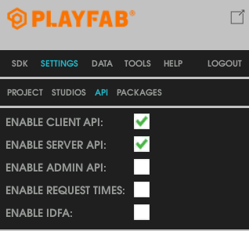
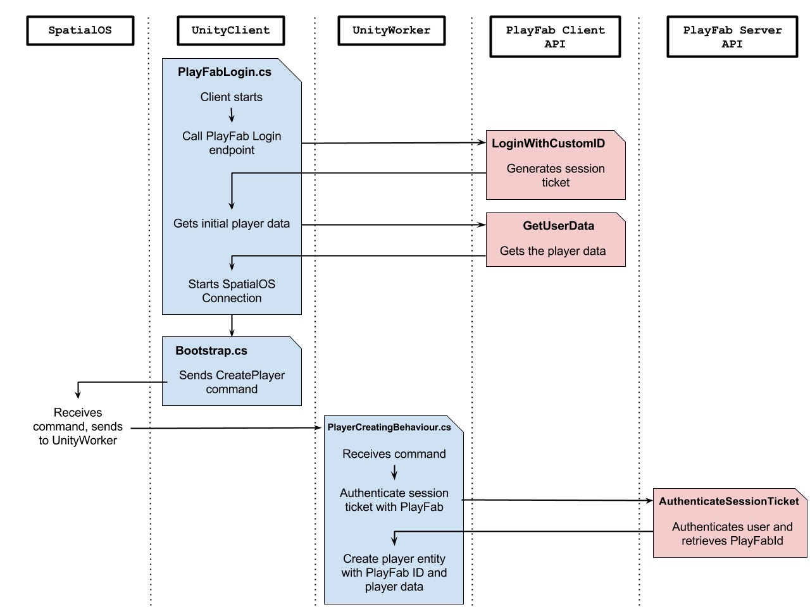
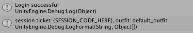
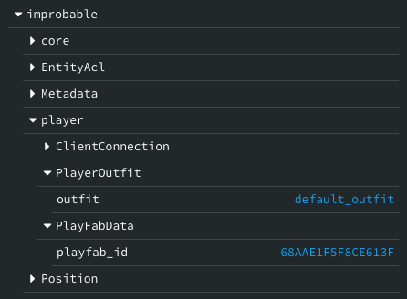

# PlayFab integration

This guide shows you how to persist player information across game sessions using [PlayFab](https://playfab.com/). 
It uses the [Unity starter project](https://github.com/spatialos/StarterProject/tree/master) as a base. PlayFab is a backend platform which allows 
you to authenticate players, store custom player data and perform other player management 
features.

In most SpatialOS games, every player is represented as an entity. This allows you to 
store player information in components during the player’s session. However, when the 
player leaves the game, the player’s entity is usually deleted along with all of the 
information stored in the entity's components.

In order to keep information about the player for the next time they login, you need to 
save this data somewhere outside of the entity. One method is to use a third party 
service such as PlayFab.

PlayFab lets you read and write data about a player in a key-value store. In the 
example in this guide, each player has an outfit. This can be changed by the player 
and is seen by other players in the game. The outfit selected by a player must 
persist even when they log out and log back in.

### Background about PlayFab

PlayFab provides a [Client API](https://api.playfab.com/documentation/client) and a 
[Server API](https://api.playfab.com/documentation/server). The Client API is used 
for authenticating the player with PlayFab, and reading data about the player. The 
Server API has full authority over all the players, and it can be used to modify 
the data for any player.

This means that in SpatialOS, the player can log in to PlayFab from the client worker, 
and then the Server API can be used by the managed workers to send updates about players.


## 1. Install the PlayFab SDK

0. Install the PlayFab Unity Editor Extensions and the PlayFab Unity SDK by following the 
[PlayFab Unity Getting Started](https://api-stage.playfab.com/docs/getting-started/unity-getting-started) 
guide up to the "Making your first API Call" section.

0. Enable the Server API: in the PlayFab Editor Extensions, go to the `Settings -> API` tab. Select the `Enable Server API` box:

    


## 2. Set the PlayFab developer secret key

To use the Server API, PlayFab requires the developer secret key.

So you don’t need to recompile if the secret key changes, you pass 
the secret key as a command line argument. This also allows you 
to only give the secret key to the UnityWorkers and not the UnityClients. 
This is *essential* to prevent a player hacking a client and retrieving 
the secret key.

### Pass a command-line argument

The command-line arguments used to launch each worker are defined in the [worker launch configuration files (SpatialOS documentation)](https://docs.improbable.io/reference/12.2/shared/worker-configuration/launch-configuration#worker-launch-configuration). To add a command line argument:

0. Open `workers/unity/spatialos.UnityWorker.worker.json`. The command-line arguments for 
    each target are defined in the arguments object.

0. Modify the arguments for each target to include `+playFabSecret {{SECRET HERE}}` so it looks like this:

    ```json
    ...
    "managed": {
        "linux": {
            ...
            "arguments": [
                ...
                "+playFabSecret",
                "85CG8BAI71IZYWDA9K9KK4..."
            ]
        },
        "windows": {
            ...
            "arguments": [
                ...
                "+playFabSecret",
                "85CG8BAI71IZYWDA9K9KK4..."
            ]
        },
        "macos": {
            ...
            "arguments": [
                ...
                "+playFabSecret",
                "85CG8BAI71IZYWDA9K9KK4..."
            ]
        }
    }
    ...
    ```

0. In `Bootstrap.cs`, at the beginning of the `Start()` method, extract the secret key from the command line 
    arguments and set the value in the `PlayFabSettings` class. Add the following import statements.

    ```csharp
    using PlayFab;
    using Improbable.Unity.Util;
    ...

    public void Start() {
        PlayFabSettings.DeveloperSecretKey = 
            CommandLineUtil.GetCommandLineValue(Environment.GetCommandLineArgs(), "playFabSecret", "");
        ...
    }
    ```

## 3. Get the player's PlayFabId

The Server API uses the **PlayFabId** to identify players. You can keep the PlayFabId in a 
component on the player entity. The UnityWorkers can then use this when they are sending 
updates to PlayFab.

Each login request on the Client API returns the PlayFabId. A simple implementation could 
be for the UnityClient to send over the PlayFabId to the UnityWorker and then it can be 
added into the player component when the player entity is created. The problem is, the 
UnityClient could be hacked, and then a different PlayFabId could be sent to the server, 
effectively allowing someone to login as a different player.

To solve this, you can use the **SessionTicket** which is also in the result of a PlayFab login request. You send the session ticket to the UnityWorker when the client is requesting a player entity. The UnityWorker can then use the Server API endpoint [AuthenticateSessionTicket](https://api.playfab.com/documentation/server/method/AuthenticateSessionTicket) to authenticate this ticket and get the player’s PlayFabId back in the response. You can then save the PlayFabId in the player’s component when the player entity is created.

The resulting flow is as follows:




### Log in to PlayFab on the client side

PlayFab provides multiple ways for a player to log in to PlayFab using the Client API. 
The documentation for these login requests can be found [here](https://api.playfab.com/documentation/client#Authentication).

0. Create a new script to handle the logging into PlayFab - you can call it `PlayFabLogin.cs`

0. In the `Awake()` method, which is called when the script is enabled, use the PlayFab Client API 
    to login the player. This example uses the PlayFab method [LoginWithCustomID](https://api.playfab.com/documentation/client/method/LoginWithCustomID):

    ```csharp
    using System.Collections;
    using System.Collections.Generic;
    using UnityEngine;
    using PlayFab.ClientModels;
    using PlayFab;

    public class PlayFabLogin : MonoBehaviour {
        private string sessionTicket = null;
        
        public void Awake() {
            var request = new LoginWithCustomIDRequest{
                CustomId = SystemInfo.deviceUniqueIdentifier,
                CreateAccount = true
            };
            PlayFabClientAPI.LoginWithCustomID(request,
            OnLoginSuccess, OnLoginFailure);
        }
        
        private void OnLoginSuccess(LoginResult result) {
            Debug.Log("Login successful");
            sessionTicket = result.SessionTicket;
        }
        
        private void OnLoginFailure(PlayFabError error) {
            Debug.LogError("Login error:");
            Debug.LogError(error.GenerateErrorReport());
        }
    }
    ```

0. Once the player has logged in, you can download the initial player data. This ensures 
    that the player entity is spawned with the up-to-date data from PlayFab, instead of 
    downloading the data after the player is spawned.

    Add another method `GetUserData()` to `PlayFabLogin.cs`, and call this method after the user 
    logs in, in `OnLoginSuccess`:

    ```csharp
    private void OnLoginSuccess(LoginResult result) {
        ...
        GetUserData ();
    }
    ...

    private void GetUserData() {
        var request = new GetUserDataRequest { };
        PlayFabClientAPI.GetUserData(request, OnGetDataSuccess, OnGetDataFailure);
    }

    private void OnGetDataSuccess(GetUserDataResult result) {
        string outfit  = "default_outfit";
        if (result.Data.ContainsKey("outfit")) {
            outfit = result.Data["outfit"].Value;
        }
        Debug.LogFormat("session ticket: {0}, outfit: {1}", sessionTicket, outfit);
    }

    private void OnGetDataFailure(PlayFabError error) {
        Debug.LogError("Playfab error:");
        Debug.LogError(error.GenerateErrorReport());
    }
    ```

0. Enable the script by attaching it to the `GameEntry` game object in the UnityClient.

0. Connect a UnityClient by pressing `Play` in your Unity project. You should see:

    


### Connect to SpatialOS after login

Currently, UnityClient is connecting to SpatialOS as soon as the scene loads. This connection 
happens in the `Start()` method of `Bootstrap.cs`.

With this integration, you want to connect to SpatialOS only after the player logs into PlayFab. 
Modify `Bootstrap.cs` to achieve this:

0. In `Bootstrap.cs`, add a field to store the `CreatePlayerRequest` object which will be sent 
    with the `CreatePlayer` command.

    Add the following `StartClientConnection()` method for `PlayFabLogin.cs` to call:

    ```csharp
    private CreatePlayerRequest createPlayerRequest;

    public void StartClientConnection(string sessionTicket, string outfit) {
        SpatialOS.Connect (gameObject);
    }
    ```

0. Move the line `SpatialOS.Connect(...)` to the location in the snippet below. This is because
    you only want to connect to SpatialOS immediately on the UnityWorkers:

    ```csharp
    public void Start()
    {
        ...
        
        switch (SpatialOS.Configuration.WorkerPlatform)
        {
            case WorkerPlatform.UnityWorker:
                Application.targetFrameRate = SimulationSettings.TargetServerFramerate;
                SpatialOS.OnDisconnected += reason => Application.Quit();
                SpatialOS.Connect (gameObject);
                break;
            case WorkerPlatform.UnityClient:
                Application.targetFrameRate = SimulationSettings.TargetClientFramerate;
                SpatialOS.OnConnected += CreatePlayer;
                break;
        }
        
        // This is where you needed to move the line `SpatialOS.Connect(...)` from
        
    }
    ```

0. Add the following `Object.FindObjectOfType<Bootstrap>()...` line to the `OnGetDataSuccess` 
    method in `PlayFabLogin.cs`:

    ```csharp
    using Assets.Gamelogic.Core;
    ...

    private void OnGetDataSuccess(GetUserDataResult result) {
        ...

        Debug.LogFormat("session ticket: {{SESSION_CODE_HERE}}, outfit: {1}", sessionTicket, outfit);
        Object.FindObjectOfType<Bootstrap>().StartClientConnection(sessionTicket, outfit);
    }
    ```

    This starts the client's connection to SpatialOS after the client has logged in and got the initial player data.


### Send the session ticket and the data to the PlayerCreator

Once you have retrieved the session ticket and the player data, you need to send these 
to the PlayerCreator to verify the session token, and if successful create the player entity.

In the StarterProject, the player entity is spawned by a command being sent to the PlayerCreator entity from `Bootstrap.cs`.
This command is then received in `PlayerCreatingBehaviour.cs` on the UnityWorker side, where the player 
entity is then created. See [Client connection lifecycle](../tutorials/recipes/client-lifecycle.md) for more details. 

In order to include the session ticket and the player data when the player entity is spawned, 
you need to send these over in the command request object:

0. The command that `Bootstrap.cs` sends to create the player entity is defined in `schema/improbable/core/PlayerCreation.schema`.
    Open this file and modify the `CreatePlayerRequest` type to include the session ticket and the outfit (or any player data):

    ```schemalang
    type CreatePlayerRequest {
        string session_ticket = 1;
        string outfit = 2;
    }
    ```

0. Run `spatial worker codegen`.

0. Modify the `StartClientConnection()` method to include the session ticket and player data 
    in the `CreatePlayerRequest` object that will be sent with the `CreatePlayer` command:

    ```csharp
    public void StartClientConnection(string sessionTicket, string outfit) {
        createPlayerRequest = new CreatePlayerRequest (sessionTicket, outfit);
        SpatialOS.Connect (gameObject);
    }
    ```

0. The command is sent to the PlayerCreator entity in the `RequestPlayerCreation()` method. 
    Modify this method to include the command request object that contains the session ticket and the player data:

    ```csharp
    private void RequestPlayerCreation(EntityId playerCreatorEntityId)
    {
        SpatialOS.WorkerCommands.SendCommand(PlayerCreation.Commands.CreatePlayer.Descriptor, 
                                             createPlayerRequest, playerCreatorEntityId)
            .OnSuccess(response => OnCreatePlayerCommandSuccess(response, playerCreatorEntityId))
            .OnFailure(response => OnCreatePlayerCommandFailure(response, playerCreatorEntityId));
    }
    ```

### Verify the session ticket

When the PlayerCreator recieves the `CreatePlayer` command, it is now given a PlayFab session ticket 
as well as the initial player data.

To make requests to PlayFab from the managed workers, a player's PlayFabId is needed. The session 
ticket can be used to verify the player's login and retrieve their PlayFabId.

The `CreatePlayer` command is received by the `OnCreatePlayer()` method in `PlayerCreatingBehaviour.cs`:

0. In `PlayerCreatingBehaviour.cs`, add the following `GetPlayerPlayFabId()` method:

    ```csharp
    using System;
    using PlayFab.ServerModels;
    using PlayFab;
    ...

    private void GetPlayerPlayFabId(string sessionTicket, 
        Action<string> onSuccess, 
        Action<PlayFabError> onFailure) {
        var request = new AuthenticateSessionTicketRequest()
        {
            SessionTicket = sessionTicket
        };
        PlayFabServerAPI.AuthenticateSessionTicket(request, (result) => {
            var playfabId = result.UserInfo.PlayFabId;
            onSuccess(playfabId);
        }, onFailure);
    }
    ```

    This method uses the [AuthenticateSessionTicket](https://api.playfab.com/documentation/server/method/AuthenticateSessionTicket) 
    endpoint of the PlayFab Server API to verify the session ticket and get the player's PlayFabId.

0. Modify the `OnCreatePlayer()` method to first get the PlayFabId before creating the player entity:

    ```csharp
    private void OnCreatePlayer(ResponseHandle<PlayerCreation.Commands.CreatePlayer, 
                                               CreatePlayerRequest, 
                                               CreatePlayerResponse> responseHandle)
    {
        GetPlayerPlayFabId (responseHandle.Request.sessionTicket, (playfabId) => {
            var clientWorkerId = responseHandle.CallerInfo.CallerWorkerId;

            Debug.LogFormat("Playfab Id: {0}, outfit: {1}", playfabId, responseHandle.Request.outfit);

            var playerEntityTemplate = EntityTemplateFactory.CreatePlayerTemplate(clientWorkerId);
            SpatialOS.Commands.CreateEntity (PlayerCreationWriter, playerEntityTemplate)
                .OnSuccess (_ => responseHandle.Respond (new CreatePlayerResponse ((int) StatusCode.Success)))
                .OnFailure (failure => responseHandle.Respond (new CreatePlayerResponse ((int) failure.StatusCode)));
        }, (error) => {
            responseHandle.Respond (new CreatePlayerResponse ((int) StatusCode.ApplicationError));
        });
    }
    ```

> Making an HTTP request during the handling of the CreatePlayer command will increase the time it takes for the command to respond. You may need to increase the timeout of the CreatePlayer command to allow for this. The timeout is an optional parameter in the [SpatialOS.Commands.SendCommand](../interact-with-world/interact-components.md#sending-a-command) method.


### Add PlayFabId and player data to player components

In order to identify players when the UnityWorkers make Server API requests, they need to 
know the player's PlayFabId. To achieve this, you can keep the PlayFabId in a component.

You can also add a component to store the player data, in this case the outfit. This component 
can be updated during the game, and the updates can be sent to PlayFab.

0. Add the following components. Create these schema files in the `/schema` directory:

    0. `PlayFabData.schema`: holds the player's PlayFabId, which can be used by the 
        UnityWorkers when they make requests to the PlayFab Server API.

        ```schemalang
        package improbable.player;

        component PlayFabData{
            id = 1005;
            string playfab_id = 1;
        }
        ```

    0. `PlayerOutfit.schema`: hold the player's outfit id, which can be used by the client to render 
        the correct player outfits.

        ```schemalang
        package improbable.player;

        component PlayerOutfit {
            id = 1004;
            string outfit = 1;
        }
        ```

0. Run `spatial worker codegen`

0. Modify `CreatePlayerTemplate()` in `EntityTemplateFactory.cs` to add the components you just defined:

    ```csharp
    public static Entity CreatePlayerTemplate(string clientId, string playFabId, string outfit)
    {
        
        
        var playerTemplate = EntityBuilder.Begin()
            ...
            .AddComponent(new PlayerOutfit.Data(outfit), CommonRequirementSets.SpecificClientOnly(clientId))
            .AddComponent(new PlayFabData.Data(playFabId), CommonRequirementSets.PhysicsOnly)
        .Build();
        
        return playerTemplate;
    }
    ```

    > It is important to not make the client authoritative over the PlayFabId. You don’t want to give the client the ability to play as another person!

0. In `PlayerCreatingBehaviour.cs`, modify the line `var playerEntityTemplate = ...` to include the PlayFabId and the player outfit:

    ```csharp
    var playerEntityTemplate = EntityTemplateFactory.CreatePlayerTemplate(clientWorkerId, playfabId, responseHandle.Request.outfit);
    ```

0. [Build the workers](../develop/build.md),
    [run a local deployment](../develop/deploy.md) and connect a 
    UnityClient. If you open the [inspector](http://localhost:21000/inspector)
    and inspect the player’s entity, you should see the PlayFabId:

    

## 4. Save player data updates to PlayFab

Now you have a PlayFabId kept in a player component, you can make any updates to a player by including 
the PlayFabId in the Server API calls from the UnityWorkers.

It's up to you when to send player updates to PlayFab.

### Update PlayFab on every component change

You could send an update to PlayFab every time a component value which you are synchronising 
with PlayFab changes.


The benefit of this method is that PlayFab is kept as up-to-date with the component value as 
it can be, as it receives an update as soon as the value changes.

To implement this behaviour:

0. Create a new script `PlayFabOutfitSaver.cs`. In this script, add readers for `PlayerOutfit` and `PlayFabData`, 
    and add an annotation to make it only run on the UnityWorkers:

    ```csharp
    using System.Collections.Generic;
    using UnityEngine;
    using Improbable.Unity.Visualizer;
    using Improbable.Unity;
    using Improbable.Player;
    using PlayFab.ServerModels;
    using PlayFab;

    [WorkerType(WorkerPlatform.UnityWorker)]
    public class PlayFabOutfitSaver : MonoBehaviour
    {
        [Require]
        private PlayFabData.Reader playFabDataReader;
        
        [Require]
        private PlayerOutfit.Reader outfitReader;
    }
    ```

0. Add a method `OutfitUpdated()` as a callback for when the player outfit changes. This method uses 
    the Server API to update the player data with the new outfit. The player is identified by the PlayFabId
    stored in the `PlayFabData` component you made earlier.

    ```csharp
    private void OutfitUpdated(string newOutfit) {
        var data = new Dictionary<string, string> {
            {"outfit", newOutfit}
        };
        var request = new UpdateUserDataRequest()
        {
            PlayFabId = playFabDataReader.Data.playfabId,
            Data = data
        };
        PlayFabServerAPI.UpdateUserData (request, OnUpdateUserDataSuccess, OnPlayFabFailure);
    }

    private void OnUpdateUserDataSuccess(UpdateUserDataResult result) {
        Debug.Log("Outfit updated successfully");
    }

    private void OnPlayFabFailure(PlayFabError error)
    {
        Debug.LogError("Playfab error:");
        Debug.LogError(error.GenerateErrorReport());
    }
    ```

0. Add `OnEnable()` and `OnDisable()` methods to register and deregister a callback for when the 
    player outfit changes:

    ```csharp
    public void OnEnable()
    {
        outfitReader.OutfitUpdated.Add (OutfitUpdated);
    }

    public void OnDisable()
    {
        outfitReader.OutfitUpdated.Remove (OutfitUpdated);
    }
    ```

0. Now add this script to the player prefab, build all of the entity prefabs and build all of the workers. 
    Any changes to the outfit component will now be saved to PlayFab.

    The next time the player starts the game, their player entity will contain the outfit value 
    that they set in the previous game session.


### Other times to update PlayFab

The above method of updating PlayFab on every component change would not be suitable for a value 
that frequently changes, as every change triggers an HTTP request to PlayFab. This could overload 
the worker, or possibly cause a rate limit to be set by PlayFab.

If you expect the component value could change frequently, you may consider rate limiting the 
updates to PlayFab yourself. Alternatively, you could just send one update when the client 
disconnects. You would need to be careful here that the player disconnecting logic is always 
run. For example, if a deployment is stopped, the player disconnection logic would not be run, 
and PlayFab may not be updated correctly.


