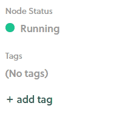

# Distributing with Steam

This page tells you how to distribute a Unity SpatialOS game via Steam, using the
[Steamworks SDK](https://partner.steamgames.com/) to authenticate a player.

## Before you start

Note that, in order to integrate your game with Steam, you'll need to acquire the means to publish a game on Steam,
and pass the [Steam Direct](https://partner.steamgames.com/steamdirect) process. 

## 1. Prerequisites for Steam integration

If you haven't already:

0. Register with [Steamworks](https://partner.steamgames.com).
0. Submit your game to [Steam Direct](https://partner.steamgames.com/steamdirect) and complete the process.

Once you've done that, you'll need to get in touch with us:

0. Find your Steam AppID.

    You'll be given an AppID once you've completed the Steam Direct process.
0. Generate a Steam Web API key by following
[these instructions](https://partner.steamgames.com/doc/webapi_overview/auth).
0. [Get in touch](https://improbable.io/company/contact-us): ask us to add your AppID and Web API key
to your project.

    > **Only** send this information privately to Improbable staff.
    **Don't** post your AppID or WebAPI key publicly.

## 2. Integrate Steamworks into your project

In this step, you'll implement a simple version of Steam integration that lets you launch Unity clients using Steam.

To do this:

1. In your SpatialOS project, install Steamworks.NET into your `workers/unity` project by following [these instructions](https://steamworks.github.io/installation/).
2. In `SteamManager.cs` (in `workers/unity/Assets/Scripts/Steamwork.NET`), implement the following method:

    ```csharp
    // Return steam access token as a hexadecimal string.
    public static string GetSteamTicketString()
    {
        var steamTicketData = new byte[1024];
        uint steamTicketLength;
        HAuthTicket hAuthTicket =  SteamUser.GetAuthSessionTicket(
                            steamTicketData,
                            1024,
                            out steamTicketLength);
        if (hAuthTicket == HAuthTicket.Invalid)
        {
            throw new System.Exception("Couldn't get valid steam ticket.");
        }
        return BitConverter.ToString(
                steamTicketData,
                0,
                (int)steamTicketLength
                ).Replace("-", "");
    }
    ```
3. In `Bootstrap.cs` (normally located on a single GameEntry object located in both your `UnityWorker`
    and `UnityClient` scenes), implement the following method:
    ```csharp
    private void StartGameWithSteamAuthentication()
    {
        // Set the auth to Steam and include the token from the Steam API.
        // "steam_deployment" should be a tag on the deployment Steam clients will use
        // Make sure we don't connect to "localhost" or a custom IP but use the locator instead
        Configuration.SpatialOsApplication.DeploymentTag = "steam_deployment";
        Configuration.Networking.SteamToken = SteamManager.GetSteamTicketString();
        Configuration.Networking.Ip = Defaults.LocatorAddress;
        SpatialOS.ApplyConfiguration(Configuration);
        SpatialOS.Connect(gameObject);
    }
    ```
4. Create and manage a conditional callback to make sure that `SteamUser.GetAuthSessionTicket()` is only called
after Steamworks has been initialised:
    
    0. In `Steammanager.cs`, add the following method delegate as a class member variable:

        ```csharp
        public static Action StartGameCallback = delegate {};
        ```

    0. At the end of `Awake()`, after `m_bInitialized = SteamAPI.Init()` (ie *after* Steamworks has been initialised)
    call this method by adding the following line:

        ```csharp
        StartGameCallback();
        ```

    0. In `Bootstrap.cs`, in `Start()`, replace the line `SpatialOS.Connect(gameObject);` with the following lines:

        ```csharp
        if (!SteamManager.Initialized)
        {
            // Defer the StartGameWithSteamAuthentication() call to after Steamworks has been initialised
            SteamManager.StartGameCallback = StartGameWithSteamAuthentication;
        }
        else
        {
            // Safely call StartGameWithSteamAuthentication(), SteamManager.StartGameCallback() will now do nothing when called in Awake()
            StartGameWithSteamAuthentication();
        }
        ```

## 3. Set up command-line arguments

At this stage, you can start a game client from Steam. However, the current implementation has several side effects:

* UnityClients can only be started from Steam and nowhere else.
* UnityWorkers won't connect.
* The [Launcher (SpatialOS documentation)](https://docs.improbable.io/reference/13.0/shared/glossary#launcher) will no longer work.

To fix these problems, you can wrap the Steam logic in a check for a command-line argument: `steamClient`.
This argument will be present when you launch a client from Steam. But it won't be there when you launch a client
from the Launcher, or when you run UnityWorkers. 

To do this:

0. Open `Bootstrap.cs`.
0. In the `Start()` method, replace the above logic with the following lines:

    ```csharp
    if (WorkerConfiguration.GetCommandLineValue(System.Environment.GetCommandLineArgs(), "steamClient", false))
    {
        // For Unity clients that were started from Steam
        if (!SteamManager.Initialized)
        {
            // Defer the StartGameWithSteamAuthentication()
            // call to after Steamworks has been initialised
            SteamManager.StartGameCallback = StartGameWithSteamAuthentication;
        }
        else
        {
            // Safely call StartGameWithSteamAuthentication() after Steamworks has been initialised.
            // SteamManager.StartGameCallback() will do nothing in Awake()
            StartGameWithSteamAuthentication();
        }
    }
    else
    {
        // For Unity Clients started from the Improbable Launcher and UnityWorkers
        SpatialOS.Connect(gameObject);
    }
    ```

## 4. Upload the game client

0. [Build your workers](../develop/build.md).
0. Find the zipped version of the client executable called `UnityClient@<your-target-platform>.zip` in `<spatialos-project-root>/build/assembly/worker`, and unzip it.
0. Upload the unzipped content to SteamPipe using the ContentBuilder.
    
    For details on how to do this, see the
    [SteamPipe documentation](https://partner.steamgames.com/documentation/steampipe).
0. On the Steamworks App Admin page, navigate to `Installation > General`.
0. Create a new Launch Option with the following settings:
    * Executable: Your client executable, for example `UnityClient@Windows.exe` or `UnityClient@Mac.app`.
    * Arguments: `+appName <your SpatialOS project name> +assetDatabaseStrategy Streaming +steamClient true`
        * `+appName` needs to be set to your
        [SpatialOS project name (SpatialOS documentation)](https://docs.improbable.io/reference/13.0/shared/glossary#project-name), as specified in
        your [`spatialos.json` (SpatialOS documentation)](https://docs.improbable.io/reference/13.0/shared/reference/file-formats/spatialos-json).
        * `+assetDatabaseStrategy Streaming` specifies that entity prefabs loaded as part of your project assemblies
        will be downloaded to the game client at runtime.
        * `+steamClient true` means that clients launched from Steam will use Steam authentication, using the
        logic you implemented in [step 3](#3-set-up-command-line-arguments) above.

## 5. Tag deployments

If you want a deployment to use Steam authentication, you must tag the deployment with the string you entered 
 for `Configuration.SpatialOsApplication.DeploymentTag` in step 2.3 above (`steam_deployment` by default).

To do this for all the deployments in your project:

0. Open `Bootstrap.cs`.
0. In `StartGameWithSteamAuthentication()`, add the following line (replacing `steam_deployment` with your own string):

    ```csharp
    EngineConfiguration.Instance.DeploymentTag = "steam_deployment";
    ```

Alternatively, you can:

* Add the tag when [launching a cloud deployment (SpatialOS documentation)](https://docs.improbable.io/reference/13.0/shared/deploy/deploy-cloud) (replacing `steam_deployment` with your own string):

    ```
    spatial cloud launch [...] --tags=steam_deployment
    ```

* After you've launched a deployment, add the tag from the [console](https://console.improbable.io):

    

## What's next

**You've now successfully integrated your game with Steam!**

To generate and manage access keys which will allow you to distribute your game, take a look at the
[SteamWorks packages documentation](https://partner.steamgames.com/documentation/packages).
