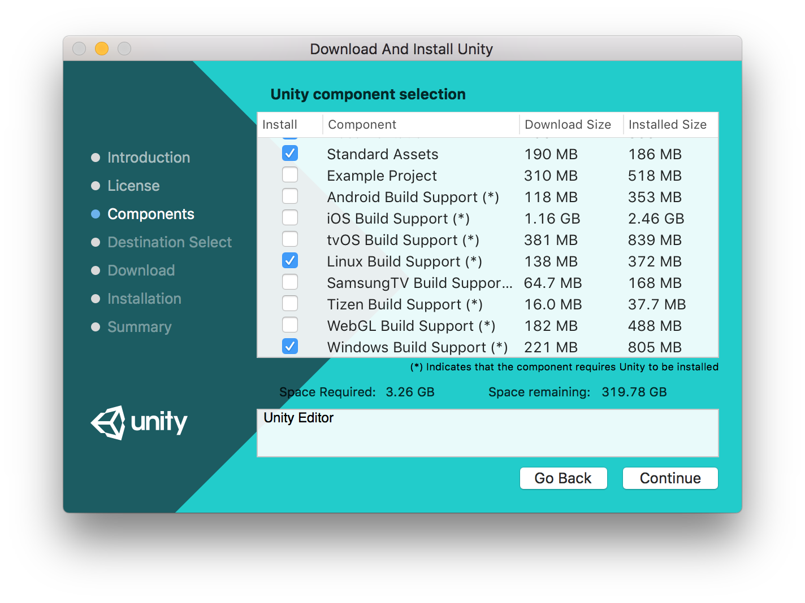

# Setup guide for macOS

## 1. System requirements

SpatialOS works with up-to-date versions of macOS Sierra, El Capitan and High Sierra.

Before following the setup guide check that your machine meets the
[hardware requirements](../../get-started/requirements.md#hardware).

> If you’re using a corporate network with a strict firewall, raise a [support request](https://improbableio.atlassian.net/servicedesk/customer/portal/5) (for customers with a service agreement) or ask on our [forums](https://forums.improbable.io) and we’ll take you through some custom setup steps.

## 2. Install SpatialOS

Download the [SpatialOS installer](https://console.improbable.io/installer/download/stable/latest/mac) and follow the steps.

This installs:

* the `spatial` CLI
* the SpatialOS Launcher

> If you don’t want to set up SpatialOS using the installer, see the [alternative setup steps for macOS](../../get-started/setup/mac-alternative.md).

## 3. Set up Unity

To use the Unity SDK, **even if you've already got Unity installed**,
you **must** follow these steps, because SpatialOS only works with specific versions of Unity, and
requires specific build support.

> Unity versions **5.6.0** and **2017.3.0** have been tested with SpatialOS. Other versions may work fine, but have not been extensively tested.

Install Unity version **2017.3.0** and the optional extras that SpatialOS requires:

1. Go to the [Unity Download Archive](https://unity3d.com/get-unity/download/archive).
2. Next to version 2017.3.0, from the "Downloads (Mac)" dropdown, select "Unity Installer".
3. Run the installer. In addition to the defaults, select `Linux Build Support` and `Windows Build Support`:

    

4. Install Unity into the default installation directory.

    Alternatively, you can set the environment variable `UNITY_HOME` to your customized Unity installation folder.
For example, if you installed Unity to `/Applications/Unity2017.3.0`,
then set `UNITY_HOME` to `/Applications/Unity2017.3.0`.

5. Launch Unity and complete the registration process.

> **Important**: Once you've set up a project, you'll need to set the path to `spatial` from the SpatialOS window in the Unity Editor.
See the [Unity SpatialOS window](../../reference/spatialos-window.md#settings) page for instructions.

## 5. Next steps

You've now set up your machine for development with SpatialOS!

To learn how to use SpatialOS and experiment with its main APIs, try the
[Pirates tutorial](../../tutorials/pirates/overview.md).