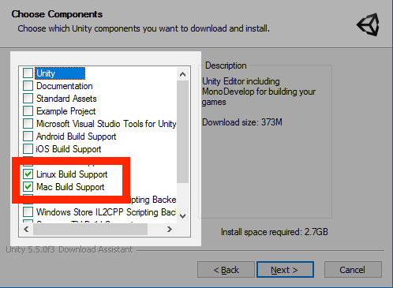
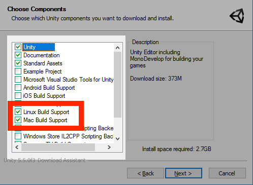

# Manual setup guide for Windows

This guide will prepare your Windows machine for local development with the SpatialOS SDK.

## 1. System requirements

SpatialOS works with up-to-date versions of Windows 7 and 10.

Before following the setup guide check that your machine meets the
[hardware requirements](../requirements.md#hardware).

## 2. Set up the SpatialOS `spatial` CLI

To set up the `spatial` CLI (`spatial`):

0. Download the `spatial` CLI for Windows (64bit): [Improbable GitHub Spatial CLI download for Windows](https://console.improbable.io/toolbelt/download/latest/win).

    By downloading `spatial`, you agree to the [SpatialOS EULA](https://auth.improbable.io/auth/v1/eula).
0. Put `spatial.exe` in a directory where you have *administrator privileges*.
0. Add the directory containing `spatial.exe` to your `PATH` by following
[these instructions](https://www.java.com/en/download/help/path.xml).

0. Check this succeeded by running `spatial update` in your terminal. You should get the output:

    `Current version of the 'spatial' command-line tool: <version number>`

    `Attempting to download the latest version...`

## 3. Set up Unity

To use the Unity SDK, **even if you've already got Unity installed**,
you **must** follow these steps, because SpatialOS only works with specific versions of Unity, and
requires specific build support.

> Unity versions **5.6.0** and **2017.3.0** have been tested with SpatialOS. Other versions may work fine, but have not been extensively tested.

0. If you haven’t got it installed already, download and install [Visual C++ Redistributable for Visual Studio 2015](https://www.microsoft.com/en-gb/download/details.aspx?id=48145).
	> We recommend you download both the x64 and x86 versions of the the Visual C++ Redistributable. The Unity Editor requires x64, and the Wizards demo
	 and Pirates tutorial produce 32-bit workers by default (which require x86).

0. Go to the [Unity Download Archive](https://unity3d.com/get-unity/download/archive).
0. Next to version 2017.3.0, from the "Downloads (Win)" dropdown, click "Unity Installer"
(which downloads the installer).
0. Run the installer.

    * **If you already have Unity 2017.3.0 installed**:

        Select `Linux Build Support` and `Mac Build Support`. De-select all the other checkboxes:

        

    * **If you have another version of Unity**, or don't have it installed at all:

        **IMPORTANT**: In addition to the defaults, select `Linux Build Support` and `Mac Build Support`:

        

0. Install Unity into the default installation directory: `%PROGRAMFILES%\Unity`.

    Alternatively, you can set the environment variable `UNITY_HOME` to your customized Unity installation folder.
    For example, if you installed Unity to `C:\Unity 2017.3.0`, then set `UNITY_HOME`
    to `C:\Unity 2017.3.0`.

0. Launch Unity and complete the registration process.

## 4. (optional) Install the launcher

If you want to run a game client to connect to a SpatialOS game running in the cloud, you must install the
[Launcher (SpatialOS documentation)](https://docs.improbable.io/reference/12.2/shared/glossary#launcher).

1. <a href="https://console.improbable.io/launcher/download/stable/latest/win" data-track-link="Launcher Download Clicked|platform=Win" target="_blank">Download the Launcher</a>.
2. Follow the instructions in the installation wizard.

## 5. Next steps

You've now set up your machine for development with SpatialOS!

To learn how to use SpatialOS and experiment with its main APIs, try the
[Pirates tutorial](../../tutorials/pirates/overview.md).
