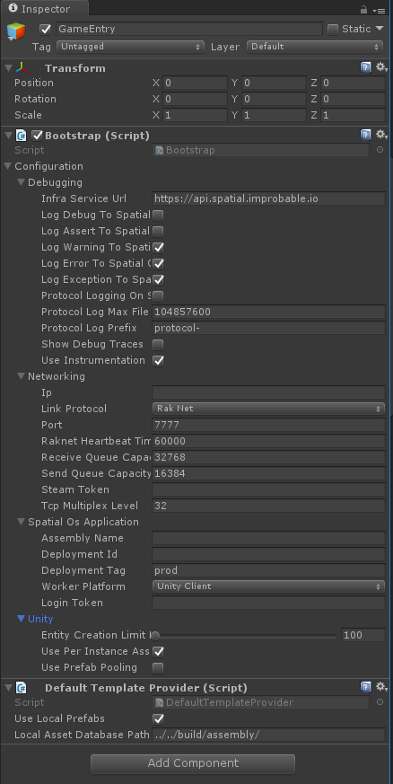

# Unity project anatomy

> Instead of setting up Unity from scratch, it's much easier to start from
[Blank Project](https://github.com/spatialos/BlankProject/tree/master), which has all the setup work done for you.

## Multiple versions of Unity

If you have multiple versions of Unity installed, you can control which version is used when
running `spatial build`. Set the `UNITY_HOME` environment variable to the folder you've installed Unity to.

For example:

  * On Windows, set `UNITY_HOME` to `C:\Program Files\Unity 2018.1.3`.
  * On macOS, set `UNITY_HOME` `/Applications/Unity2018.1.3`. __This path cannot contain any spaces.__

## Directory structure

For information about the required directory structure (including the mandatory `worker.json` file which
contains most of the configuration), see the [Unity directory structure](../reference/unity-worker-structure.md)
page.

## WorkerConfigurationData and Bootstrap.cs

The base class for setting up a Unity instance as a SpatialOS worker is `SpatialOS`, which contains all the relevant
methods and callback hooks for dealing with the lifecycle of the worker.

We recommend creating an empty `GameObject` in the scene and adding a `Bootstrap` script to it. The following snippet
sets up a basic connection to SpatialOS:


```csharp
public class Bootstrap : MonoBehaviour
{
    private void Start()
    {
        SpatialOS.ApplyConfiguration(new WorkerConfigurationData());
        SpatialOS.Connect(gameObject);
    }
}
```
The `WorkerConfigurationData` class allows you to specify configuration, including `Networking` and `Debugging`,
which is a blob of data passed to SpatialOS at connection time.

You'll be able to edit the configuration from the Bootstrap script in the Unity Editor.



For more information, see the in-code documentation for `Improbable.Unity.Configuration.WorkerConfigurationData`.

For examples, see the
[SpatialOS Blank Project on GitHub](https://github.com/spatialos/BlankProject/blob/master/workers/unity/Assets/Gamelogic/Core/Bootstrap.cs).

## Scenes

A SpatialOS Unity worker project usually contains two [scenes](https://docs.unity3d.com/Manual/CreatingScenes.html),
corresponding to the two types of worker:

* The `Assets/UnityClient.unity` - Used to build and start the player's client. It corresponds to the `UnityClient` worker type.

* The `Assets/UnityWorker.unity` - Used to build and start the physics worker. It corresponds to the `UnityWorker` worker type.

Read more about [Default worker building](../customize/configure-build.md#default-worker-building) and
[how to customise worker build and packaging](../customize/configure-build.md#customizing-how-workers-are-built-and-packaged). There's also an example of
[using multiple scenes per worker](../customize/multiple-scenes.md).
