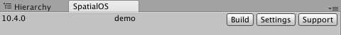
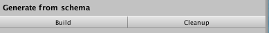
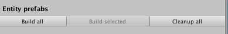
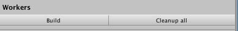
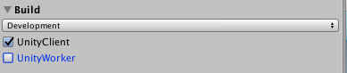
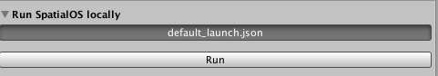
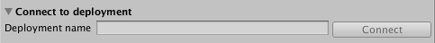
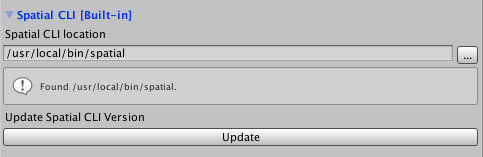

> The Unity SpatialOS window is experimental.

# The Unity SpatialOS window

The Unity SpatialOS window is an easy way to run [`spatial` command-line tool (SpatialOS documentation)](https://docs.improbable.io/reference/13.0/shared/spatial-cli-introduction) commands
from inside Unity. It also lets you manage aspects of SpatialOS projects.

## Opening the SpatialOS window

To open the SpatialOS window:

0. In the Unity Editor, use the menu `Window > SpatialOS`.

    

0. At the top of the window are your project's name and SpatialOS SDK version.

    * Click Build to open the Build tab.
    * Click Settings to open the Settings tab.
    * Click Support for quick links to the [forums](https://forums.improbable.io/) and documentation.

## Building from the SpatialOS window

From the Build tab, you can run the following build tasks:

* Generate code from your [schema (SpatialOS documentation)](https://docs.improbable.io/reference/13.0/shared/glossary#schema) (and clean generated code)

    
* Build entity prefabs (and clean them)

    
* Build worker code (and clean it)

    

To choose which target you're building for, use the drop-down menu and checkboxes at the top of the
build tab:

> For local deployments, select `Development`. For cloud deployments, select `Deployment`.
Similarly, select the checkbox for whichever worker code you've made changes to.

## Interacting with deployments

From the Build tab, you can:

* [Run a local deployment (SpatialOS documentation)](https://docs.improbable.io/reference/13.0/shared/glossary#local-deployment). Click `default_launch.json` to change which
[launch configuration (SpatialOS documentation)](https://docs.improbable.io/reference/13.0/shared/reference/file-formats/launch-config) the deployment uses.

    
* [Upload (SpatialOS documentation)](https://docs.improbable.io/reference/13.0/shared/deploy/deploy-cloud#3-upload-project-assembly-to-the-cloud) an assembly 
of this project (the full set of binaries for all your workers and their assets). Enter a name to use as a label for the assembly.

    
* Connect a client to a running cloud deployment.

    For instructions on how to run a cloud deployment, see the
    [Deploying to the cloud (SpatialOS documentation)](https://docs.improbable.io/reference/13.0/shared/deploy/deploy-cloud) page.

    

## Settings

From the Settings tab, you can:

* Under `Spatial CLI location`, set the location of the `spatial` CLI tool.

    **On Windows**: If the `spatial` CLI cannot be found, enter the path to `spatial.exe` here.

    **On macOS**: You'll need to set the path to `spatial` from the SpatialOS window in the Unity Editor:

    1. [In the window](#opening-the-spatialos-window), click `Settings`.
    2. In the `Spatial location` field, enter the path to where `spatial` is installed on your machine.

        If you used `brew cask install spatial` to install spatial, the path should be `/usr/local/bin/spatial`.

* Update `spatial` to the latest version by clicking `Update`. We recommend doing this frequently.

