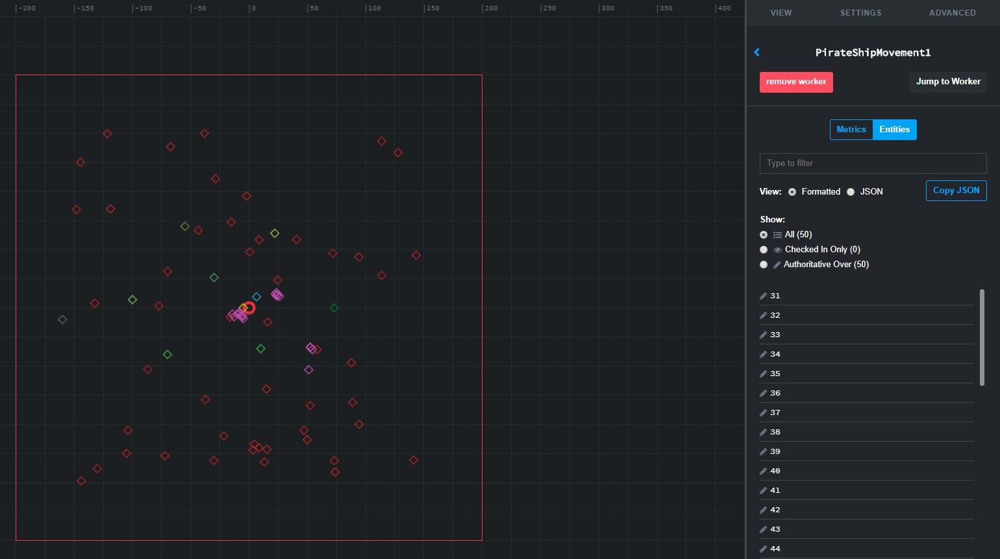

# Lesson 2 - Give your worker access to a component

In the [previous lesson](../../tutorials/cpp-worker-tutorial/add-cpp-worker.md) you added a worker called `PirateShipMovement` to your project. Now you
will configure SpatialOS to launch your worker. You will also give
`PirateShipMovement` [write access (SpatialOS documentation)](https://docs.improbable.io/reference/13.0/shared/glossary#read-and-write-access-authority) to the `ShipControls`
component.

You will learn:

- how to get write access to a component
- how use launch configuration for a managed worker

## 1. Get write access to pirate ship controls

As it currently stands, workers of the `UnityWorker` type will have access to
the `ShipControls` components of all pirate ships. To see why this is the case,
recall [Lesson 2 of the Pirates tutorial](../../tutorials/pirates/lesson2.md) and how
[entity templates (SpatialOS documentation)](https://docs.improbable.io/reference/13.0/shared/glossary#entity-template) for
pirate ships were created for saving into the snapshot:

```csharp
public static Entity CreatePirateEntityTemplate(Vector3 initialPosition, uint initialRotation)
{
    var pirateEntityTemplate = EntityBuilder.Begin()
        .AddPositionComponent(initialPosition, CommonRequirementSets.PhysicsOnly)
        .AddMetadataComponent(SimulationSettings.PirateShipPrefabName)
        .SetPersistence(true)
        .SetReadAcl(CommonRequirementSets.PhysicsOrVisual)
        .AddComponent(new Rotation.Data(initialRotation), CommonRequirementSets.PhysicsOnly)
        .AddComponent(new ShipControls.Data(0, 0), CommonRequirementSets.PhysicsOnly)
        .Build();

    return pirateEntityTemplate;
}
```

You can see that when the `ShipControls` component is added, the method also sets
the write access for this component to `CommonRequirementSets.PhysicsOnly`. This
requirement set is used by SpatialOS at runtime to determine which workers can
send component updates for the data in this component. A worker declares the
type of work it can do in its [worker attribute set (SpatialOS documentation)](https://docs.improbable.io/reference/13.0/shared/glossary#worker-attribute).
For example, workers of the `UnityClient` type have a `visual` attribute, while
workers of the `UnityWorker` type have a `physics` attribute.

Since you have created a new worker type - `PirateShipMovement`, the next thing
to do is decide what the attribute set of that worker type will be. You might
think it's best to include `physics` in it because you'll need access to `ShipControls`
and this is the current requirement. However, `physics` is also a requirement for
many other components of the game that your worker won't be able to do the work for.
The best solution in this case is to come up with a new attribute and use that to
modify the requirement set for `ShipControls`.

### 1.1. Set the worker attribute set

Firstly, you need to make sure the `PirateShipMovement` worker rightly declares the work it can do.

Open the worker configuration file (`spatialos.PirateShipMovement.worker.json`) and
find the `workerAttributeSet` field. It is located in the bridge configuration
and should currently look like this:

```json
"bridge": {
  "worker_attribute_set": {
    "attributes": [
      "example_attribute_of_managed_worker"
    ]
  }
}
```

As you can see, workers of this type will have a single attribute called
`example_attribute_of_managed_worker`. Change this to `pirate_ship_movement` so that
it describes the kind of work you're about to implement. After doing this, the bridge
configuration should look this way:

```json
"bridge": {
  "worker_attribute_set": {
    "attributes": [
      "pirate_ship_movement"
    ]
  }
}
```

After modifying the attribute set for your worker, you need to generate its
bridge settings. This command will rebuild the configuration of your worker
without actually rebuilding the sources - this is faster when all your changes
are configuration:

```sh
spatial worker build build-config PirateShipMovement
```

### 1.2. Modify the pirate ship template

Open `EntityTemplateFactory.cs` of the Unity project and modify the method which creates pirate ships:

```csharp
public static Entity CreatePirateEntityTemplate(Vector3 initialPosition, uint initialRotation)
{
    var piratesWorkerAttrSet = Acl.MakeAttributeSet("pirate_ship_movement");
    var piratesShipControlsAcl = Acl.MakeRequirementSet(piratesWorkerAttrSet);
    var pirateShipReadAcl = Acl.MakeRequirementSet(piratesWorkerAttrSet,
        CommonAttributeSets.Physics,
        CommonAttributeSets.Visual);

    var pirateEntityTemplate = EntityBuilder.Begin()
        .AddPositionComponent(initialPosition, CommonRequirementSets.PhysicsOnly)
        .AddMetadataComponent(SimulationSettings.PirateShipPrefabName)
        .SetPersistence(true)
        .SetReadAcl(pirateShipReadAcl)
        .AddComponent(new Rotation.Data(initialRotation), CommonRequirementSets.PhysicsOnly)
        .AddComponent(new ShipControls.Data(0, 0), piratesShipControlsAcl)
        .Build();

    return pirateEntityTemplate;
}
```

You can see that both the read ACL for the entity and the write ACL for the
`ShipControls` component are changed. The new attribute is
`pirate_ship_movement` which matches the attribute you defined for your worker.

### 1.3. Generate the snapshot

In order to make use of this new attribute, you need to re-generate the
snapshot which still contains pirate ships with the old data. In Unity, select
the menu `Improbable > Snapshots > Generate default snapshot`.

## 2. Launch your worker

If you launch your game now, SpatialOS doesn't even attempt to start an instance of the
`PirateShipMovement` worker. This is because it isn't present in the launch configuration
(`default_launch.json`).

Open the file and add the following to the `workers` array which already has similar
configuration for `UnityWorker` and `UnityClient`:

```json
{
  "worker_type": "PirateShipMovement",
  "permissions": [
    {
      "entity_creation": {
        "allow": false
      },
      "entity_deletion": {
        "allow": false
      },
      "entity_query": {
        "allow": false
      }
    }
  ],
  "load_balancing": {
    "auto_hex_grid": {
      "num_workers": 1
     }
  }
},
```

All permissions are set to `false` because it's good to follow the principle of
least privilege, and only add permissions when they are actually needed.

Load-balancing uses the simplest possible configuration with a single worker
instance in a fixed grid. You can change this later when testing worker
interactions and scaling the game.

You can now restart the deployment:

```
spatial local launch
```

In the terminal output, you will see a message similar to the following:

```
[improbable.bridge.oracle.scaling.WorkerScaler] Starting 1 new managed workers for attribute_set {
       attribute: "pirate_ship_movement"
     }
      (required: 1, existing: 0)
```

This confirms SpatialOS is starting an instance of your worker. You can now open
the inspector and select your worker. You will be able to see that it has authority
over components on all 50 pirate ships.



## 3. Make `ShipControls` available in your worker

You need to make sure that, when `PirateShipMovement` is compiled, the required
generated sources for components are included too. Open `schema/CMakeLists.txt`
which you added in the previous lesson. Locate the `ShipControls.schema` in
`schema/improbable/ship` and add it to the set of schema files:

```
set(SCHEMA_FILES
  "${CMAKE_CURRENT_SOURCE_DIR}/improbable/ship/ShipControls.schema"
  )
```

Then add the header and source files to the set of schema source files:

```
set(SCHEMA_SOURCE_FILES
  "${GENERATED_CODE_DIR}/improbable/standard_library.cc"
  "${GENERATED_CODE_DIR}/improbable/standard_library.h"
  "${GENERATED_CODE_DIR}/improbable/ship/ShipControls.cc"
  "${GENERATED_CODE_DIR}/improbable/ship/ShipControls.h"
  )
```

This lets you include and use the generated classes for `ShipControls` in your
C++ code. In the [next lesson](../../tutorials/cpp-worker-tutorial/move-pirate-ships.md)
you will create and send a `ShipControls::Update` to make the
pirate ships move.

