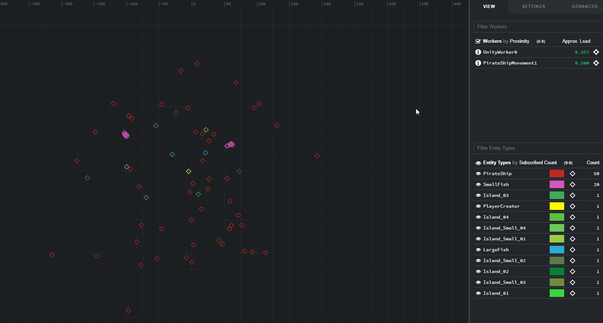

# Lesson 3 - Update a component property

In the [previous lesson](../../tutorials/cpp-worker-tutorial/add-cpp-worker.md)
you configured SpatialOS to launch your worker. You also gave
`PirateShipMovement` write access to the `ShipControls` component.

Now you will complete the tasks needed to steer the pirate ships. This lesson
achieves a behaviour equivalent to the one shown in [Lesson 3 of the Pirates tutorial](../../tutorials/pirates/lesson3.md).
The main difference is that your logic this time is completely decoupled from the game engine.

> What you'll implement is a C++ program which affects the state of your Unity
game. With the help of SpatialOS you'll abstract the issues around language
interoperability and engine-specific details. To the game engine your worker
could be any program - in C++ or any other of the supported languages.

You will learn:

- how to update component properties
- how to work with a [`View` (SpatialOS documentation)](https://docs.improbable.io/reference/12.2/cppsdk/using#using-the-view)

## 1. Update ship controls

At this point you must be itching to write some actual code, so let's
get these ships moving.

When you build the C++ worker project on Windows, CMake will generate a Visual
Studio solution for it, which is located in the `cmake_build` directory. You
could open this and work on project files in your IDE or use another code
editor to modify the sources. You will be working in `src/startup.cc`. Feel
free to add more source files and split out the logic later, but try to keep it
simple and in one place for now.

Firstly, if you haven't used the C++ blank project before, which served as the
template for creating this worker in the previous lesson, have a look at the
existing functions in `startup.cc`. It currently handles connecting to SpatialOS
and stays connected until an external signal - the worker process crashing or
being forced to terminate, for example.

At the very end of the main function, notice the almost empty game loop:

```cpp
while (is_connected) {
    dispatcher.Process(connection.GetOpList(kGetOpListTimeoutInMilliseconds));
}
```

The only work done is to process the list of Ops sent by SpatialOS so that the
connection doesn't time out. In this lesson, you'll add the following steps:

1. Create a view.
2. Process the list of Ops by the view.
3. Define a function for generating random floats.
4. Iterate over all entities and create a component update with random values
   for the `ShipControls` component.
5. Send the component udpate to SpatialOS.
6. Add a delay between each iteration.

You'll need to add the following headers to the top of `startup.cc`:

```cpp
#include <improbable/view.h>
#include <improbable/ship/ShipControls.h>
#include <chrono>
#include <thread>

// Enables the nice 5s syntax for time
using namespace std::chrono_literals;
```

Rename the component registry from `EmptyRegistry` to `ShipComponents`. Then, add the following components:

```cpp
using ShipComponents = worker::Components<improbable::ship::ShipControls,
                                          improbable::Position>;
```

Define some variables above the game loop:

```cpp
// Create a view
worker::View view{ShipComponents{}};

// Generates random floats between two values
auto rand_float = [](float low, float high) {
    return low + static_cast <float> (rand()) / (static_cast <float> (RAND_MAX / (high - low)));
};

// Holds each component update before sending it
improbable::ship::ShipControls::Update steering_update;
```

Add the movement update logic to the main loop:

```cpp
while (is_connected) {
    auto ops = connection.GetOpList(kGetOpListTimeoutInMilliseconds);

    // Process the list of Ops by the view
    view.Process(ops);

    for (auto iter = view.Entities.begin(); iter != view.Entities.end(); ++iter) {
        auto entity_id = iter->first;
        // Randomize speed and steering for each ship
        steering_update.set_target_speed(rand_float(0.0, 1.0));

        // The change in steering is small to make sure ships don't suddenly turn around
        steering_update.set_target_steering((rand_float(-15.0, 15.0)));

        // Send the steering update to SpatialOS
        connection.SendComponentUpdate<improbable::ship::ShipControls>(entity_id, steering_update);
    }

    // Add a delay between each iteration to avoid excess steering changes
    std::this_thread::sleep_for(5s);
}
```

Note that the line:

```cpp
dispatcher.Process(connection.GetOpList(kGetOpListTimeoutInMilliseconds));
```

is no longer part of the main loop. You should remove the
[dispatcher (SpatialOS documentation)](https://docs.improbable.io/reference/12.2/cppsdk/using#dispatcher-callbacks) declaration:
`worker::Dispatcher dispatcher;` and replace all usages of `dispatcher` with
`view` because a [View (SpatialOS documentation)](https://docs.improbable.io/reference/12.2/cppsdk/using#using-the-view) is just a
specialised Dispatcher and it will support all the callbacks you had before.

A couple of things to note about the code above:

- You need to process Ops in the view so that entities and components get added
  automatically to it. If you don't do this the view will be empty even though
  SpatialOS sends data about the components.

- `steering_update` is reused for each update. To make sure the right data is
  sent and the memory is not lost, the version of `SendComponentUpdate` used in
  this instance copies the passed reference. There is another version of
  `SendComponentUpdate` where the provided update object is moved-from. Have a
  look at `worker.h` which contains neatly commented definitions for the
  complete C++ SDK.

## 2. Check it works

Rebuild the `PirateShipMovement` worker and start the deployment:

```
spatial worker build PirateShipMovement -t=windows # macos or linux
spatial local launch
```

If you open the inspector, you will be able to see the icons representing
pirate ships moving in the world view. You can also select a pirate ship and
expand the `ShipControls` properties in the side bar to see how they are
updated approximately every 5 seconds.



## 3. Make it right

While this works, the current solution is not great. The main worker thread spends most of the time sleeping. Adding more logic which needs to execute much more frequently would result in a complicated mess of timers. You need a clear separation between logic which clearly belongs to the main thread and other periodic tasks that a worker may need to do.

A better design would be to run the movement update on a separate thread. When
writing multi-threaded workers, you should keep in mind the `Connection` object
is not thread-safe. For that reason the `Dispatcher` and `View` should also be
synchronized in your code when that matters.

Define mutexes for the view and connection. You could use a [shared
mutex](http://en.cppreference.com/w/cpp/thread/shared_mutex) for the view to
implement a read-write lock, but we stick to a normal mutex because it's
simpler. Add them to at the top of `startup.cc`. Declare `is_connected` there
and change its type to `std::atomic_bool`:

```cpp
#include <atomic>
#include <mutex>

std::atomic_bool is_connected;
std::mutex connection_mutex;
std::mutex view_mutex;
```

Change all existing usages of `is_connected` to use `is_connected.store(true)`,
`is_connected.store(false)` and `is_connected.load()`.

Define a helper function for sending connection updates safely:

```cpp
template <typename T>
void thread_safe_component_update(worker::Connection& connection,
                                  worker::EntityId entity_id,
                                  const typename T::Update& update) {
    std::lock_guard<std::mutex> lock(connection_mutex);
    connection.SendComponentUpdate<T>(entity_id, update);
}
```

Move the steering update logic into a function to execute on a new thread:

```cpp
void steering_update(worker::Connection& connection,
                     worker::View& view) {
    // Generates random floats between two values
    auto rand_float = [](float low, float high) {
        return low + static_cast <float> (rand()) / (static_cast <float> (RAND_MAX / (high - low)));
    };

    // Holds each component update before sending it
    improbable::ship::ShipControls::Update steering_update;

    while (is_connected.load()) {
        // Make sure the view is not modified while iterating
        // std::shared_mutex could be used in C++17 as we're just reading on this thread
        view_mutex.lock();

        for (auto iter = view.Entities.begin(); iter != view.Entities.end(); ++iter) {
            auto entity_id = iter->first;

            // Randomize speed and steering for each ship
            steering_update.set_target_speed(rand_float(0.0, 1.0));

            // The change in steering is small to make sure ships don't suddenly turn around
            steering_update.set_target_steering((rand_float(-15.0, 15.0)));

            // Send the steering update to SpatialOS
            thread_safe_component_update<improbable::ship::ShipControls>(connection, entity_id, steering_update);
        }

        // Unlock before sleeping
        view_mutex.unlock();

        // Add a delay between each iteration to avoid excess steering changes
        std::this_thread::sleep_for(5s);
    }
}
```

This is the same logic as before but with a lock around the view access.

Start the thread before the entry to the main loop and use the same mutex
inside the loop to prevent concurrent reads and writes to the view.

```cpp
// Start periodic worker jobs
std::thread steering_thread(steering_update, std::ref(connection), std::ref(view));

// Run the main worker loop
while (is_connected.load()) {
    auto ops = connection.GetOpList(kGetOpListTimeoutInMilliseconds);

    // Process the list of ops by the view
    // You need to make sure no other thread is acessing the map of entities
    view_mutex.lock();
    view.Process(ops);
    view_mutex.unlock();
}

steering_thread.join();
```

Check it still works by making sure all pirate ships are moving like before.

> In Unity, the movement of pirate ships might appear choppy compared to how
your ship sails. This is because we only synchronize raw position data on the
client as it comes. There are various techniques to mitigate this such as
buffering updates and using client-side prediction.

## Summary

In this lesson you learned how to send component updates. Components are a core
concept in SpatialOS and updating them is the most important interaction which
occurs in almost every imaginable kind of gameplay.

You also observed something which might be a bit hidden but is perhaps the most
exciting part of this tutorial. What you've implemented is a C++ program which
affects the state of your Unity game. With the help of SpatialOS you've been
able to abstract the issues around language interoperability and engine-specific details. To the game engine your worker could be any program - in C++
or any other of the supported languages.

## In the next lesson

In the [next lesson](../../tutorials/cpp-worker-tutorial/shooting-pirate-ships.md)
you will make the pirate ships shoot when there is another ship in
range. You will learn about component [events (SpatialOS documentation)](https://docs.improbable.io/reference/12.2/shared/glossary#event) and how to add a library to your worker.
