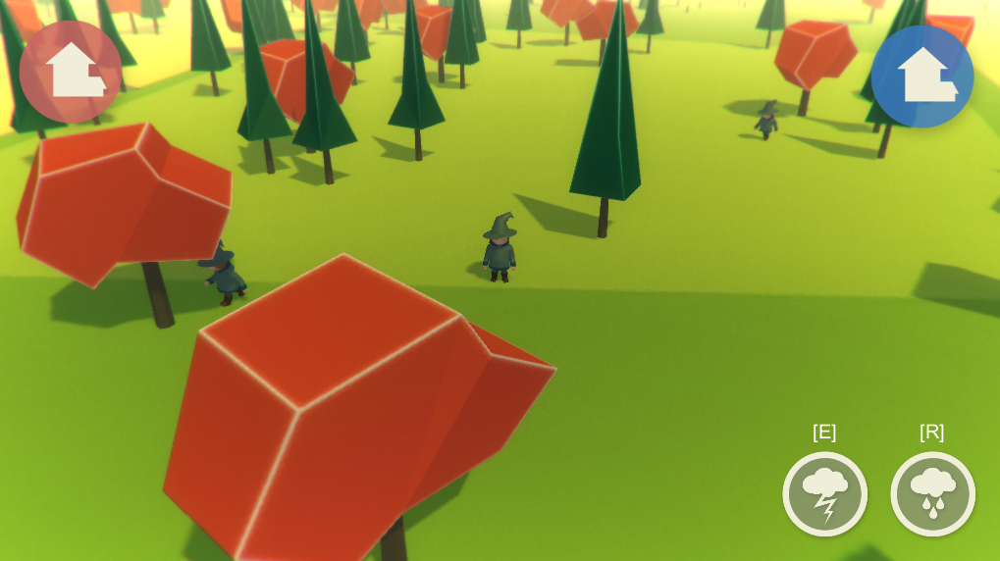
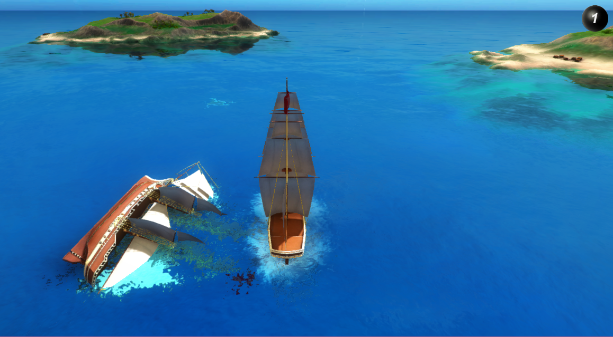

# Learning resources

On this page, you can find out about all the learning resources we provide for SpatialOS.

## SpatialOS tour

Take the [SpatialOS tour](../get-started/tour.md) to get a high-level introduction
to SpatialOS. Through a multiplayer demo game, "Wizards", it explains the main SpatialOS concepts, and gives you
hands-on experience with the main SpatialOS tools.

## Pirates tutorial

If you want to find out about building game features on SpatialOS, try out the
[Pirates tutorial](../tutorials/pirates/overview.md). It's an in-depth walkthrough all of the main features of
SpatialOS and the Unity SDK, and a great introduction to building a SpatialOS game. 

You'll learn how to build and deploy a project, make changes to a SpatialOS world and
receive changes from one, and get an introduction to how to design for client and server-side workers.

## Recipes

Our recipes are smaller tutorials that explain how to implement specific features using the Unity SDK:

* [Creating an entity](../tutorials/recipes/entity-creation.md)
* [Creating an entity at runtime](../tutorials/recipes/runtime-entity-creation.md)
* [Client connection lifecycle](../tutorials/recipes/client-lifecycle.md)
* [Player camera visualization](../tutorials/recipes/player-visualization.md)
* [Connection splash screen](../tutorials/recipes/splash-screen.md)
* [Implementing a command](../tutorials/recipes/command.md)
* [Voice over IP](../tutorials/recipes/voip.md)

## Repositories

Source code on GitHub for UnitySDK projects:

* [Pirates](https://github.com/spatialos/PiratesTutorial/tree/master)
* [Wizards](https://github.com/spatialos/Wizards/tree/master)
* [Blank project](https://github.com/spatialos/BlankProject/tree/master)
* [Unity Starter project](https://github.com/spatialos/StarterProject/tree/master)
* [VR starter project](https://github.com/spatialos/VRStarterProject/tree/master)

## C++ worker tutorial

The [C++ worker tutorial (SpatialOS documentation)](../tutorials/cpp-worker-tutorial/introduction.md)
branches out of the [Pirates tutorial](../tutorials/pirates/overview.md) to show you an alternative
way of architecting a SpatialOS game.

You'll learn how to add a C++ managed worker to an existing SpatialOS project, how to use the C++ SDK alongside a game
running in a game engine, and features of SpatialOS and its C++ SDK.
