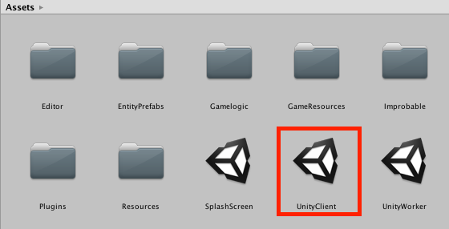
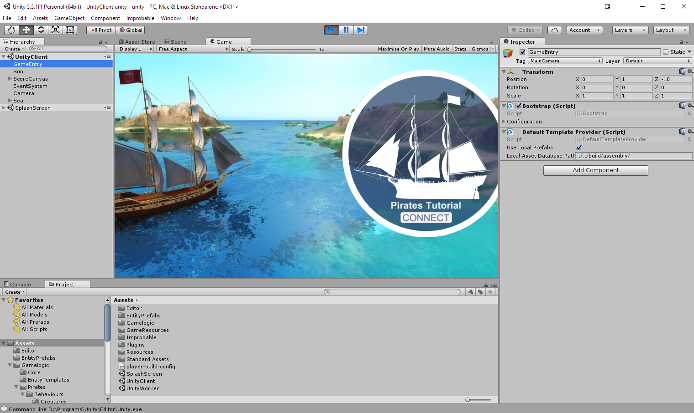
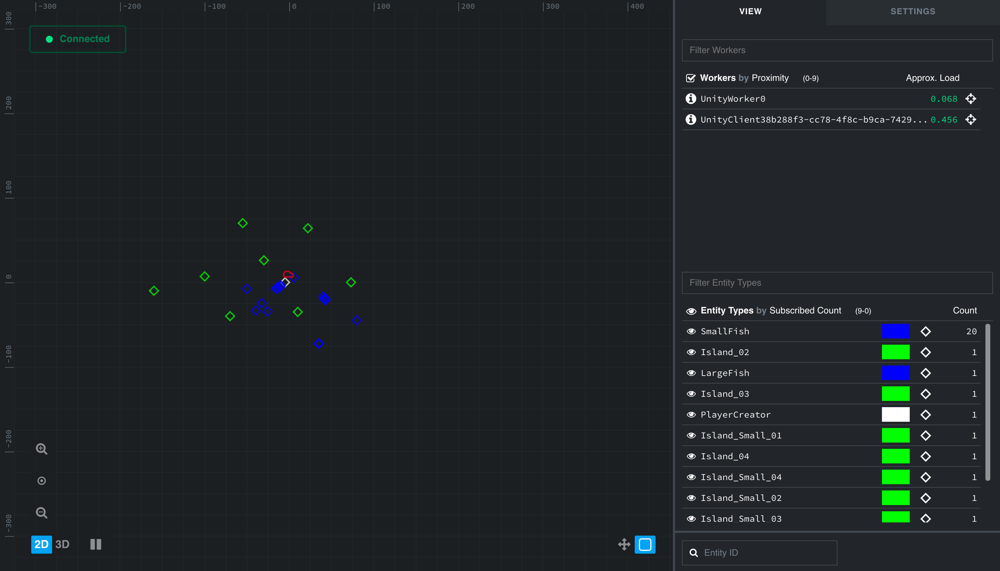
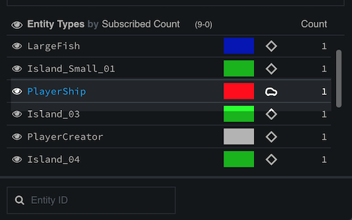
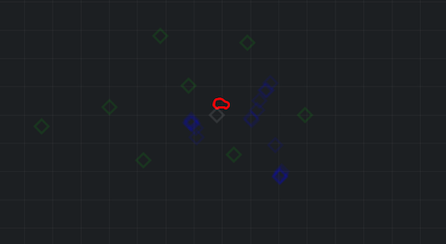
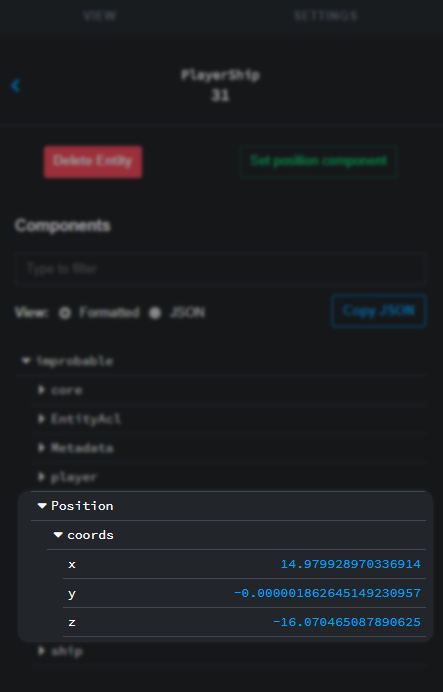

# Pirates 1 — Set up the game

Welcome to the Pirates Tutorial!

In this lesson you'll:

* **set up your machine** for development with SpatialOS
* **run the Pirates game** locally
* **use the Inspector** to explore the game world
* **learn about entities, components and workers** - the core concepts of SpatialOS

This first lesson is mostly background work you need to do before you can get going with development. Once your machine is
set up and the game is running, we’ll use the game to explain the basic concepts of SpatialOS. So bear with us!

## 1. Set up your machine

To set up your machine for developing with SpatialOS, follow the setup guide for your OS:

* [Windows](../../get-started/setup/win.md)
* [Mac](../../get-started/setup/mac.md)

This sets up the `spatial` command-line tool, which you use to build, run, and deploy your game.
You'll use it later in the lesson to build the Pirates game and run a local deployment.

> **It's done when:** You run `spatial version` in a terminal, and see `'spatial' command-line tool version: <number>`
> (or `'spatial.exe' command-line tool version: <number>`) printed in your console output.

## 2. Set up the PiratesTutorial project

In this tutorial, you'll develop on the [PiratesTutorial](https://github.com/spatialos/PiratesTutorial/tree/master) project.

### 2.1. Download the source code

Download and unzip <a href="https://github.com/spatialos/PiratesTutorial/archive/master.zip" data-track-link="Repository Zip Downloaded|product=Docs|repositoryName=Pirates" target="_blank">the game source code</a>.

### 2.2. Check your setup

1. Open a terminal and navigate to the directory you just unzipped (the directory that contains `spatialos.json`).
2. Run `spatial diagnose`.

    This checks that you installed all the software you needed correctly.

3. If `spatial diagnose` finds errors with your setup, fix them.

> **It's done when:** You see `'spatial diagnose' succeeded` (or `'spatial.exe diagnose' succeeded`) printed in your console output.

### 2.3. Build the game

In same terminal window, run `spatial worker build UnityWorker UnityClient --target=development`.

This builds the game. It can take up to ten minutes, so you might want to go and get a cup of tea.

If it doesn't work first time, you can retry by running `spatial worker clean` then `spatial worker build` again.

> **It's done when:** You see `'spatial build UnityWorker UnityClient' succeeded` (or `'spatial.exe build UnityWorker UnityClient' succeeded`) printed in your console output.

### 2.4. Run the game locally

In the same terminal window as before, run a local deployment of the game by running `spatial local launch`. This can take a
minute to get up and running.

> This command launches SpatialOS itself, locally. SpatialOS then starts up
the 'workers' it needs to run the game. We'll explain more about what that means in a bit.

> **It's done when:** You see `SpatialOS ready. Access the inspector at http://localhost:21000/inspector`
printed in your console output.

### 2.5. Connect a client

Now SpatialOS is running the server-side part of the game. But for you to connect to it and play, you need to run a client.

There are several ways to run a client, but the fastest one for local development is to run one through the Unity Editor.
(The SpatialOS SDK for Unity automatically hooks the client up to SpatialOS.)

0. Launch the Unity Editor.

1. In the window that opens, navigate to the folder you unzipped in
[step 2.1. above](#2-1-download-the-source-code), then inside that, open the `workers/unity` directory.

2. In the Unity Editor, double-click on the scene `UnityClient.unity`:

    

3. At the top, click **Play ▶**.

    > **It's done when:** You see a connection splashscreen in Unity:
    >
    > 

4. Click `CONNECT`, then use the `W`,`A` and `D` keys to sail your ship.

Explore the world, and have some fun!

## 3. Open the Inspector

The [Inspector (SpatialOS documentation)](https://docs.improbable.io/reference/13.0/shared/glossary#inspector) is a web-based tool that you use to explore the
internal state of a SpatialOS world. You’ll use it right now to find out about the main SpatialOS concepts.

Open the Inspector at [`http://localhost:21000/inspector`](http://localhost:21000/inspector).

### 3.1. What you can see in the Inspector window

#### Entities

**Entities** are the basic building block of a SpatialOS world.
Every _thing_ in your game world is an [entity (SpatialOS documentation)](https://docs.improbable.io/reference/13.0/shared/glossary#entity).

Entities are made of [components (SpatialOS documentation)](https://docs.improbable.io/reference/13.0/shared/glossary#component), which describe an entity's
properties (like position, health, or waypoints). Later in this lesson you'll see the values of the components changing
in real time; and in future lessons, you'll add new components to your ship entity.

The main area of the Inspector shows you a top-down, real-time view of the entities in your game world. The entities
in this game world include player ships, islands, and fish swimming around:

In the next lesson, you'll be learning how to add new entities to the game world.

The bottom-right list initially shows how many entities of each type there are right now. We'll look
at this area in more detail shortly.

#### Workers

The top-right list shows the **workers** connected to SpatialOS.

Essentially, workers are just programs that can read from and write to the entities in the world you see in the Inspector.

In *this* game, all the workers are **instances of Unity**. There are two types:

* Unity running in headless mode. These workers handle the server-side logic. In the list, `UnityWorker0` is of this type.
* Unity running as a game client. There'll be one of these in the list for every player connected. At the moment, there's
just one: yours (`UnityClient`).

The number next to each worker represents its **load**: a measure of how much work it is
doing. SpatialOS uses this number to start and stop server-side workers as necessary.

In this small local game, you'll only need one `UnityWorker`; but if you expanded the game world, you'd need more.
SpatialOS automatically allocates areas of the world to each `UnityWorker`, and seamlessly stitches the world together
between them.

### 3.2. (optional) Stop a worker

To see worker management in action, you can stop the worker running the game logic, and see how SpatialOS
starts a new one - without any disruption to players at all. To try this:

1. Click the name `UnityWorker0` in the list of workers. This shows details about that worker.
2. Click the red **Stop worker** button. This shows a confirmation dialog.
3. Click the **Stop worker** button.

SpatialOS stops the worker immediately. Just a few seconds later, the load-balancing algorithm kicks in, and it starts
a new worker. Note that nothing at all happens in the game window - the client isn't even disconnected.
Load-balancing is completely invisible to players.

### 3.3. Sail around

The Inspector shows you a live view of the game world. You can watch your ship's entity moving in the
Inspector as you move it in the game window:

1. Select your entity in the Inspector window.

    If you can't easily find your entity, zoom out until the entity list on the right includes a `PlayerShip` entity:

    

2. In the list, click on the word `PlayerShip`. Every other entity should be dimmed, making the
`PlayerShip` entity easier to spot:

    

3. In the main view, click on the icon of the `PlayerShip` entity to select it.

4. The bottom right area of the Inspector shows you which **components** an entity has, and
the current values of its **properties**.

    For example, the `PlayerShip` has a component called `Position`, which stores its position.

    Find the property called `coords` in the `improbable.Position` component:

    

5. Go back to the game window, and use the `W`,`A` and `D` keys to move your ship.

    You'll see the values of the position change as you move.

Components are really what define an entity. They can be anything you like, but common examples might be health, or score.
*Every* entity needs to have a `Position` component, that defines its location in the SpatialOS world.

You'll learn a lot more about components in later lessons: you'll adapt and extend the existing components of the ship,
and add new ones too.

## 4. Stop the game running

1. In Unity, click the **Play** icon again to stop your client.
2. In your terminal, stop the server side of the game by pressing `Ctrl + C`.

> There's a known issue where Ctrl + C sometimes doesn't properly stop all processes. See
[this forum post](https://forums.improbable.io/t/ctrl-c-not-stopping-spatial-local-deployment/2925) for fixes and
workarounds.

## Lesson summary

In this lesson you've set up the SpatialOS SDK on your machine, and run the Pirates game for the first time.
You've also learned about some fundamental SpatialOS concepts: [entities (SpatialOS documentation)](https://docs.improbable.io/reference/13.0/shared/glossary#entity),
[components (SpatialOS documentation)](https://docs.improbable.io/reference/13.0/shared/glossary#component) and [workers (SpatialOS documentation)](https://docs.improbable.io/reference/13.0/shared/glossary#worker).

### What's next?

In the [next lesson](../../tutorials/pirates/lesson2.md) you'll add some new entities to the world:
enemy pirate ships.
