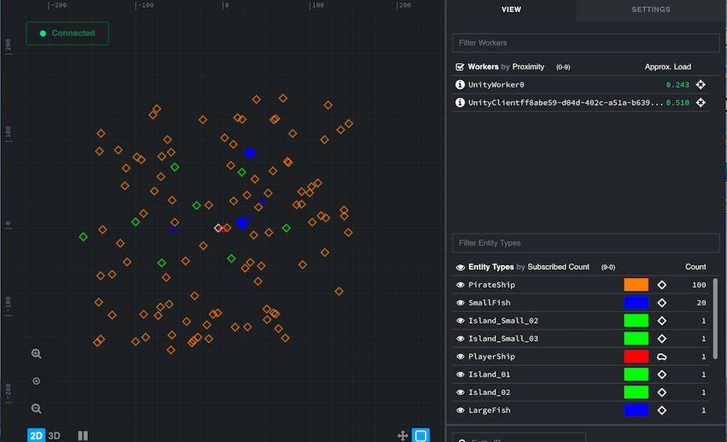

# Pirates 2 - Add enemy pirates

At the moment, the world is a bit empty. So we'll start by showing you how to add NPCs. In this lesson you'll:

* **create a template** for a new entity type: enemy pirate ships
* **learn about snapshots**: the starting state of the game world
* **write code that uses your template** to add entities to a snapshot
* **populate the default snapshot** with these pirate ships

## 1. Create simple enemy pirates

In the first lesson, you came across the idea of entities: the building blocks of a SpatialOS world. Pretty much everything
in your game world is an entity. So adding some NPCs means adding new entities.

> There are some things in the world which shouldn't be entities: for example, projectiles
are sometimes better modelled as local GameObjects. We'll discuss these design decisions in detail in
[lesson 4](../../tutorials/pirates/lesson4.md).

The steps to create an entity are:

1. Write an **entity template**, which lists all of the components an entity has.
2. Use that template to spawn the entity in the game world.

So to write a template for pirate entities, you need to decide: What components should a pirate ship entity have? 

They're pretty similar to the ones that the player's ship should have, so let's start by looking at those.

### 1.1. Look at the PlayerShip template

In the Unity Editor's project panel, navigate to `Assets/Gamelogic/EntityTemplates/`. This contains the script
`EntityTemplateFactory.cs`, which defines templates for all the entities in the game so far. 

One of the methods here, `CreatePlayerShipTemplate()`, defines the template for the player's ship:

```csharp
public static Entity CreatePlayerShipTemplate(string clientWorkerId, Vector3 initialPosition)
{
    var playerEntityTemplate = EntityBuilder.Begin()
      // Add components to the entity, then set the access permissions for the component on the entity relative to the client or server worker ids.
      .AddPositionComponent(initialPosition, CommonRequirementSets.SpecificClientOnly(clientWorkerId))
      .AddMetadataComponent(SimulationSettings.PlayerShipPrefabName)
      .SetPersistence(false)
      .SetReadAcl(CommonRequirementSets.PhysicsOrVisual)
      .AddComponent(new Rotation.Data(0), CommonRequirementSets.SpecificClientOnly(clientWorkerId))
      .AddComponent(new ClientConnection.Data(SimulationSettings.TotalHeartbeatsBeforeTimeout), CommonRequirementSets.PhysicsOnly)
      .AddComponent(new ShipControls.Data(0, 0), CommonRequirementSets.SpecificClientOnly(clientWorkerId))
      .AddComponent(new ClientAuthorityCheck.Data(), CommonRequirementSets.SpecificClientOnly(clientWorkerId))
      .Build();

    return playerEntityTemplate;
}
```

#### What's going on here?

Take a look at the lines that begin with `.Add`. These lines add components to the specified entity template for the
player's ship:

* [**Position** (SpatialOS documentation)](https://docs.improbable.io/reference/13.0/shared/glossary#position): defines the position of an entity in the
  world. Every entity needs a `Position` component. There is a special `AddPositionComponent` method because
  **Position** is a required component for all entities.
* [**Metadata** (SpatialOS documentation)](https://docs.improbable.io/reference/13.0/shared/glossary#metadata): defines the entity type of an entity which
  is used internally by the SpatialOS SDK for Unity to map entities to Unity prefabs.
* **ClientConnection**: used to maintain a connection with clients. This is only needed by entities associated with a
  player client, so you don't need this component for the pirate ships.
* **ShipControls**: used to steer the ship. You can re-use this one, as a pirate ship will need to move around too.
* **ClientAuthorityCheck**: another component only needed by entities associated with a player client. You don't need
  this component for the pirate ships either.

Every entity also has an [**ACL** (SpatialOS documentation)](https://docs.improbable.io/reference/13.0/shared/glossary#acl) (access control list)
component, which determines which workers can read from and write to its components. You'll learn about and edit
**ACLs** in later lessons. For now, it's enough to know that
`CommonRequirementSets.SpecificClientOnly(clientWorkerId)` makes sure that only the player client has write access to
the player ship components.

We set the [**Persistence** (SpatialOS documentation)](https://docs.improbable.io/reference/13.0/shared/glossary#persistence) component of this entity to
`false`, because we want it to have the same lifecycle as the player that controls it.

### 1.2. Create a Pirate entity template

You've looked at `CreatePlayerShipTemplate()`. Now, you need to write a similar method that creates a template for a
pirate ship:

1. In `EntityTemplateFactory.cs`, add a new method to create a Pirate Entity at a given position:

    ```csharp
    public static Entity CreatePirateEntityTemplate(Vector3 initialPosition, uint initialRotation)
    {
    }
    ```

2. You create an entity using the builder pattern. Add the following lines to initialise an `EntityBuilder` with a
Position component, which every entity needs:

    ```csharp
        var pirateEntityTemplate = EntityBuilder.Begin()
            .AddPositionComponent(initialPosition, CommonRequirementSets.PhysicsOnly)
    ```

    The second argument also adds an entry to the ACL, making the Position component available only to workers with the
    'physics' attribute - ie UnityWorkers.

3. The pirate ships also need a [Unity prefab](https://docs.unity3d.com/Manual/Prefabs.html) associated with them, so
   that Unity can spawn a GameObject for them. That prefab is already in the project, and its name is in the
   `PirateShipPrefabName` setting.

    Add a line that sets the prefab name for this entity:

    ```csharp
        ...
        // Set name of Unity prefab associated with this entity
        .AddMetadataComponent(SimulationSettings.PirateShipPrefabName)
    ```

4. We want NPC ships to be persistent, that is, to be included in snapshots (we'll talk about snapshots in the next
   section). Add the following line:

    ```csharp
        ...
        .SetPersistence(true)
    ```

5. When you create an entity template, as mentioned above, you create an ACL to determine which workers can read and
   write to the entity. Add the following line that gives any worker read access to the pirate entity:

    ```csharp
        ...
        // Grant any worker read access to this entity.
        .SetReadAcl(CommonRequirementSets.PhysicsOrVisual)
    ```

6. As discussed in [step 1.1. above](#1-1-look-at-the-playership-template), the pirate ship entity needs two components,
and they both already exist: `Rotation` and `ShipControls`.

    Add the components to the template in the same way as in `CreatePlayerShipTemplate()` method:

    ```csharp
        ...
        // Add components to the entity
        .AddComponent(new Rotation.Data(initialRotation), CommonRequirementSets.PhysicsOnly)
        .AddComponent(new ShipControls.Data(0, 0), CommonRequirementSets.PhysicsOnly)
    ```

    Both of these components should be controlled by a `UnityWorker`, hence `CommonRequirementSets.PhysicsOnly`.

7. Finally, the method needs to build the entity and return it to the caller:

    ```csharp
        ...
        .Build();

    return pirateEntityTemplate;
    ```

The finished method should look like this:

```csharp
public static Entity CreatePirateEntityTemplate(Vector3 initialPosition, uint initialRotation)
{
    var pirateEntityTemplate = EntityBuilder.Begin()
        .AddPositionComponent(initialPosition, CommonRequirementSets.PhysicsOnly)
        .AddMetadataComponent(SimulationSettings.PirateShipPrefabName)
        .SetPersistence(true)
        .SetReadAcl(CommonRequirementSets.PhysicsOrVisual)
        .AddComponent(new Rotation.Data(initialRotation), CommonRequirementSets.PhysicsOnly)
        .AddComponent(new ShipControls.Data(0, 0), CommonRequirementSets.PhysicsOnly)
        .Build();

    return pirateEntityTemplate;
}
```

### 1.3. What's a snapshot?

There's a difference between how you'll use `CreatePlayerShipTemplate()` and `CreatePirateEntityTemplate()`. Why is
there a difference? It depends on **when you create the entities**.

`CreatePlayerShipTemplate()` is called at runtime: the entity is only created when a player connects.

In contrast, pirate ships will exist in the world from the beginning: they'll be part of the starting state of
the game world. That starting state is defined in a **snapshot**.

#### Snapshots

A snapshot is a **representation of the state of a game world**. For each entity in the world, a snapshot lists all of that entity's 
components, and the values of their properties (in fact, this is the same as the 'snapshot entity' you created above). It
also has the entity's unique ID, assigned when the entity was created.

**All game worlds need an initial state to load from** when you start the game running; a snapshot provides this. When
SpatialOS starts up, it populates the contents of the game world based on a particular snapshot.

## 2. Add pirate ships to the snapshot

The Pirates game world starts from the snapshot `snapshots/default.snapshot`. So in order to add pirates to your world, you
need to edit this snapshot.

The easiest way to do this uses a customization of the Unity Editor:
the custom Unity menu item `Improbable > Snapshots > Generate Default Snapshot`. 

To add pirate entities to the default snapshot:

1. In Unity's Editor's project panel, navigate to `Assets/Editor/` and open the script
`SnapshotMenu.cs`.
2. Snapshots are created as a `Dictionary`, which maps an `EntityId` to a `SnapshotEntity`.

    There are already methods for creating fish and island entities.

    Write a similar method in the `SnapshotMenu` class
    which repeatedly adds PirateShip entities (using the entity template method you wrote in 
    [step 1.2](#1-2-create-a-pirate-entity-template)) to the dictionary.

    Your new method could look like this:

    ```csharp
    public static void PopulateSnapshotWithPirateEntities(ref Dictionary<EntityId, Entity> snapshotEntities, ref int nextAvailableId)
    {
        for (var i = 0; i < SimulationSettings.TotalPirates; i++)
        {
            // Choose a starting position for this pirate entity
            var pirateCoordinates = new Vector3((Random.value - 0.5f) * SimulationSettings.PiratesSpawnDiameter, 0,
                (Random.value - 0.5f) * SimulationSettings.PiratesSpawnDiameter);
            var pirateRotation = System.Convert.ToUInt32(Random.value * 360);

            snapshotEntities.Add(new EntityId(nextAvailableId++),
                EntityTemplateFactory.CreatePirateEntityTemplate(pirateCoordinates, pirateRotation));
        }
    }
    ```

    > If you want to change the parameters for how <code>PirateShip</code> entities are added 
    to the snapshot, open <code>Assets/Gamelogic/Core/SimulationSettings.cs</code>. There, you can edit
    the values for <code>TotalPirates</code> or <code>PiratesSpawnDiameter</code>.
2. Find the method `GenerateDefaultSnapshot()`.

    This is the method that runs when you click `Improbable > Snapshots > Generate Default Snapshot`. It constructs
    the dictionary for a newly generated snapshot.

    Extend this method so that it uses your new `CreatePirateEntityTemplate()`
    method to populate the map with pirates.

    Once you've modified the method, it should look something like this:

    ```csharp
    // ... CODE ... //

    [MenuItem("Improbable/Snapshots/Generate Default Snapshot")]
    private static void GenerateDefaultSnapshot()
    {
        var snapshotEntities = new Dictionary<EntityId, Entity>();
        var currentEntityId = 1;

        snapshotEntities.Add(new EntityId(currentEntityId++), EntityTemplateFactory.CreatePlayerCreatorTemplate());
        PopulateSnapshotWithIslandTerrainEntities(ref snapshotEntities, ref currentEntityId);
        PopulateSnapshotWithSmallFishGroups(ref snapshotEntities, ref currentEntityId);
        PopulateSnapshotWithLargeFish(ref snapshotEntities, ref currentEntityId);
        // Add pirate ships
        PopulateSnapshotWithPirateEntities(ref snapshotEntities, ref currentEntityId);

        SaveSnapshot(snapshotEntities);
    }

    // ... CODE ... //
    ```

5. You edited the script that generates the default snapshot. Now you actually need to run the script. To do this,
use the menu `Improbable > Snapshots > Generate Default Snapshot`.

## 3. Check it worked

To test these changes, run the game locally:

1. Open a terminal, and navigate to the root directory in your project.

2. As you did in [step 2.4 of the last lesson](../../tutorials/pirates/lesson1.md#2-4-run-the-game-locally),
run the game locally by running `spatial local launch`.

    Wait until you see `SpatialOS ready. Access the inspector at http://localhost:21000/inspector`.

3. As you did in [step 2.5 of the last lesson](../../tutorials/pirates/lesson1.md#2-5-connect-a-client),
back in the Unity Editor, run a client by opening the scene `UnityClient.unity`, then clicking **Play ▶**.

4. In the client window, click `CONNECT`.

> **It's done when:** The world is full of pirates:
>
> 

You can also take a look at the pirate ship entities in the [Inspector](http://localhost:21000/inspector):



### Stop the game

When you're done, stop the game running:

1. In Unity, click the **Play** icon again to stop your client.
2. In your terminal, stop `spatial local launch` using `Ctrl + C`.

## Lesson summary

In this lesson you:

* learned what an [entity template (SpatialOS documentation)](https://docs.improbable.io/reference/13.0/shared/glossary#entity-template) is
* created a new entity template for a pirate ship, and added components to it
* learned what a [snapshot (SpatialOS documentation)](https://docs.improbable.io/reference/13.0/shared/glossary#snapshot) is
* wrote code to edit what's in the default snapshot
* changed the world's default snapshot to contain pirate ships

At the moment, your enemies are staying still, which isn't very interesting. In the 
[next lesson](../../tutorials/pirates/lesson3.md), you'll move the pirate ships around the world,
by sending updates to a component.
