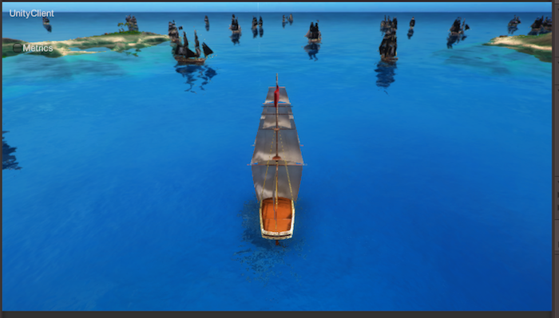

# Pirates 3 - Update a component property

In the previous lesson, you filled the game world with enemy pirate ships. In this lesson you'll:

* **learn how to get write access** to a component
* **learn about limiting** which code runs on which workers
* **write to a component** by updating the steering component properties on the PirateShip

## 1. Write a MonoBehaviour to move PirateShips

As you saw at the end of the last lesson, the world is scattered with pirate ships, but they don't do anything.
In this step, you'll write a script that uses the existing `ShipControls` component to move the ships around.

### 1.1. How to move ships around

You saw in [lesson 1](../../tutorials/pirates/lesson1.md#3-3-sail-around) that an entity's position
is stored in its `Position` component. The entity's template also included a `ShipControls` component. 

**Properties** are part of a component, and they store any data of an entity that you want to share between
workers. `ShipControls` has two properties that will be useful here: `targetSteering` and `targetSpeed`. 

#### How the PlayerShip moves

`PlayerShip` prefabs include a script (`PlayerInputController.cs`) that writes player keyboard input to
the `ShipControls` properties whenever a player presses particular keys.

Another script (`ShipMovement.cs`) watches for updates to `ShipControls`, and updates 
the `Position` accordingly. That's what moves the ship.

> **Why don't we just write to the `Position` component directly?**

> Two reasons. 
> One: in a real game, some players may modify the executable game so they can cheat. 
> You wouldn't want to let players with modified games decide on their own position. 
> Using `ShipMovement.cs` protects your game from unwanted position modifications.  
> Two: this way lets you re-use `ShipMovement.cs` to make it easy to steer
> a PirateShip around.

#### How the PirateShip will move

When you [wrote the template method](../../tutorials/pirates/lesson2.md#1-2-create-a-pirate-entity-template)
to create `PirateShip` entities, you initialized its properties with the value `0`:

```csharp
.AddComponent(new ShipControls.Data(0, 0), CommonRequirementSets.PhysicsOnly)
```

There's nothing changing those values from 0 at the moment, which is why the pirate ships don't move.

Like the `PlayerShip` prefab, the `PirateShip` prefab includes `ShipMovement.cs`, so it's ready to move as soon as it
receives updates to the `ShipControls` properties. So you need to write a MonoBehaviour that makes steering decisions
and updates the `ShipControls` properties with them.

> In this lesson you're going to use components which have already been created for you.
If you're keen to know how to define new components - you'll learn all about it in the next lesson.

#### Which worker?

NPCs should be completely controlled on the server side. So you'll lock down this script so it can only be
run by a `UnityWorker`.

### 1.2. Create a MonoBehaviour to steer the ship

1. In the Unity Editor's project panel, navigate to `Assets/Gamelogic/Pirates/Behaviours/`
and create a C# script called `SteerRandomly`.

2. Replace the script's contents with the following:

    ```csharp
    using UnityEngine;
    using Improbable.Unity;
    using Improbable.Unity.Visualizer;

    namespace Assets.Gamelogic.Pirates.Behaviours
    {
        public class SteerRandomly : MonoBehaviour
        {
        }
    }
    ```
3. So that you can interact with the `ShipControls` component, at the top of the script, add `using Improbable.Ship;`:

    ```csharp
    using UnityEngine;
    using Improbable.Unity;
    using Improbable.Unity.Visualizer;
    using Improbable.Ship;
    ```

4. Just before the class declaration, add the line `[WorkerType(WorkerPlatform.UnityWorker)]`. 

    This annotation, provided by the SpatialOS Unity SDK, means that when you build the project, this script will only be
    included in prefabs on the `UnityWorker`.

    ```csharp
    // Add this MonoBehaviour on UnityWorker (server-side) workers only
    [WorkerType(WorkerPlatform.UnityWorker)]
    public class SteerRandomly : MonoBehaviour
    {
    }
    ```

5. Just inside the `SteerRandomly` class, add the line `[Require] private ShipControls.Writer ShipControlsWriter;`.

    This does two things:

    * It imports a `ShipControls.Writer`.

        This is an object you can use to interact with `ShipControls`. It has methods for checking the current values of
        properties, sending updates to properties, and a lot more. You'll use one of those methods in the next step.
    * It uses the `[Require]` annotation.

        This annotation, also provided by the SpatialOS Unity SDK, is another way of controlling when this script is run.

        Workers can have read access or write access to a component. **Only one worker at a time**, regardless of whether
        it's a UnityWorker or UnityClient, can have write access to a specific component on a specific entity.

        The `[Require]` annotation means that this script (`SteerRandomly.cs`) is only enabled if the worker has 
        write access to the component specified (`ShipControls`): ie, if the worker is allowed to have a `Writer`.

    ```csharp
    [WorkerType(WorkerPlatform.UnityWorker)]
    public class SteerRandomly : MonoBehaviour
    {
        /*
         * This MonoBehaviour will only be enabled for the single UnityWorker
         * which has write access to this entity's ShipControls component.
         */
        [Require] private ShipControls.Writer ShipControlsWriter;
    }
    ```
6. Add a method to the `steerRandomly` class that sends a random update to the `ShipControls`.

    The following shows you how to use the `ShipControlsWriter` to do this:

    ```csharp
    private void RandomizeSteering()
    {
        ShipControlsWriter.Send(new ShipControls.Update()
            .SetTargetSpeed(Random.value)
            .SetTargetSteering((Random.value * 30.0f) - 15.0f));
    }
    ```

    For all components and all properties, there's a method that looks like this: `<component name>.Update().Set<property name>()`.
7. Finally, something needs to invoke `RandomizeSteering()`.

    You can use the Unity function [InvokeRepeating()](https://docs.unity3d.com/ScriptReference/MonoBehaviour.InvokeRepeating.html)
    to do this. You should use `InvokeRepeating` in `OnEnable()`, and **cancel it** in `OnDisable()`, in order to
    prevent unexpected behaviour - for more information see [MonoBehaviour lifecycle](../../reference/monobehaviour-lifecycle.md):

    ```csharp
    private void OnEnable()
    {
        // Change steering decisions every five seconds
        InvokeRepeating("RandomizeSteering", 0, 5.0f);
    }

    private void OnDisable()
    {
        CancelInvoke("RandomizeSteering");
    }
    ```

The finished script should look like something this:

```csharp
using UnityEngine;
using Improbable.Unity;
using Improbable.Unity.Visualizer;
using Improbable.Ship;

namespace Assets.Gamelogic.Pirates.Behaviours
{
    // Add this MonoBehaviour on UnityWorker (server-side) workers only
    [WorkerType(WorkerPlatform.UnityWorker)]
    public class SteerRandomly : MonoBehaviour
    {
        /*
         * This MonoBehaviour will only be enabled for the single UnityWorker
         * which has write access to this entity's ShipControls component.
         */
        [Require] private ShipControls.Writer ShipControlsWriter;

        private void OnEnable()
        {
            // Change steering decisions every five seconds
            InvokeRepeating("RandomizeSteering", 0, 5.0f);
        }

        private void OnDisable()
        {
            CancelInvoke("RandomizeSteering");
        }

        private void RandomizeSteering()
        {
            ShipControlsWriter.Send(new ShipControls.Update()
                .SetTargetSpeed(Random.value)
                .SetTargetSteering((Random.value*30.0f)-15.0f));
        }
    }
}
```

## 2. Apply the changes and build from Unity

Previously, you've used the `spatial` command-line to build your game. But it's quicker to build from
Unity. To apply the changes you've made and then build from Unity:

0. In Unity, open the `EntityPrefabs` folder, and double-click on the `PirateShip` prefab to open it.
0. Click `Add component`, and add the `SteerRandomly` script to the prefab (it should appear in the search list as you
   start typing its name).
0. Build entity prefabs: In the SpatialOS window (open it using the menu `Window > SpatialOS`), under `Entity prefabs`, 
click `Build all`.

    Whenever you change what's on a prefab, you need to build prefabs.
0. In the same window, under `Workers`, click `Build`.

    This builds your worker code for local development, and is equivalent to running
    `spatial worker build UnityWorker UnityClient --target=development`, as you
    did in the first lesson. It's just quicker to run this, as you don't have to close Unity.

> You don't always have to build everything. For a handy reference, see
[What to build when](../../develop/build.md).

## 3. Check it worked

To test the changes, run the game locally:

1. In the SpatialOS window, under `Run SpatialOS locally`, click `Run`.

    This opens a terminal window and runs `spatial local launch` for you.

2. When SpatialOS is ready, run a client (open the scene `UnityClient.unity`, then click **Play ▶**), and
click `CONNECT`.

> **It's done when:** The enemy pirate ships move around the world:
>
> 

If you open the [Inspector](http://localhost:21000/inspector), you'll be able to see them all moving.

Don't stop `spatial local launch` now - you'll need it in the next lesson.

## Lesson summary

In this lesson you:

* thought about which code should run on which worker
* learned about the `[Require]` annotation
* learned about [component `Writer`s (SpatialOS documentation)](../../interact-with-world/interact-components.md#Example-of-MonoBehaviours-component-readers-and-writers)
* used a `Writer` to send an update to a component property
* re-used existing functionality to move the pirate ships around

At this stage, your enemies are fully-fledged and roaming around the world. It's time to introduce some action!

In the [next lesson](../../tutorials/pirates/lesson4.md), you'll work on a new feature: firing cannonballs.
