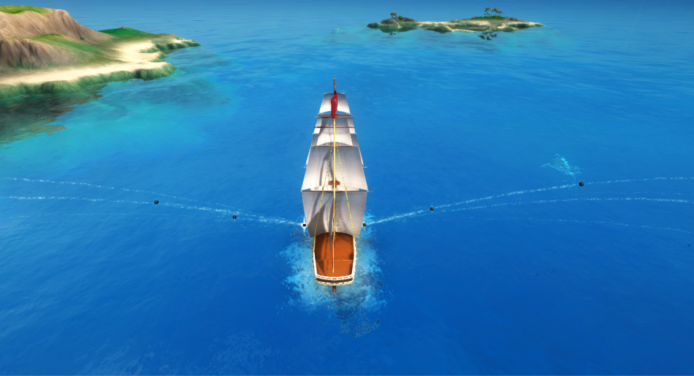
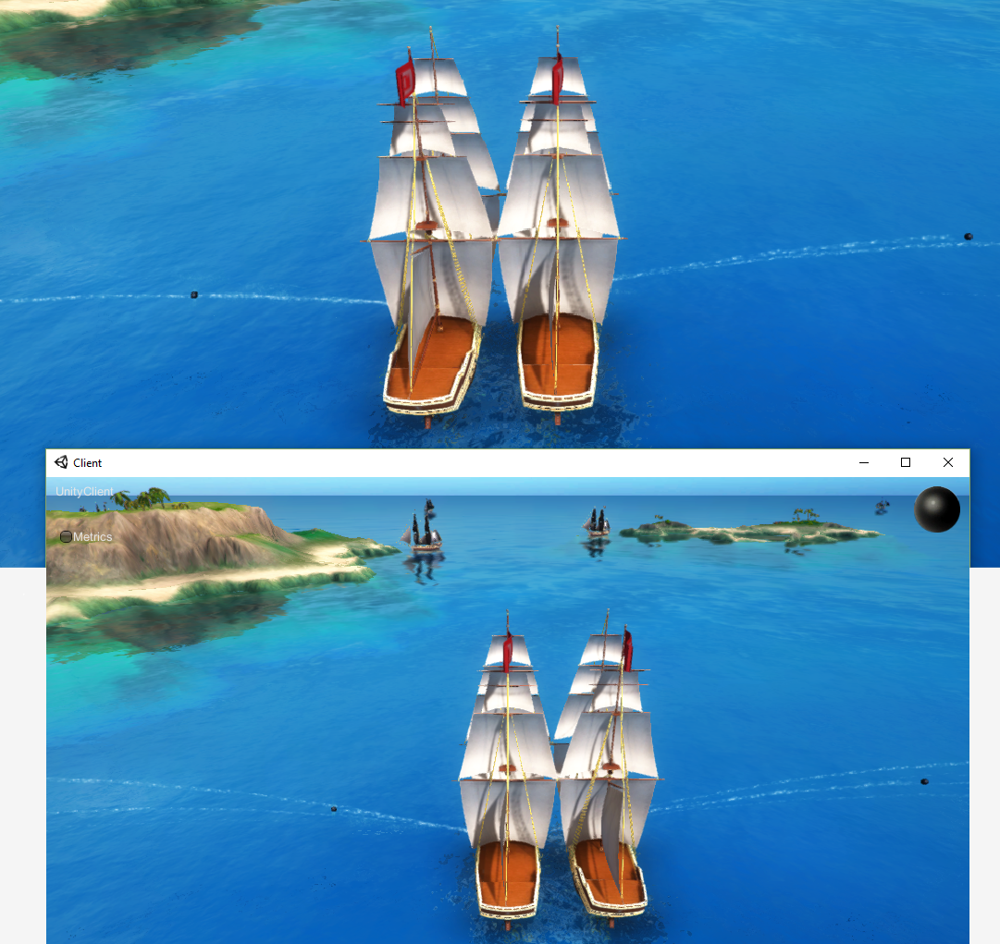

# Pirates 4 — Trigger and receive a component event

In the previous lessons you created enemy pirates that move around the world, and learned about
sending updates to a component property. In this lesson, you'll:

* **learn about events**: another thing that can be part of a component
* **create a new event** that can be synchronised across workers
* **fire cannonballs** when the event is triggered
* make sure those cannonballs are **fired on all clients**

## 1. Finding the problem with cannonballs

We haven't mentioned it yet, but you might have discovered some extra controls: your player's ship can fire cannonballs,
using the `E` and `Q` keys. Try it out now:

1. If you haven't still got the game running locally from the previous lesson:

    1. In the SpatialOS window, click `Build`, then under `Run SpatialOS locally`, click `Run`.

    2. When SpatialOS is ready, run a client (open the scene `UnityClient.unity`, then click **Play ▶**), and
    click `CONNECT`.

2. Press `E` and `Q` to fire cannonballs. 

    

    These cannonballs are local GameObjects: they're not SpatialOS entities. They're fired using the following Unity code:

    ```
    if (Input.GetKeyDown(KeyCode.Q))
    {
        if (cannon != null)
        {
            cannon.Fire(-transform.right);
        }
    }
    ```

    You can take a look at that in `PlayerInputController.cs`, which we'll be editing later. (To locate the script; in the Unity Editor's project panel, navigate to `gamelogic/Pirates/Behaviours`.)

But the fact that these are local GameObjects causes a problem. You'll find this out if you connect another Unity
client to your game:

1. Open a new terminal window, and navigate to the root directory of your project.
2. Run `spatial local worker launch UnityClient default`.

    This will launch another Unity client, connecting to the same game.
3. Make sure you can see both game windows at the same time.
4. In one of the game windows, move the ship so you can see the other ship clearly.
5. Press `E` or `Q` to fire a cannon.

Now you should be able to see the problem: **only the player's own client** visualizes the cannonball firing.
Because they're local GameObjects, they're not visible to other clients.

In this lesson, you'll fix that.

### Stop the deployment

Once you've seen that the cannonballs are only displayed on the player's own client, stop `spatial local launch` by running `Ctrl + C`
in the terminal, and close the second Unity client. You'll run both clients again later, after making some code changes.

### What's the solution?

In a SpatialOS game, you have to decide what things you want to synchronise to SpatialOS and what things you don't.

> In order to synchronise something, it needs to be expressed as **an aspect of a component on an entity**.

> If something's part of a component on an entity, SpatialOS makes sure that other workers and clients have access to it.

> If it's not, **no other worker or client will have access to it**.

**Keeping some things local is fine**. For example, your player might be able to change the colour of their UI. Nobody
but that player needs that information. But you can see, in the case of firing cannonballs, that **some information needs
to be shared**, so that all clients know that a cannonball has been fired.

One way of solving the problem is to **make the cannonballs into entities**. This would make them visible to other clients
in the same way your ship is. But entities make most sense when they're **long-lived objects**, especially ones that move 
around the world.

There's actually a simpler (and cheaper in terms of bandwidth overhead) way to get the effect you want: you can use
a feature of components called **events**.

#### Events

In the previous lesson, you used **properties**, which are persistent values stored in a component. **Events** are
also part of a component, but they're **transient**. You send an event update in the same way you do a property update.
And just like a property change, any worker that can "see" an entity will receive the event update.

So in this case, you can rewrite `PlayerInputController.cs` so that when a player presses `E` or `Q`, this fires an
event. You can then write another script that runs on *every worker that can see your ship*, which, whenever it
receives the event, fires the cannons locally:


### How we'll do this

There are a few different steps to join everything up to make it work.

In this lesson, you'll:

* add a new event to a component
* trigger the event on the authoritative Unity client (the Unity client with write access to the component)
* fire the cannons on all workers when they receive the event

In the few lessons after that, you'll:

* (lesson 5) actually detect the cannonball collision
* (lesson 6) give ships a `Health` value, and reduce that health when a cannonball hits them
* (lesson 7) show an animation of the ships sinking when their health reaches 0

## 2. Extend the ShipControls component to fire cannonballs

In lesson 3, you used the properties on the `ShipControls` component to move pirate ships around. In this lesson,
you're going to add something new to `ShipControls`.

Components are defined in a project's **schema**. SpatialOS uses this schema to generate code which workers use to read and 
write to components. It's written in [schemalang (SpatialOS documentation)](https://docs.improbable.io/reference/12.2/shared/glossary#schemalang), 
and it's located in the `schema` directory of the project.

1. From the project root directory, navigate to `schema/improbable/ship/ShipControls.schema`.

    This schema file is where `ShipControls` is defined.

2. Look at this file. At the moment, it contains two properties: `target_steering` and `target_speed`.

3. `ShipControls` needs to record the "fire cannonballs" key presses as events. To implement this,
add `FireLeft` and `FireRight` component events to this definition, like this:

    ```
    package improbable.ship;

    type FireLeft {}
    type FireRight {}

    component ShipControls {

      // ... CODE ... //

      // The component event for triggering firing cannonballs left.
      event FireLeft fire_left;
      // The component event for triggering firing cannonballs right.
      event FireRight fire_right;
    }
    ```

    The declarations for the `FireLeft` and `FireRight` types don't have any fields: they are empty objects.
    They _could_ store data that is synchronized when the events are triggered. For example, they could store the
    time at which the key press was made. We'll leave them empty for now.

4. You've changed the schema. Whenever you change the schema, you need to regenerate the generated code.

    In the SpatialOS window, click `Build`, then under `Generate from schema`, click `Build`.

    This **generates code that workers can use** to read and modify components, and allows 
    SpatialOS to synchronize components across the system.

## 3. Trigger the Fire events from the Unity Client

When the player presses `E` or `Q`, you want to trigger the `Fire` component events you just created.

You'll do this from a script that exists on the `PlayerShip` GameObject on *all* UnityClients. 
But when a player hits `E` or `Q`, you only want *their* local instance of PlayerShip to trigger the `FireLeft`/
`FireRight` event.

So it's important to make sure that this script will only be *enabled* on the `PlayerShip` on which the UnityClient
has write access: that is, the ship that belongs to the player.

1. Open the project in the Unity Editor.
2. In the `EntityPrefabs` folder, double-click on the `PlayerShip` prefab.
3. On the `PlayerShip` prefab is a `PlayerInputController.cs` script. Double-click on it to open it in your C# IDE.

4. Take a look at this line:

    ```
    [Require] private ShipControls.Writer ShipControlsWriter;
    ```

    You came across `[Require]` in the previous lesson. Requiring a component writer means that this script 
    will only be enabled on the worker with **write access to `ShipControls`**.

    This means `PlayerInputController.cs` only runs on the UnityClient with write access to `ShipControls`.
    In this case, the worker with write access will be the player's Unity Client, which is associated with this entity.
    (We'll look at how this is set up in a later lesson.)

    It won't run on other UnityClients, or on a `UnityWorker`. This is important, because it means **only the player can 
    control their own ship**.

5. The script reads the user input on each frame, and updates the `ShipControls` component with the new values.
    The steering and speed values are taken from the _Vertical_ and _Horizontal_ axes, as defined in the
    [Unity input manager](http://docs.unity3d.com/ScriptReference/Input.html).

6. It also checks for the `Q` and `E` keys being pressed, but it just creates local GameObjects. You want to replace
this with code that sends an event update to SpatialOS. 

    You sent an update in the previous lesson using `ShipControlsWriter.Send(new ShipControls.Update()`. But instead
    of using `.Set<name of property>`, you trigger an event using `.Add<name of event>`.

    Replace the two `if` clauses with the following: 

    ```csharp
    if (Input.GetKeyDown(KeyCode.Q))
    {
        ShipControlsWriter.Send(new ShipControls.Update().AddFireLeft(new FireLeft()));
    }

    if (Input.GetKeyDown(KeyCode.E))
    {
        ShipControlsWriter.Send(new ShipControls.Update().AddFireRight(new FireRight()));
    }
    ```

When you're finished, `PlayerInputController` should look like this:

```
using Assets.Gamelogic.Core;
using Improbable.Ship;
using Improbable.Unity;
using Improbable.Unity.Visualizer;
using UnityEngine;
using UnityEngine.SceneManagement;

namespace Assets.Gamelogic.Pirates.Behaviours
{
    // Add this MonoBehaviour on client workers only
    [WorkerType(WorkerPlatform.UnityClient)]
    public class PlayerInputController : MonoBehaviour
    {
        /*
         * Client will only have write access for their own designated PlayerShip entity's ShipControls component,
         * so this MonoBehaviour will be enabled on the client's designated PlayerShip GameObject only and not on
         * the GameObject of other players' ships.
         */
        [Require]
        private ShipControls.Writer ShipControlsWriter;

        void OnEnable()
        {
            SceneManager.UnloadSceneAsync(BuildSettings.SplashScreenScene);
        }

        void Update()
        {
            ShipControlsWriter.Send(new ShipControls.Update()
                .SetTargetSpeed(Mathf.Clamp01(Input.GetAxis("Vertical")))
                .SetTargetSteering(Input.GetAxis("Horizontal")));

            if (Input.GetKeyDown(KeyCode.Q))
            {
                ShipControlsWriter.Send(new ShipControls.Update().AddFireLeft(new FireLeft()));
            }

            if (Input.GetKeyDown(KeyCode.E))
            {
                ShipControlsWriter.Send(new ShipControls.Update().AddFireRight(new FireRight()));
            }
        }
    }
}
```

You've removed the code that actually fired the cannons, and instead triggered an event.

## 4. Fire the cannons!

Now, there is no code to fire the cannons. You want to fire them using a script that runs on **all workers**: the
problem you saw earlier was that other clients weren't firing cannonballs.
 
`CannonFirer.cs` is used to fire the cannons. You'll extend this script to watch for `Fire` events being triggered,
and respond by firing the cannon (creating the local cannonball GameObject).

### 4.1. State a requirement to read ShipControls

1. In the Unity Editor, select the `PlayerShip` prefab. 
2. Open the script `CannonFirer.cs`.
3. At the top, add the import statements `using Improbable.Ship;` (for the `ShipControls` generated code that you updated in step 2.4 above).
and `using Improbable.Unity.Visualizer;` (for the `Require` syntax).
4. Add a `[Require]` statement, but not for a component writer: for a `Reader`.

    This means that this script will be enabled on workers with **read access** to this component:

    ```
    public class CannonFirer : MonoBehaviour
    {
        [Require] private ShipControls.Reader ShipControlsReader;
    ```

    In previous steps, you've used a component writer. This object is a component *reader*, which has a subset
    of a writer's functionality. 

    Among other things, you can use it to register a callback for when events and properties change.


### 4.2. Fire the cannons on the FireLeft and FireRight events

In this step, you'll register callbacks to run a function when the `FireLeft` and `FireRight` events 
on the `ShipControls` component are triggered.

1.  Still in `CannonFirer.cs`, add the following `OnFireLeft` function to fire the left cannon:

    ```csharp
    private void OnFireLeft(FireLeft fireLeft)
    {
        // Respond to FireLeft event
        AttemptToFireCannons(-transform.right);
    }
    ```
2. Add a similar `OnFireRight` function for firing the right cannon as well. Make sure to exclude the minus sign
so the cannonballs travel in the correct direction.

    ```csharp
    private void OnFireRight(FireRight fireRight)
    {
        // Respond to FireRight event
        AttemptToFireCannons(transform.right);
    }
    ```
3. This script needs to watch for `FireLeft` and `FireRight` events. To do this, register the following callbacks,
using the `ShipControlsReader`:

    ```csharp
    private void OnEnable()
    {
        ShipControlsReader.FireLeftTriggered.Add(OnFireLeft);
        ShipControlsReader.FireRightTriggered.Add(OnFireRight);
    }
    ```
    This uses `FireLeftTriggered` and `FireRightTriggered` as synchronous callbacks. `OnFireLeft()` and `OnFireRight()`
    will run every time the events are triggered. 

5. Deregister the callbacks in `OnDisable()`, to prevent unexpected behaviour:

    ```csharp
    private void OnDisable()
    {
        ShipControlsReader.FireLeftTriggered.Remove(OnFireLeft);
        ShipControlsReader.FireRightTriggered.Remove(OnFireRight);
    }
    ```

> You **must** register all callbacks in
[`OnEnable()`](https://docs.unity3d.com/ScriptReference/MonoBehaviour.OnEnable.html),
a standard function in the [Unity lifecycle](https://docs.unity3d.com/Manual/ExecutionOrder.html). It runs when
the MonoBehaviour is enabled - which includes when an entity is first created, and when it crosses worker boundaries.
 
> Similarly, you **must** de-register all callbacks in
[`OnDisable()`](https://docs.unity3d.com/ScriptReference/MonoBehaviour.OnDisable.html).

The finished script should look like something this:

```csharp
using UnityEngine;
using Improbable.Ship;
using Improbable.Unity.Visualizer;

namespace Assets.Gamelogic.Pirates.Cannons
{
    // This MonoBehaviour will be enabled on both client and server-side workers
    public class CannonFirer : MonoBehaviour
    {
        [Require] private ShipControls.Reader ShipControlsReader;
        private Cannon cannon;

        private void OnEnable()
        {
            ShipControlsReader.FireLeftTriggered.Add(OnFireLeft);
            ShipControlsReader.FireRightTriggered.Add(OnFireRight);
        }

        private void OnDisable()
        {
            ShipControlsReader.FireLeftTriggered.Remove(OnFireLeft);
            ShipControlsReader.FireRightTriggered.Remove(OnFireRight);
        }

        private void OnFireLeft(FireLeft fireLeft)
        {
            // Respond to FireLeft event
            AttemptToFireCannons(-transform.right);
        }

        private void OnFireRight(FireRight fireRight)
        {
            // Respond to FireRight event
            AttemptToFireCannons(transform.right);
        }

        private void Start()
        {
            // Cache entity's cannon gameobject
            cannon = gameObject.GetComponent<Cannon>();
        }

        public void AttemptToFireCannons(Vector3 direction)
        {
            if (cannon != null)
            {
                cannon.Fire(direction);
            }
        }
    }
}
```

## 5. Build the changes

1. Refresh the Unity Editor (`Ctrl+R`) to register the code changes you've made. (Unity should refresh automatically,
but this makes sure.)
2. Rebuild the worker code: In the SpatialOS window, click `Build`, then under `Workers`, click `Build`.

> You don't always have to build everything. For a handy reference, see
[What to build when](../../develop/build.md).

## 6. Check it worked

To test the changes, run the game locally:

1. In the SpatialOS window, click `Build`, then under `Run SpatialOS locally`, click `Run`.
2. When the terminal window says SpatialOS is ready, run a client (open the scene `UnityClient.unity`, then
click **Play ▶**), and click `CONNECT`.
3. As you did at the start of this lesson, run another client:

    1. Open a new terminal window, and navigate to the root directory of your project.
    2. Run `spatial local worker launch UnityClient default`.

3. As before, make sure you can see both game windows at the same time, and move one of the ships so you can see 
the other ship clearly.
5. Press `E` or `Q` to fire a cannon.

> **It's done when:** You can see ship's cannons fire in both clients:
> 
> 

To stop `spatial local launch` running, switch to that terminal window and use `Ctrl + C`.

## Lesson summary

In this lesson, you:

* learned what an [event (SpatialOS documentation)](https://docs.improbable.io/reference/12.2/shared/glossary#event) is
* learned what [schema (SpatialOS documentation)](https://docs.improbable.io/reference/12.2/shared/glossary#schema) is
* added a new event to a [component (SpatialOS documentation)](https://docs.improbable.io/reference/12.2/shared/glossary#component) in schema
* ran [codegen (SpatialOS documentation)](https://docs.improbable.io/reference/12.2/shared/glossary#code-generation)
* triggered an event
* used a [component `Reader` (SpatialOS documentation)](https://docs.improbable.io/reference/12.2/shared/glossary#readers-and-writers)
* registered callbacks to watch for the event
* responded to the event by firing cannons on all workers

This fired cannonballs, but also made sure those cannonballs are fired **on all clients**.

### What's next?

Your cannonballs are firing, but at the moment, if they hit an enemy, nothing will happen. 

In the [next lesson](../../tutorials/pirates/lesson5.md) you'll detect the collision between cannonballs and 
enemy ships on the UnityWorker.
