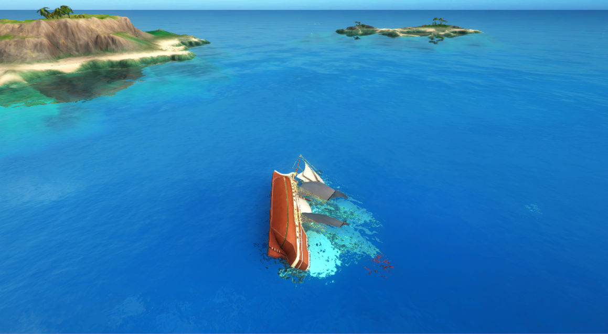

# Pirates 7 — Sink the ship

In the previous lesson, you built functionality to reduce a ship's health when it's hit by a cannonball.
In this lesson you'll:

* **register a callback to watch** the `current_health` property
* **play a sinking animation** when a ship's `current_health` reaches zero

There's already a barebones Unity MonoBehaviour called `SinkingBehaviour.cs`, which is a component on the 
`PlayerShip` and `PirateShip` prefabs.

1. In the Unity editor, navigate to the `Assets/Gamelogic/Pirates/Behaviours` directory.
2. Open `SinkingBehaviour.cs`.

    `SinkingBehaviour.cs` needs completing so it plays a sinking animation when a ship's
    `current_health` reaches zero.

To make this happen, you need to:

* add a requirement to read the `Health` component
* write a function that triggers the sinking animation
* register a callback to listen to updates to `current_health`

### 1. Add a requirement to read from the Health component

As in previous lessons, this MonoBehaviour should only be enabled if it has access to the component. In this
case, it only needs **read access**.

1. In `SinkingBehaviour.cs`, add the following import to get access to the `Health` component:

    ```csharp
    using Improbable.Ship;
    ```

2. Add a statement to `[Require]` a Health Reader:

    ```
    public class SinkingBehaviour : MonoBehaviour
    {
        // Enable this MonoBehaviour on workers with read access to the entity's Health component
        [Require] private Health.Reader HealthReader;
    ```

    This line also makes sure that `SinkingBehaviour` is only enabled if the `Health` component exists on the ship.

### 2. Play a sinking animation

In this section, you'll write the function that's called whenever the ship's `Health` changes.
It needs to check what the updated `current_health` is, and play the `SinkingAnimation` if the `current_health`
is below `0`.

1. Add the following line in your class body to declare an `alreadySunk` member variable:

    ```csharp
    private bool alreadySunk = false;
    ```
    `alreadySunk` is used to check whether a ship has already sunk to avoid playing a sinking animation twice.

2. Copy this function into the `SinkingBehaviour` class:

    ```csharp
    // Callback for whenever the CurrentHealth property of the Health component is updated
    private void OnCurrentHealthUpdated(int currentHealth)
    {
        if (!alreadySunk && currentHealth <= 0)
        {
            VisualiseSinking();
            alreadySunk = true;
        }
    }
    ```

    This uses `OnCurrentHealthUpdated` as a synchronous callback: a function that runs every time the `CurrentHealth`
    property of `Health` is updated. If `alreadySunk` is false and `currentHealth` is below zero, it calls a function
    that plays the sinking animation and disables the particle effect for the ship's trail in the water.

3. At the beginning of `OnEnable()`, add the following line:
    ```csharp
    alreadySunk = false;
    ```

    This is because this project uses **prefab pooling**. Prefab pooling allows Unity to reuse GameObjects to represent
    different entities. Including this line ensures that, when this script is enabled, a ship entity with `health > 0` doesn't
    appear as a sunk ship just because the ship entity that was previous associated with this GameObject 
    was sunk.

### 3. Register a callback for OnCurrentHealthUpdated

Register a callback to run `OnCurrentHealthUpdated` whenever the entity's `CurrentHealth` changes.

In [lesson 4](../../tutorials/pirates/lesson4.md#4-2-fire-the-cannons-on-the-fireleft-and-fireright-events), you
registered callbacks for whenever an event was triggered. Callbacks for property changes are similar: instead of
using `ComponentReader.<event name>Triggered.Add()`, use `ComponentReader.<property name>Updated.Add()`.

1. Register a callback for updates of `Health` in `OnEnable()`:

    ```csharp
    private void OnEnable()
    {
        alreadySunk = false;
        InitializeSinkingAnimation();
        // Register callback for when components change
        HealthReader.CurrentHealthUpdated.Add(OnCurrentHealthUpdated);
    }
    ```

    > There are a couple of alternative methods we could have used to register this callback, if we'd wanted different behaviour:
    > 
    > * `HealthReader.ComponentUpdated.Add()` would invoke the method every time *any* property of `Health` changed,
    or any event on `Health` was triggered.
    > * `HealthReader.CurrentHealthUpdated.AddAndInvoke()` would invoke the callback immediately with the current
    component values upon registration.


2. Deregister the callback in `OnDisable()` to prevent unexpected behaviour:

    ```csharp
    void OnDisable()
    {
        // Deregister callback for when components change
        HealthReader.CurrentHealthUpdated.Remove(OnCurrentHealthUpdated);
    }
    ```

3. Copy this `InitializeSinkingAnimation` function into `SinkingBehaviour.cs`:

    ```csharp
    private void InitializeSinkingAnimation()
    {
        /*
         * SinkingAnimation is triggered when the ship is first killed. But a worker which checks out
         * the entity after this time (for example, a client connecting to the game later) 
         * must not visualize the ship as still alive.
         * 
         * Therefore, on checkout, any sunk ships jump to the end of the sinking animation.
         */
         
        if (HealthReader.Data.currentHealth <= 0)
        {
            foreach (AnimationState state in SinkingAnimation)
            {
                // Jump to end of the animation
                state.normalizedTime = 1;
            }
            VisualiseSinking();
            alreadySunk = true;
        }
    }
    ```

#### Finished version of SinkingBehaviour.cs

The finished script should look like something this:

```
using Improbable.Ship;
using Improbable.Unity;
using Improbable.Unity.Visualizer;
using UnityEngine;

namespace Assets.Gamelogic.Pirates.Behaviours
{
    // Add this MonoBehaviour on client workers only
   [WorkerType(WorkerPlatform.UnityClient)]
    public class SinkingBehaviour : MonoBehaviour
    {
        // Inject access to the entity's Health component
        [Require] private Health.Reader HealthReader;

        public Animation SinkingAnimation;
        
        private bool alreadySunk = false;

        private void OnEnable()
        {
            alreadySunk = false;
            InitializeSinkingAnimation();
            // Register callback for when components change
            HealthReader.CurrentHealthUpdated.Add(OnCurrentHealthUpdated);
        }

        private void OnDisable()
        {
            // Deregister callback for when components change
            HealthReader.CurrentHealthUpdated.Remove(OnCurrentHealthUpdated);
        }

        private void InitializeSinkingAnimation()
        {
            /*
             * SinkingAnimation is triggered when the ship is first killed. But a worker which checks out
             * the entity after this time (for example, a client connecting to the game later) 
             * must not visualize the ship as still alive.
             * 
             * Therefore, on checkout, any sunk ships jump to the end of the sinking animation.
             */
            if (HealthReader.Data.currentHealth <= 0)
            {
                foreach (AnimationState state in SinkingAnimation)
                {
                    // Jump to end of the animation
                    state.normalizedTime = 1;
                }
                VisualiseSinking();
                alreadySunk = true;
            }
        }

        // Callback for whenever the CurrentHealth property of the Health component is updated
        private void OnCurrentHealthUpdated(int currentHealth)
        {
            if (!alreadySunk && currentHealth <= 0)
            {
                VisualiseSinking();
                alreadySunk = true;
            }
        }

        private void VisualiseSinking()
        {
            SinkingAnimation.Play();
        }
    }
}

```

## 4. Build the changes

You don't need to build any changes this time. This is because all the changes have been made to Unity code,
and you haven't added components to or removed components from a prefab. So when you run a client from Unity, Unity refreshes
code changes automatically.

> If you wanted to run a client from the command line instead (using
`spatial local worker launch UnityClient default`), you'd need to build worker code, using 
the SpatialOS window: `Build` > `Workers` > `Build`.

## 5. Check it worked

To test these changes, run the game locally:

1. Run the game locally from the SpatialOS window, then run a client from Unity.
2. Find another ship, and press `E` or `Q` to fire a cannon at it.
3. After four hits, the ship should sink.

> **It's done when:** the ship you hit sinks:
> 
> 

To stop `spatial local launch` running, use `Ctrl + C`.

### Deploying to the cloud

So far in the Pirates tutorial, you've always run your game locally. But there's an alternative: running
in the cloud. This has some advantages, including making it much easier to test multiplayer
functionality.

To try out deploying to the cloud, try the optional lesson 
[Play in the cloud](../../tutorials/pirates/pirates-cloud.md).

## Lesson summary

Congratulations, you've finished this feature!

In this lesson you:

* watched the `currentHealth` property for changes
* made a sinking animation play after a ship's `current_health` reached zero

### What's next?

You can try out the optional extensions to Pirates:

* Learn about another aspect of components: 
[component commands](../../tutorials/pirates/pirates-command.md).
* Try [playing your game in the cloud](../../tutorials/pirates/pirates-cloud.md) by
running a cloud deployment.
