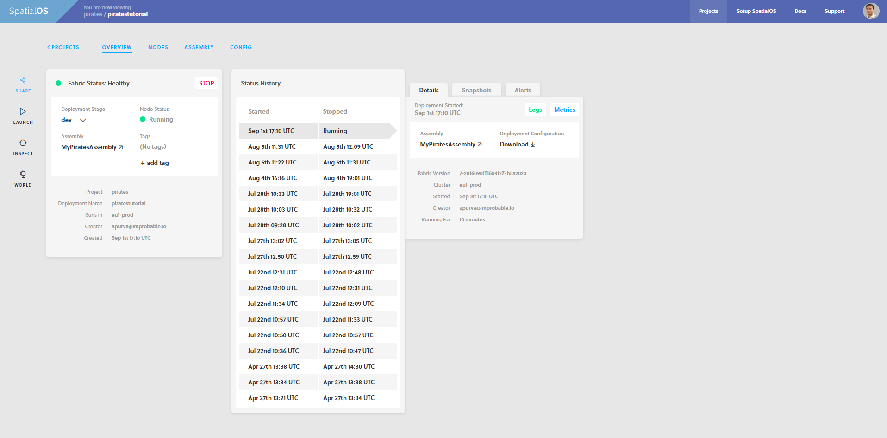
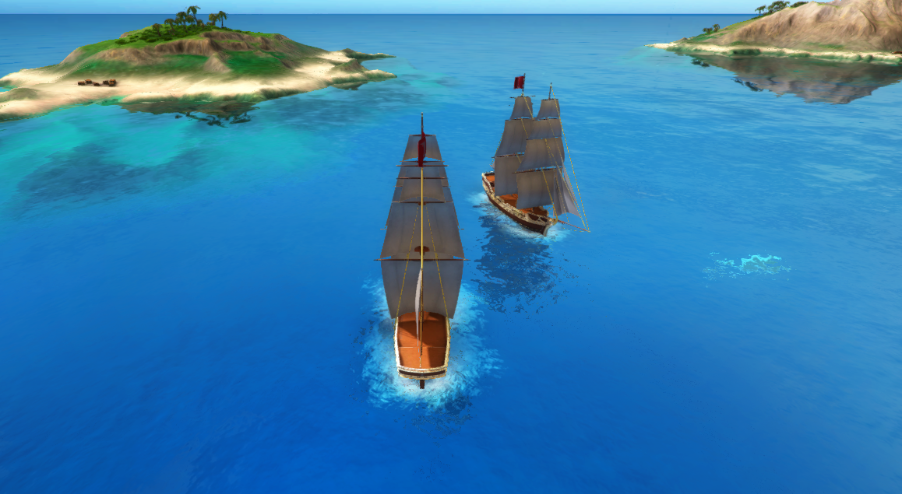
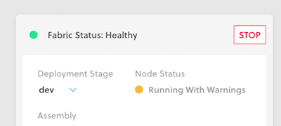

# Pirates — Play in the cloud

In this lesson you'll:

* **initialize the project** for cloud deployment
* **create the assets** needed to run a SpatialOS game
* **upload** these assets to the cloud
* **run the command** to run the game in the cloud
* **share the deployment** and play the game in multiplayer

## Background: cloud deployment

Through the Pirates tutorial we show you how to run your game locally. But there are a few
disadvantages to only deploying locally. 

You can also deploy your game to the cloud. The advantages of doing this:

* You can test your game at a much larger scale.
* It's easy to test multiplayer functionality.
* Anyone you share the game with can connect to it and play.

### In a nutshell

For a quick visual guide of how to deploy a SpatialOS project to the cloud, see
[this cheat sheet](../../assets/deploy/unitycloudcheatsheet.pdf):

## 1. Initialize the project

The first time you run a game in the cloud, you need to add some information to your project configuration:

1. Open the project configuration file: `spatialos.json`, in the project root directory. 
2. Change the `name` value (currently `your_project_name_here`) to your SpatialOS project name.

    You can find yours in the [SpatialOS console](https://console.improbable.io). It'll be something like 
    `beta_someword_anotherword_000`.

## 2. Build an assembly for the deployment 

The first step of running a cloud deployment is uploading all the files that your game uses. This
includes executable files for the clients and workers, and the assets your workers use (like models and textures
used by the Unity client to visualize the game). We call that set of game files an **assembly**.

To build the assembly your game will use when running in the cloud:

1. In the Unity Editor, in the SpatialOS window, select `Deployment` in the drop-down menu.
2. Make sure both worker types (`UnityWorker` and `UnityClient`) are selected.
3. Under `Workers`, click `Build`.

Alternatively, to build outside Unity, use the command `spatial worker build`:

1. Close the Unity Editor.
2. In the root directory of the project, run `spatial worker build UnityWorker UnityClient --target=deployment`.

    > If you don't close Unity before running `spatial worker build`, the command will report an error.

> **It's done when:** You see `'spatial build UnityWorker UnityClient' succeeded` (or `'spatial.exe build UnityWorker UnityClient' succeeded`) printed in your console output.

## 3. Upload assembly to the cloud

The command `spatial cloud upload <assembly name>` uploads the assembly to the cloud. The `<assembly name>` is just a label
so you can identify this assembly in the next step — for example, `MyPiratesAssembly`. 

To upload from Unity:

1. In the SpatialOS window, under `Spatial upload`, enter a name for your assembly — for example, `MyPiratesAssembly`.
2. Click `Upload`.

Alternatively:

1. Run `spatial cloud upload MyPiratesAssembly`.

> **It's done when:** You see `'spatial upload MyPiratesAssembly' succeeded` (or `'spatial.exe upload MyPiratesAssembly' succeeded`) printed in your console output.

## 4. Launch a cloud deployment

The command `spatial cloud launch` deploys a project to the cloud. Its full syntax is:

`spatial cloud launch <assembly name> <launch configuration> <deployment name> --snapshot=<snapshot file>`

where:

* `<assembly name>` is the name of the assembly the deployment will use. You just created an assembly with the name 
`MyPiratesAssembly`.
* `<launch configuration>` is the configuration file for the deployment. This project includes one called `default_launch.json`.
* `<deployment name>` is a name of your choice, which you'll use to identify the deployment. Must be in lowercase.
* `<snapshot file>` is the snapshot of the world you want to start from. This project includes one called 
`snapshots/default.snapshot`. You'll learn more about snapshots in the next lessons.

This command defaults to deploying to clusters located in the US. So if you're in Europe, add the `--cluster_region=eu` flag
for better performance.

If you're in the US, deploy your game by running:

`spatial cloud launch MyPiratesAssembly default_launch.json piratestutorial --snapshot=snapshots/default.snapshot`

Or, if you're in Europe:

`spatial cloud launch MyPiratesAssembly default_launch.json piratestutorial --snapshot=snapshots/default.snapshot --cluster_region=eu`

> **It's done when:** you see `Successfully created deployment` printed in your console output.

## 5. Play Pirates - in multiplayer!

1. Open [https://console.improbable.io/projects](https://console.improbable.io/projects).

    You'll see your project and the deployment you just created.

2. Click on the deployment's name (`piratestutorial`). This opens an overview of your deployment, which looks something like this:

    

3. To get links to share the game with others, click **Share** (on the top left). 

    This gives you a link that you can share.

4. Send the link to friends and colleagues, so they can launch the game on their own computers.

3. Launch the game on your machine by clicking **▷ Launch**.

    This prompts you to install the Improbable Launcher:

    

4. Install the Launcher.

5. Click **Launch your Deployment**, and play your game!

As your friends and colleagues join, you'll see new pirate ships appear in your client:

## 6. Stop the deployment

Once you've finished playing, click **STOP**.

You should always stop a deployment once you've finished using or testing it. 

> If you don't stop a deployment, it will be stopped automatically 6 hours after it was started.

## Lesson summary

In this lesson you:

* ran the Pirates game in the cloud in three steps: 
    * build the project
    * upload the assembly
    * deploy
* played the game using a client running using the Launcher
