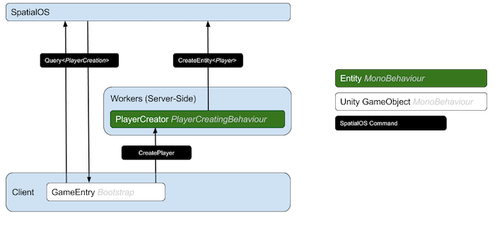

# SpatialOS SDK for Unity client connection lifecycle

All online multiplayer games need to handle players connecting and disconnecting. In a SpatialOS game, player clients
need to have an entity in the world associated with them.

**This recipe gives a basic overview of the connection process with the SpatialOS SDK for Unity**, and covers a simple
implementation of client connection lifecycle:

* [When a player client connects, create a new entity for them](#creating-a-player-entity-when-a-client-connects).
* [When the client disconnects, delete the entity](#removing-the-player-entity-when-the-client-disconnects).

**Future recipes will cover how to add custom functionality**. This includes more complex solutions: for example, where
players log in using 3rd-party authentication via a splash screen, and where you load stored user data. You could even
make the player entity persist while the player is offline.

You can use the [Blank Project](https://github.com/spatialos/BlankProject/tree/master)
as the starting point for this recipe.

> You can find the completed code in the
[Starter Project](https://github.com/spatialos/StarterProject/tree/master) on GitHub.

## Creating a Player entity when a client connects

Workers create entities using the `CreateEntity()` command. But in games, you don't want to give clients the power to
send such commands directly, to limit what a malicious client would be able to do (you could also enforce this using
[worker permissions (SpatialOS documentation)](https://docs.improbable.io/reference/13.0/shared/worker-configuration/permissions), which aren't covered in this recipe).

This means clients need to communicate with a server-side worker in order to create a player. So instead of creating an
entity themselves, you can use a pattern where clients send a component command to a `PlayerCreator` entity, requesting
that the creation of an entity. On the server side, the `PlayerCreator` then runs the `CreateEntity()` command to create
the player entity.

This diagram illustrates the pattern:



Overview of player creation process:

1. Create the required components for requesting the `Player` creation, connecting the client and positioning the `Player`.
2. Extend `Bootstrap.cs` with a callback when the client connects to request the `Player` creation.
3. Set up the templates and prefabs for the `PlayerCreator` and `Player` entities.
4. Respond to the `CreatePlayer` command on the `PlayerCreator` entity.
5. Set the initial position of the `Player` in the Unity client.

### 1. Create the components in schema

The following components are needed for connection. Create these schema files in the `/schema` directory:

1. `PlayerCreation.schema`: defines a `PlayerCreation` component, which contains a command that a client can use to
    request the creation of a player entity.

    ```
    package improbable.core;

    type CreatePlayerRequest {}
    type CreatePlayerResponse {
        int32 status_code = 1;
    }

    component PlayerCreation {
        id = 1001;
        command CreatePlayerResponse create_player(CreatePlayerRequest);
    }
    ```

2. `ClientConnection.schema`: this is just an example component that will be added to the player. A client worker
    needs to have write access to at least one component on the player entity.

    ```
    package improbable.player;

    component ClientConnection {
        id = 1002;
    }
    ```

Now run `spatial worker codegen` to generate Unity code for these schema changes.

If you haven't built the project since cloning it, you also need to run `spatial worker build`.

### 2. Extend Bootstrap.cs

All SpatialOS projects should contain a `GameEntry` object in both the `UnityClient` and `UnityWorker` scenes. This object
has a script called `Bootstrap` which controls the worker connection to SpatialOS. You can use this script to implement
a custom login flow.

`Bootstrap` is used to start both client and server-side workers, so it does a lot. The following method call adds the
MonoBehaviours that enable interaction with SpatialOS to the GameEntry:

```
SpatialOS.Connect(gameObject);
```

Referring back to the diagram, `Bootstrap` needs to:

* Locate the `PlayerCreator` entity using an entity query
* Send a `CreatePlayer` command to that entity

You'll implement this in the callback for a successful `SpatialOS.Connect(...)` call. The callback will search for a
`PlayerCreator` entity (via the `PlayerCreation` component), and if it finds one, send it the command:

1. In `Bootstrap.cs`, replace the line `SpatialOS.OnConnected += OnSpatialOsConnection;` with a callback to a method with
   a more descriptive name, for example `SpatialOS.OnConnected += CreatePlayer;`:

    ```csharp
    switch (SpatialOS.Configuration.WorkerPlatform)
    {
        case WorkerPlatform.UnityWorker:
            Application.targetFrameRate = SimulationSettings.TargetServerFramerate;
            SpatialOS.OnDisconnected += reason => Application.Quit();
            break;
        case WorkerPlatform.UnityClient:
            Application.targetFrameRate = SimulationSettings.TargetClientFramerate;
            // You're changing this
            SpatialOS.OnConnected += CreatePlayer;
            break;
    }
    ```

2. Implement the callback, which queries for an entity with the `PlayerCreation` component:

    ```csharp
    public void CreatePlayer()
    {
        var playerCreatorQuery = Query.HasComponent<PlayerCreation>().ReturnOnlyEntityIds();
        SpatialOS.WorkerCommands.SendQuery(playerCreatorQuery)
            .OnSuccess(OnSuccessfulPlayerCreatorQuery)
            .OnFailure(OnFailedPlayerCreatorQuery);
    }
    ```

3. In the `OnSuccess` callback of query, send the `CreatePlayer` command.

    ```csharp
    private void OnSuccessfulPlayerCreatorQuery(EntityQueryResult queryResult)
    {
        if (queryResult.EntityCount < 1)
        {
            Debug.LogError("Failed to find PlayerCreator. SpatialOS probably hadn't finished loading the initial snapshot. Trying again in a few seconds.");
            StartCoroutine(TimerUtils.WaitAndPerform(SimulationSettings.PlayerCreatorQueryRetrySecs, CreatePlayer));
            return;
        }

        var playerCreatorEntityId = queryResult.Entities.First.Value.Key;
        RequestPlayerCreation(playerCreatorEntityId);
    }

    // Send a CreatePlayer command to the PLayerCreator entity requesting a Player entity be spawned.
    private void RequestPlayerCreation(EntityId playerCreatorEntityId)
    {
        SpatialOS.WorkerCommands.SendCommand(PlayerCreation.Commands.CreatePlayer.Descriptor, new CreatePlayerRequest(), playerCreatorEntityId)
            .OnSuccess(response => OnCreatePlayerCommandSuccess(response, playerCreatorEntityId))
            .OnFailure(response => OnCreatePlayerCommandFailure(response, playerCreatorEntityId));
    }
    ```

4. If that command succeeds, check the status code to see if the player entity was created successfully.

    ```csharp
    private void OnCreatePlayerCommandSuccess(CreatePlayerResponse response, EntityId playerCreatorEntityId)
    {
        var statusCode = (StatusCode) response.statusCode;
        if (statusCode != StatusCode.Success) {
            Debug.LogWarningFormat("PlayerCreator failed to create the player entity. Status code = {0}. Try again in a few seconds.", statusCode.ToString());
            RetryCreatePlayerCommand(playerCreatorEntityId);
        }
    }

    // Retry a failed creation of the Player entity after a short delay.
    private void RetryCreatePlayerCommand(EntityId playerCreatorEntityId)
    {
        StartCoroutine(TimerUtils.WaitAndPerform(SimulationSettings.PlayerEntityCreationRetrySecs, () => RequestPlayerCreation(playerCreatorEntityId)));
    }

    ```


5. If that command fails, log a warning message and retry.

    ```csharp
    private void OnCreatePlayerCommandFailure(ICommandErrorDetails details, EntityId playerCreatorEntityId){
        Debug.LogWarningFormat("CreatePlayer command failed. Status code = {0}. - you probably tried to connect too soon. Try again in a few seconds.", details.StatusCode.ToString());
        RetryCreatePlayerCommand(playerCreatorEntityId);
    }
    ```
5. If the query fails, log an error message.

    ```
    private void OnFailedPlayerCreatorQuery(ICommandErrorDetails _)
    {
        Debug.LogError("PlayerCreator query failed. SpatialOS workers probably haven't started yet. Try again in a few seconds.");
        StartCoroutine(TimerUtils.WaitAndPerform(SimulationSettings.PlayerCreatorQueryRetrySecs, CreatePlayer));
    }
    ```
6. Add a new file `TimerUtils.cs`, which contains methods which are used to delay the retries.

    ```csharp
    using System;
    using System.Collections;
    using UnityEngine;

    namespace Assets.Gamelogic.Utils
    {
        public static class TimerUtils
        {
            public static IEnumerator WaitAndPerform(float bufferTime, Action action)
            {
                yield return new WaitForSeconds(bufferTime);
                action();
            }

            public static IEnumerator CallRepeatedly(float interval, Action action)
            {
                while (true)
                {
                    yield return new WaitForSeconds(interval);
                    action();
                }
            }
        }
    }
    ```
7. In `SimulationSettings.cs`, add the following constants. These define how long the client waits before it 
    retries the entity query and the `CreatePlayer` command.

    ```csharp
    public static class SimulationSettings
    {
        public static readonly float PlayerCreatorQueryRetrySecs = 4;
        public static readonly float PlayerEntityCreationRetrySecs = 4;
        ...
    ```


Here is [the completed Bootstrap.cs](https://github.com/spatialos/StarterProject/blob/master/workers/unity/Assets/Gamelogic/Core/Bootstrap.cs).

### 3. Set up the templates and prefabs for the PlayerCreator and Player entities

There's some more setup to be done: creating the entities and their associated prefabs.

This section assumes you're using two patterns that you can see in action in the [Pirates tutorial](../../tutorials/pirates/overview.md):

* An `EntityTemplateFactory` to generate entity templates ([see this example in the Pirates repository]
(https://github.com/spatialos/PiratesTutorial/blob/master/workers/unity/Assets/Gamelogic/EntityTemplates/EntityTemplateFactory.cs)).
* A `SimulationSettings` file to contain game-wide settings ([see this example in the Pirates repository]
(https://github.com/spatialos/PiratesTutorial/blob/master/workers/unity/Assets/Gamelogic/Core/SimulationSettings.cs)).

To set up the entities:

1. In `EntityTemplateFactory.cs`, add any of the following `using` statements that you don't have already:

    ```csharp
    using Assets.Gamelogic.Core;
    using Improbable;
    using Improbable.Core;
    using Improbable.Player;
    using Improbable.Unity.Core.Acls;
    using Improbable.Unity.Entity;
    using Improbable.Worker;
    using UnityEngine;
    ```

2. Add a method that creates a template for the `PlayerCreator` entity.

    ```csharp
    public static Entity CreatePlayerCreatorTemplate()
    {
        return EntityBuilder.Begin()
            .AddPositionComponent(Vector3.zero, CommonRequirementSets.PhysicsOnly)
            .AddMetadataComponent(SimulationSettings.PlayerCreatorPrefabName)
            .SetPersistence(true)
            .SetReadAcl(CommonRequirementSets.PhysicsOnly)
            .AddComponent(new PlayerCreation.Data(), CommonRequirementSets.PhysicsOnly)
                .Build();
    }
    ```

3. Do the same for the `Player` entity.

    ```csharp
    public static Entity CreatePlayerTemplate(string clientId)
    {
        return EntityBuilder.Begin()
            .AddPositionComponent(Vector3.zero, CommonRequirementSets.PhysicsOnly)
            .AddMetadataComponent(SimulationSettings.PlayerPrefabName)
            .SetPersistence(false)
            .SetReadAcl(CommonRequirementSets.PhysicsOrVisual)
            .AddComponent(
                new ClientConnection.Data(),
                CommonRequirementSets.SpecificClientOnly(clientId))
            .Build();
    }
    ```

    > The client worker **must have** write access to at least one component, or it
    won't be able to check out the entity.
    
    > This method gets passed the ID of the client worker. You'll pass
    that value later through the `CreatePlayer` command.

4. In `SimulationSettings`, define the names of their prefabs:

    ```csharp
    public static class SimulationSettings
    {
        public static readonly string PlayerPrefabName = "Player";
        public static readonly string PlayerCreatorPrefabName = "PlayerCreator";
        ...
    ```

5. Add `CreatePlayerCreatorTemplate` to `SnapshotMenu`, located in `Assets/Editor`. This adds the `PlayerCreator` entity
to the snapshot at the start of the simulation, so the entity is there from the beginning.

    ```csharp
    private static void GenerateDefaultSnapshot()
    {
        var snapshotEntities = new Dictionary<EntityId, Entity>();
        var currentEntityId = 1;

        snapshotEntities.Add(new EntityId(currentEntityId++), EntityTemplateFactory.CreatePlayerCreatorTemplate());
        SaveSnapshot(snapshotEntities);
    }
    ```

6. Create empty prefabs called `PlayerCreator` and `Player`.

    You can see an example of how to do this in the
    [Unity entity creation recipe](../../tutorials/recipes/entity-creation.md).

### 4. Respond to the player creation command

At this point, Bootstrap is sending a `CreatePlayer` command, but nothing is responding to it. The `PlayerCreator` entity
should receive the `CreatePlayer` command and then create a `Player` entity. Here's a basic implementation, adhering to
the basic patterns for both [receiving commands](../../interact-with-world/interact-components.md#responding-to-a-command-request)
and [creating new entities](../../interact-with-world/create-delete-entities.md#create-an-entity):

0. On the `PlayerCreator` prefab, create a new script, `PlayerCreatingBehaviour`.
1. Add the following `using` statements:

    ```csharp
    using Assets.Gamelogic.EntityTemplates;
    using Assets.Gamelogic.Core;
    using Improbable;
    using Improbable.Entity.Component;
    using Improbable.Core; // or whichever package you used for the schema files earlier
    using Improbable.Unity;
    using Improbable.Unity.Core;
    using Improbable.Unity.Visualizer;
    using Improbable.Worker;
    using UnityEngine;
    ```

2. In `OnEnable`, register an asynchronous response to the command `CreatePlayer`, and deregister it in `OnDisable`.

    ```csharp
    [Require]
    private PlayerCreation.Writer PlayerCreationWriter;

    private void OnEnable()
    {
        PlayerCreationWriter.CommandReceiver.OnCreatePlayer.RegisterAsyncResponse(OnCreatePlayer);
    }

    private void OnDisable()
    {
        PlayerCreationWriter.CommandReceiver.OnCreatePlayer.DeregisterResponse();
    }
    ```

3. Implement the callback, which sends the entity creation command. This responds to the `CreatePlayer` command with a SpatialOS
    status code indicating if the player entity was created successfully. If it was not, the client will retry after a few seconds.
    This retry logic is in `Bootstrap.cs`.

    ```csharp
    private void OnCreatePlayer(ResponseHandle<PlayerCreation.Commands.CreatePlayer, CreatePlayerRequest, CreatePlayerResponse> responseHandle)
    {
        var clientWorkerId = responseHandle.CallerInfo.CallerWorkerId;
        var playerEntityTemplate = EntityTemplateFactory.CreatePlayerTemplate(clientWorkerId);
        SpatialOS.Commands.CreateEntity (PlayerCreationWriter, playerEntityTemplate)
            .OnSuccess (_ => responseHandle.Respond (new CreatePlayerResponse ((int) StatusCode.Success)))
            .OnFailure (failure => responseHandle.Respond (new CreatePlayerResponse ((int) failure.StatusCode)));
    }
    ```

### 5. Set the player's initial position

While not necessary to demonstrate the connection lifecycle, setting the position of entities is something
you’ll usually want to do. You can achieve a basic version like this:

0. On the `Player` prefab, create a new script `TransformReceiver`:

    ```csharp
    using Improbable;
    using Improbable.Worker;
    using Improbable.Unity.Visualizer;
    using UnityEngine;

    namespace Assets.Gamelogic.Core
    {
        public class TransformReceiver : MonoBehaviour
        {
            [Require]
            private Position.Reader PositionReader;

            void OnEnable()
            {
                transform.position = PositionReader.Data.coords.ToUnityVector();

                PositionReader.ComponentUpdated.Add(OnComponentUpdated);
            }

            void OnDisable()
            {
                PositionReader.ComponentUpdated.Remove(OnComponentUpdated);
            }

            void OnComponentUpdated(Position.Update update)
            {
                if (!PositionReader.Authority == Authority.Authoritative)
                {
                    if (update.coords.HasValue)
                    {
                        transform.position = update.coords.Value.ToUnityVector();
                    }
                }
            }
        }
    }
    ```

The [completed code](https://github.com/spatialos/StarterProject/tree/master) extends this further, to also receive rotation information.

## Removing the player entity when the client disconnects

In most SpatialOS simulations you will want to delete the `Player` entity when the user exits the
Unity client.

A deliberate client disconnection would be implemented with some UI where you could save game state to some third party
storage before calling `SpatialOS.Disconnect()`. Implementing such a feature is outside the scope of this recipe, so we'll
handle the general case of a client detected as inactive. This encompasses both when the user unclicks the play button
within Unity, and when the application crashes. This is handled using heartbeats.

Heartbeats involve the client repeatedly indicating to a server-side worker that it is still connected to SpatialOS. This
sounds intensive, but triggering one event per client every few seconds is okay. If the server-side worker doesn't receive any
events from the client within a given period of time, the server-side worker will assume the client has died, and deletes
the `Player` entity associated with that client. Both the scripts for the client and server worker sides of this
interaction can be implemented as MonoBehaviours on the `Player` prefab as follows:

0. Extend the `ClientConnection` component with a new `heartbeat` event.

    ```
    package improbable.player;

    type Heartbeat{}

    component ClientConnection {
        id = 1002;
        event Heartbeat heartbeat;
    }
    ```
0. Add a `HeartbeatCounter.schema` script to the `schema` folder defining a new component:
    ```
    package improbable.player;

    component HeartbeatCounter {
        id = 1003;
        uint32 timeout_beats_remaining = 1;
    }
    ```

  The `timeout_beats_remaining` property allows you to configure how many heartbeats can be missed before the client is
  considered disconnected, so that infrequent lag spikes don't disconnect the client.

0. Because you've made schema changes, run `spatial worker codegen`.

0. Add these values to `SimulationSettings` (you'll use them in the next few steps):

    ```csharp
    public static readonly float HeartbeatCheckIntervalSecs = 3;
    public static readonly uint TotalHeartbeatsBeforeTimeout = 3;
    public static readonly float HeartbeatSendingIntervalSecs = 3;
    ```

0. Add a `SendClientConnection` client-side script that uses a coroutine to send heartbeat events periodically:
   ```csharp
    using Assets.Gamelogic.Core;
    using Assets.Gamelogic.Utils;
    using Improbable.Player;
    using Improbable.Unity;
    using Improbable.Unity.Visualizer;
    using UnityEngine;

    namespace Assets.Gamelogic.Player
    {
       [WorkerType(WorkerPlatform.UnityClient)]
       public class SendClientConnection : MonoBehaviour
       {
           [Require]
           private ClientConnection.Writer ClientConnectionWriter;

           private Coroutine heartbeatCoroutine;

           private void OnEnable()
           {
               heartbeatCoroutine = StartCoroutine(TimerUtils.CallRepeatedly(SimulationSettings.HeartbeatSendingIntervalSecs, SendHeartbeat));
           }

           private void OnDisable()
           {
               StopCoroutine(heartbeatCoroutine);
           }

           private void SendHeartbeat()
           {
               ClientConnectionWriter.Send(new ClientConnection.Update().AddHeartbeat(new Heartbeat()));
           }
       }
    }
    ```

0. Add a `HandleClientConnection` server-side script that uses a coroutine to check whether the client is still sending
    heartbeats.

    This is implemented through the coroutine decrementing the `timeoutBeatsRemaining` property; receiving a `Heartbeat`
    event resets to the default count. If the server worker doesn't receive a `Heartbeat` for too long,
    `timeoutBeatsRemaining` will reach `0`, and the server worker will delete the `Player` entity.

    ```csharp
    using Assets.Gamelogic.Core;
    using Assets.Gamelogic.Utils;
    using Improbable.Player;
    using Improbable.Unity;
    using Improbable.Unity.Core;
    using Improbable.Unity.Visualizer;
    using UnityEngine;

    namespace Assets.Gamelogic.Player
    {
        [WorkerType(WorkerPlatform.UnityWorker)]
        public class HandleClientConnection : MonoBehaviour
        {
            [Require]
            private HeartbeatCounter.Writer HeartbeatCounterWriter;
            [Require]
            private ClientConnection.Reader ClientConnectionReader;

            private Coroutine heartbeatCoroutine;

            private void OnEnable()
            {
                ClientConnectionReader.HeartbeatTriggered.Add(OnHeartbeat);
                heartbeatCoroutine = StartCoroutine(TimerUtils.CallRepeatedly(SimulationSettings.HeartbeatCheckIntervalSecs, CheckHeartbeat));
            }

            private void OnDisable()
            {
                ClientConnectionReader.HeartbeatTriggered.Remove(OnHeartbeat);
                StopCoroutine(heartbeatCoroutine);
            }

            private void OnHeartbeat(Heartbeat _)
            {
                SetHeartbeat(SimulationSettings.TotalHeartbeatsBeforeTimeout);
            }

            private void SetHeartbeat(uint timeoutBeatsRemaining)
            {
                HeartbeatCounterWriter.Send(new HeartbeatCounter.Update().SetTimeoutBeatsRemaining(timeoutBeatsRemaining));
            }

            private void CheckHeartbeat()
            {
                var heartbeatsRemainingBeforeTimeout = HeartbeatCounterWriter.Data.timeoutBeatsRemaining;
                if (heartbeatsRemainingBeforeTimeout == 0)
                {
                    StopCoroutine(heartbeatCoroutine);
                    DeletePlayerEntity();
                    return;
                }
                SetHeartbeat(heartbeatsRemainingBeforeTimeout - 1);
            }

            private void DeletePlayerEntity()
            {
                SpatialOS.Commands.DeleteEntity(HeartbeatCounterWriter, gameObject.EntityId());
            }
        }
    }
    ```

0. In `EntityTemplateFactory`, add the `HeartbeatCounter` component and give an initial value for
    the `timeout_beats_remaining` property:

    ```csharp
    public static Entity CreatePlayerTemplate(string clientId)
    {
        return EntityBuilder.Begin()
            .AddPositionComponent(Vector3.zero, CommonRequirementSets.PhysicsOnly)
            .AddMetadataComponent(SimulationSettings.PlayerPrefabName)
            .SetPersistence(false)
            .SetReadAcl(CommonRequirementSets.PhysicsOrVisual)
            .AddComponent(
                new ClientConnection.Data(),
                CommonRequirementSets.SpecificClientOnly(clientId))
            .AddComponent(
                new HeartbeatCounter.Data(SimulationSettings.TotalHeartbeatsBeforeTimeout),
                CommonRequirementSets.PhysicsOnly)
            .Build();
    }
    ```

0. Now you've set everything up, generate a new snapshot which includes the new `PlayerCreator` entity:
To do this use the menu
   `Improbable > Snapshots > Generate Default Snapshot`
0. Build the workers so they include the new logic: in the SpatialOS window (`Window > SpatialOS`),
under `Workers`, click `Build`.

You can test it worked by [running a local deployment](../../develop/deploy.md) (`spatial local launch`).
Once you've successfully [connected a UnityClient](../../develop/deploy.md#connect-a-client),
unclick the play button with the Unity client.

In the Inspector, you should see the UnityClient disappearing from the Workers list. If you wait a few seconds, the
heartbeat timeout should kick in, causing the `Player` entity to be successfully deleted.
