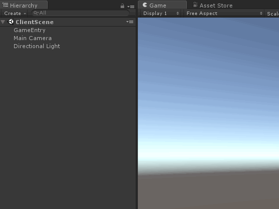
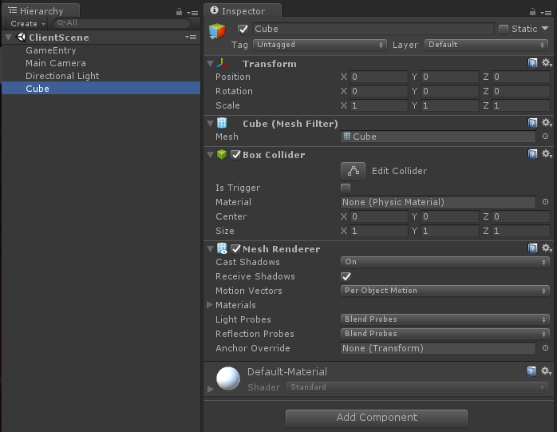
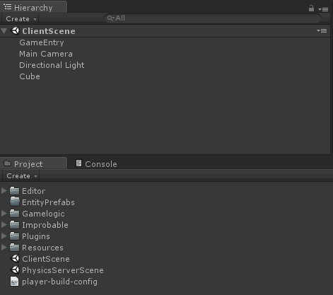
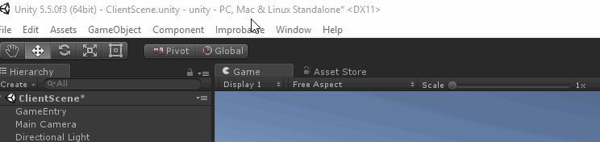
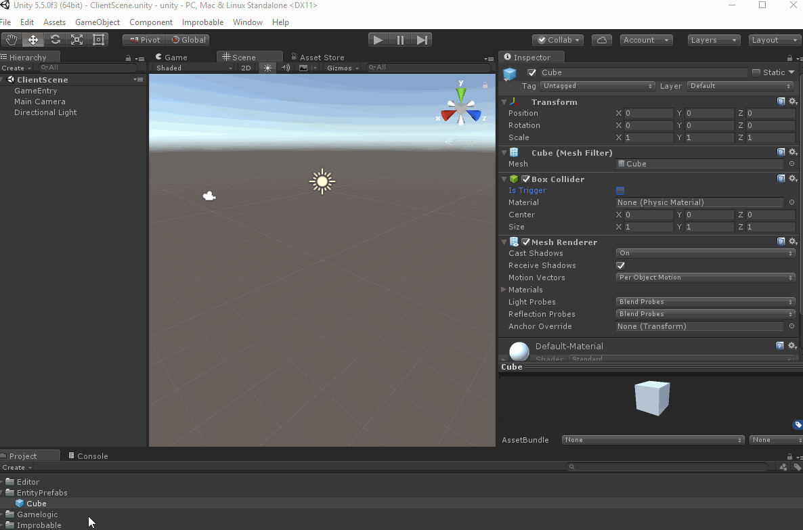
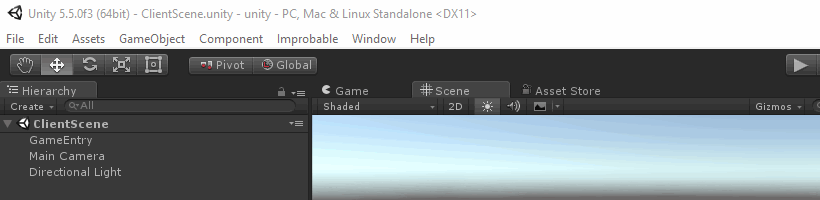
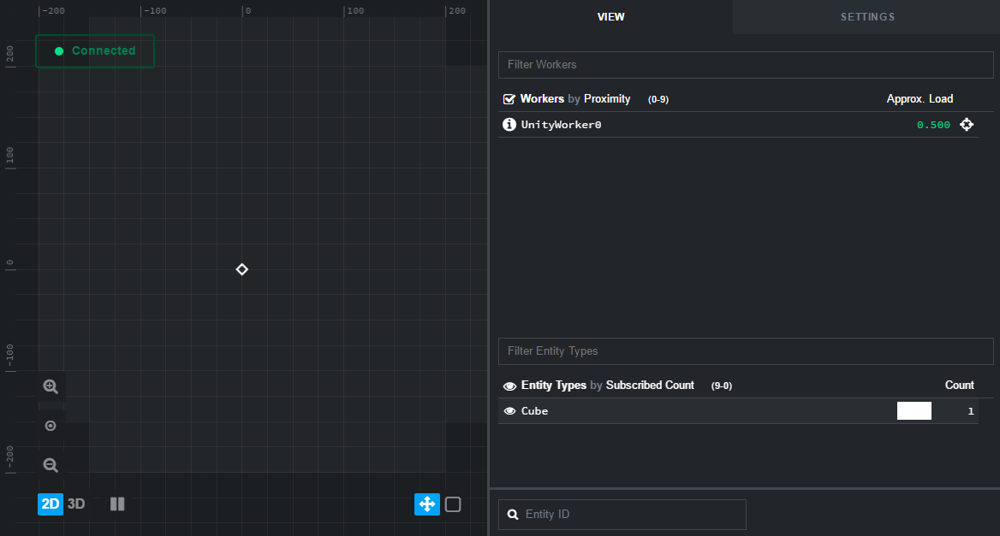

# Creating an entity with the Unity SDK

This recipe shows how to add an entity to a SpatialOS simulation with the Unity SDK.

The entity is created in a [snapshot (SpatialOS documentation)](https://docs.improbable.io/reference/12.2/shared/operate/snapshots), meaning it will exist when the
simulation starts. For an example of creating an entity at runtime, see the
[Unity client lifecycle recipe](../../tutorials/recipes/client-lifecycle.md#4-respond-to-the-player-creation-command).

You can use the [Blank Project](https://github.com/spatialos/BlankProject/tree/master) as the starting point for this recipe.

> You can find the completed code in the
[Starter Project](https://github.com/spatialos/StarterProject/tree/master) on GitHub.

If you want to visualize the entity in a Unity client, you would have to create a
Player entity as implemented in the [Starter Project](https://github.com/spatialos/StarterProject/tree/master).

## 1. Create the prefab

Prefabs are the basic Unity asset type, which have a 1-1 relationship with the entity templates used
to create SpatialOS entities. The prefab name is referenced as part of the entity template, so it makes sense to create the prefab first.

This can be done in a multitude of ways, one of the simplest being:

1. Right-click in the Unity *Hierarchy* panel.

2. Either select `Create Empty` or one of the basic templates (for example, *Cube*).

    

    Selecting this in the hierarchy then displays the prefab details in the Unity *Inspector* panel:

    

    If you selected `CreateEmpty`, the prefab will only have the Unity `Transform` component in the
    inspector and no physical or visual representation in the Unity Scene viewport.

    At this point you could add other Unity MonoBehaviours to the prefab, such as a typical
    `TransformReceiver` and `TransformSender` pair to handle position updates.

3. Save it to the `EntityPrefabs` folder in the Unity *Project* panel.

    

4. Export the prefab via the `Improbable > Prefabs > Export All
EntityPrefabs` drop-down menu:

    

If you want to make changes to the prefab later, you can do so by either:

* Directly changing the prefab in the `EntityPrefabs` folder.

* Dragging the prefab into the scene, making a change, and then pressing `Apply`.




**Every time you change a prefab in Unity, don't forget to run Export Prefabs in the Improbable menu!**

## 2. Define the entity template

Entities are spawned both dynamically at runtime, and via snapshots at startup, using entity
templates. This entity template describes:

 * What components the entity has
 * How read and write access for those components are distributed between workers. More
 information is available in the
 [glossary (SpatialOS documentation)](https://docs.improbable.io/reference/12.2/shared/glossary#entity-template).

A good pattern is to define methods that create entity templates in a script like `EntityTemplateFactory.cs`. 
We normally locate it in `Assets/Gamelogic/EntityTemplates`, and it looks like this:

```c#
using Improbable.Worker;
using Improbable.Core;
using Improbable.Unity.Core.Acls;
using Improbable.Math;

namespace Assets.Gamelogic.EntityTemplates
{
  public static class EntityTemplateFactory
  {
    // Add methods to define entity templates
  }
}
```

You can implement a minimal entity template creation method as follows:

```c#
public static Entity CreateCubeTemplate()
{
  return EntityBuilder.Begin()
      .AddPositionComponent(Vector3.zero, CommonRequirementSets.PhysicsOnly)
      .AddMetadataComponent("Cube")
      .SetPersistence(true)
      .SetReadAcl(CommonRequirementSets.PhysicsOrVisual)
      .Build();
}
```

This returns an entity template which will:

 1. Spawn the prefab named *Cube* (which you previously created) at position *(0, 0, 0)*
 2. Give the server write access over the position.
 3. Allow the entity to be persisted to a snapshot.
 4. Grant read access of the entity to both the server and clients.

## 3. Add the entity to a snapshot

Adding an entity to the snapshot means it will be present in the world when the simulation starts.
There is a template script to programmatically generate snapshots, `SnapshotMenu.cs` under
`Assets/Editor`, that is used in the tutorials and the Starter Project.

Here you call entity template methods to add entities to our snapshot:

```c#
[MenuItem("Improbable/Snapshots/Generate Default Snapshot")]
private static void GenerateDefaultSnapshot()
{
  var snapshotEntities = new Dictionary<EntityId, Entity>();

  var currentEntityId = 1;
  snapshotEntities.Add(new EntityId(currentEntityId++), EntityTemplateFactory.CreateCubeTemplate());

  SaveSnapshot(snapshotEntities);
}
```

To create the snapshot, use the `Improbable > Snapshots > Generate Default Snapshot` drop-down menu:



To test this succeeded, start a simulation using `spatial local launch` and open the
[inspector](http://localhost:21000/inspector):


