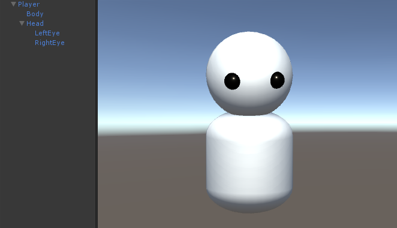
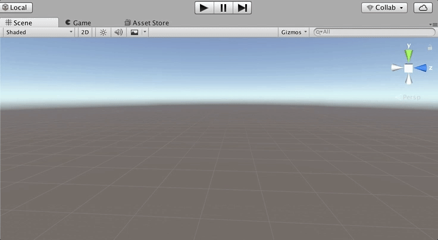
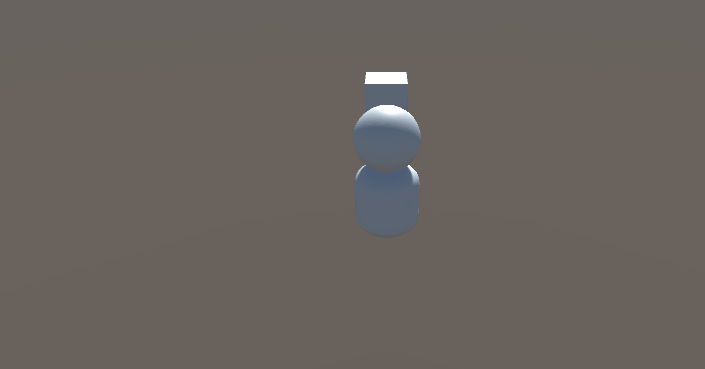
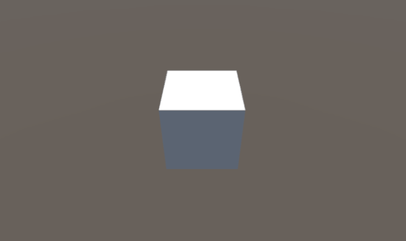
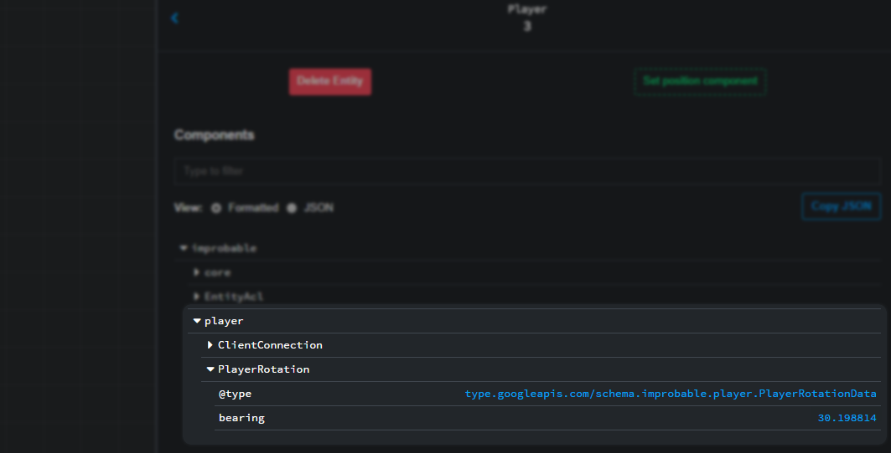

# Player camera visualization with the Unity SDK

This recipe covers adding a model and basic camera controls to a Player in Unity for first-person and
third-person perspectives. This involves:

* creating a visual representation of the player entity
* using a single-camera setup to avoid camera conflicts
* adding a script for controlling the camera
* synchronising the character’s rotation across SpatialOS so all clients and server-side workers can visualize the
character accurately

If you only need one of the two camera styles, you can skip the section covering the other, or you can adapt the approach
found here to your own custom camera control scheme.

You can use the [Unity Starter Project](https://github.com/spatialos/StarterProject/tree/master) as the starting point for this recipe.

## 1. Create the player model

To see how your camera control scheme is working, you will need a visual representation for the Player entity.

Unity represents SpatialOS entities by instantiating a prefab of the correct type into the scene.
The EntityTemplate for `Player` entities in the Starter Project codebase specifies that it will use the EntityPrefab
named “Player”. You can find this prefab in the `Assets/EntityPrefabs` folder.

You can build your Player prefab however you want, but the simplest way is to:

1. Drag the existing `Player` prefab into the scene.

2. Right-click it in the scene hierarchy.

3. Add some default Unity 3D Objects as children of the prefab root.

    

    This simple example prefab includes some spheres for eyes to allow you to verify which direction the Player
    GameObject is facing.

4. Apply the changes to the prefab.

5. Remove the `Player` GameObject from the scene. Keeping it in the scene will cause errors, because the player needs to
    be instantiated by SpatialOS.

## 2. Working with player cameras

If you placed a camera on the `Player` EntityPrefab itself, you'd run into problems: when two players are visualized on
the same client, each of them would be instantiated with a camera, which would not work as expected.

Instead, for best practice, you should:

* place a camera in your UnityClient scene so it is a local resource on the client-side
* reference the scene camera from any script that controls the camera, and move the camera to the correct position relative
to the `Player` GameObject
* use SpatialOS `[Require]` attribute in your camera controls scripts to ensure the camera
is only used by the `Player`’s own character GameObject

The most commonly used camera perspectives are [first-person](#first-person-camera) and [third-person](#third-person-camera)
Depending on your game’s camera control scheme you may wish to add one or both of the scripts to your `Player` EntityPrefab.

The Starter Project already contains a camera in the scene called `MainCamera`, and the first-person and third-person camera
control scripts below will refer to that camera.

If you choose to use your own custom camera control script, be aware of the SpatialOS-specific additions:

* requiring a writer for the `ClientConnection` component
* acquiring a reference to the scene camera in `OnEnable()`

### Third-person camera

Third-person cameras float above the Player character’s head and look down, so you can see both the player’s model and some
of the environment in front of them. They typically also allow the user to rotate the view to observe the environment but
not affect the orientation of the Player avatar itself.

The third-person camera script you are creating in this section must:

* run only on the client-side
* run only on the `Player` GameObject being controlled by the current client
* obtain a reference to the camera in the client’s local scene
* make the camera move with the `Player` GameObject by parenting the transforms
* set the camera an initial distance from the `Player` gameobject and view direction

Using the `[Require]` attribute and a `Writer` object ensures a script is only enabled on workers which have write access over
the specified component. The ACL for the `Player` entity template specifies that only the client that owns this `Player`
entity can have write access to the `ClientConnection` component. This means that for any given `Player` entity, its camera
control scripts will only run on the corresponding client.

Later, you will also add some mouse controls to rotate the camera.

Add the following `ThirdPersonCamera.cs` script to the `Player` prefab, located in `Assets/EntityPrefabs`:

```csharp
using Assets.Gamelogic.Core;
using Improbable.Core;
using Improbable.Unity.Visualizer;
using UnityEngine;

namespace Assets.Gamelogic.Player
{
    public class ThirdPersonCamera : MonoBehaviour
    {
        [Require]
        private ClientAuthorityCheck.Writer ClientAuthorityCheckWriter;

        private Transform camera;
        private UnityEngine.Quaternion cameraRotation;
        private float cameraDistance;

        private void OnEnable()
        {
            // Grab the camera from the Unity scene
            camera = Camera.main.transform;
            // Set the camera as a child of the Player to easily ensure the camera follows the Player
            camera.parent = transform;
            // Set the camera rotation and zoom distance to some initial values
            cameraRotation = SimulationSettings.InitialThirdPersonCameraRotation;
            cameraDistance = SimulationSettings.InitialThirdPersonCameraDistance;

        }

        private void LateUpdate()
        {
            SetCameraTransform();
        }

        // Update the position and orientation of the camera to match the cameraRotation and cameraDistance
        private void SetCameraTransform()
        {
            // Set the position of the camera based on the desired rotation towards and distance from the Player model
            camera.localPosition = cameraRotation * Vector3.back * cameraDistance;
            // Set the camera to look towards the Player model
            camera.LookAt(transform.position);
        }
    }
}
```

This script makes use of some constants specified in a file called `SimulationSettings.cs`, but you can add them to some
other location if you’d prefer:

```csharp
public static readonly Quaternion InitialThirdPersonCameraRotation = Quaternion.Euler(40, 0, 0);
public static readonly float InitialThirdPersonCameraDistance = 15;
```

To test this camera you must:

1. Export prefabs using the menu `Improbable > Prefabs > Export All EntityPrefabs`.

2. Run the simulation with `spatial local launch`.

3. Connect a client through your Unity instance.

    

For a classic third-person camera you should enable the user to adjust the camera pitch, yaw and distance to the avatar
using their mouse.

In the following script the camera pitch and yaw are adjusted based on the movement of the mouse within the viewport while
the user is holding down the right mouse button. The camera’s distance to the player model is adjusted by scrolling of
the user’s mouse wheel.

Add the following methods to the `ThirdPersonCamera.cs` script you already created:

```csharp
private void Update()
{
    SelectNextCameraDistance();
    SelectNextCameraRotation();
}

// If the user scrolls up on their mousewheel then zoom in, if they scroll down then zoom out
private void SelectNextCameraDistance()
{
    var mouseScroll = Input.GetAxis(SimulationSettings.MouseScrollWheel);
    if (!mouseScroll.Equals(0f))
    {
        var distanceChange = cameraDistance - mouseScroll * SimulationSettings.ThirdPersonZoomSensitivity;
        cameraDistance = Mathf.Clamp(distanceChange, SimulationSettings.ThirdPersonCameraMinDistance,
            SimulationSettings.ThirdPersonCameraMaxDistance);
    }
}

// If the user holds right mouse button and moves their mouse about, the camera rotates around the player
private void SelectNextCameraRotation()
{
    if (Input.GetMouseButton(SimulationSettings.RotateCameraMouseButton))
    {
        var yaw = (cameraRotation.eulerAngles.y + Input.GetAxis("Mouse X") * SimulationSettings.ThirdPersonCameraSensitivity) % 360f;
        var pitch = Mathf.Clamp(cameraRotation.eulerAngles.x - Input.GetAxis("Mouse Y") * SimulationSettings.ThirdPersonCameraSensitivity,
                SimulationSettings.ThirdPersonCameraMinPitch,
                SimulationSettings.ThirdPersonCameraMaxPitch);
        cameraRotation = UnityEngine.Quaternion.Euler(new Vector3(pitch, yaw, 0));
    }
}
```

Once again, some constants are referred to as being stored in `SimulationSettings.cs`, but you can add them to some other
location if you’d prefer:

```csharp
public static readonly string MouseScrollWheel = "Mouse ScrollWheel";
public static readonly float ThirdPersonZoomSensitivity = 3f;
public static readonly float ThirdPersonCameraMinDistance = 4f;
public static readonly float ThirdPersonCameraMaxDistance = 20f;
public static readonly int RotateCameraMouseButton = 1;
public static readonly float ThirdPersonCameraSensitivity = 2f;
public static readonly float ThirdPersonCameraMinPitch = 5f;
public static readonly float ThirdPersonCameraMaxPitch = 70f;
```

To test these changes:

1. Make sure `ThirdPersonCamera.cs` is on the `Player` prefab.

2. Export prefabs using the menu `Improbable > Prefabs > Export All EntityPrefabs`.

3. Run the simulation with `spatial local launch`.

4. Connect a client through your Unity instance.

5. **Hold right-click on your mouse** and rotate the camera around the player character.

    

From the positions of the player and the cube (which is present in the Starter Project’s client scene), you can see that the
camera is rotating, rather than the player character themselves.

### First-person camera

The position of the first-person camera remains fixed relative to the character model, with the pitch and yaw once again
changing based on mouse movement.

The first-person camera script must:

* run only on the client-side
* run only on the `Player` GameObject being controlled by the current client
* obtain a reference to the camera in the UnityClient scene
* make the camera move with the `Player` GameObject by parenting the transforms
* position the camera roughly at the player’s head
* rotate the camera based on mouse position on each update call

As in the third-person example above, make the first-person camera control script run only on the controlling player’s
client by using SpatialOS syntax to require a `ClientConnection` writer.

Add the following `FirstPersonCamera.cs` script to the `Player` EntityPrefab:

```csharp
using Assets.Gamelogic.Core;
using Improbable.Core;
using Improbable.Unity.Visualizer;
using UnityEngine;
using Quaternion = UnityEngine.Quaternion;

namespace Assets.Gamelogic.Player
{
    public class FirstPersonCamera : MonoBehaviour
    {
        [Require]
        private ClientAuthorityCheck.Writer ClientAuthorityCheckWriter;

        private Transform camera;
        private float pitch;

        private void OnEnable()
        {
            // Grab the camera from the Unity scene
            camera = Camera.main.transform;
            // Set the camera as a child of the Player to easily ensure the camera follows the Player
            camera.parent = transform;
            // Position the camera at the same location as the Player
            camera.localPosition = SimulationSettings.FirstPersonCameraOffset;

            Cursor.lockState = CursorLockMode.Locked;    
        }

        private void Update ()
        {
            SetCameraRotation();
        }

        // Update the pitch of camera object and the yaw of the Player object
        private void SetCameraRotation()
        {
            // Take the new yaw (horizontal look) based on the position on the lateral position of the mouse in the viewport
            var yaw = (transform.rotation.eulerAngles.y + Input.GetAxis("Mouse X") * SimulationSettings.FirstPersonCameraSensitivity) % 360f;
            // Take the new pitch (vertical look) based on the position on the vertical position of the mouse in the viewport
            pitch = Mathf.Clamp(pitch - Input.GetAxis("Mouse Y") * SimulationSettings.FirstPersonCameraSensitivity, -SimulationSettings.FirstPersonCameraMaxPitch, -SimulationSettings.FirstPersonCameraMinPitch);
            // Update the pitch value of the camera
            camera.localRotation = Quaternion.Euler(new Vector3(pitch, 0, 0));
        }
    }
}
```
Once again, some constants are referred to as being stored where in `SimulationSettings.cs`, but you can add them to some
other location if you’d prefer:

```csharp
public static readonly Vector3 FirstPersonCameraOffset = new Vector3(0, 2.5f, 0.2f);
public static readonly float FirstPersonCameraSensitivity = 1f;
public static readonly float FirstPersonCameraMaxPitch = 70f;
public static readonly float FirstPersonCameraMinPitch = -80f;
```

To test these changes you must:

1. Make sure `FirstPersonCamera.cs` script is on the `Player` prefab.

2. If the `ThirdPersonCamera.cs` script was previously added to the `Player` prefab, remove it.

3. Export prefabs using the menu `Improbable > Prefabs > Export All EntityPrefabs`.

4. Run the simulation with `spatial local launch`.

5. Connect a client through your Unity instance.

6. Move the mouse to change the orientation of the camera:

    

## 3. Rotating the Player entity

The current implementation in both first-person and third-person is a “free-look” mode which rotates the camera but does
not affect the direction the player model is facing.

For many games, only the rotation of the player around the up-vector (the y-axis in Unity’s coordinate system) matters to how
the player entity will be visualized. To update the model’s rotation based on the camera’s rotation, the following line is needed:

```csharp
// Update the yaw value of the Player transform
transform.rotation = Quaternion.Euler(new Vector3(0, yaw, 0));
```

Add this line to the bottom of the `SetCameraRotation()` function, inside `FirstPersonCamera.cs`
This behaviour is standard and expected for first-person camera schemes, but this line of code could also be used in a
third-person script for an "over the shoulder" camera scheme.

Some games allow you to use “free-look” mode while a key is being held.
By wrapping the above line of code in an user input check you can switch between free-look and rotation locked to the camera:

```csharp
if (!Input.GetKey(KeyCode.LeftAlt))
{
    // Update the yaw value of the Player transform
    transform.rotation = Quaternion.Euler(new Vector3(0, yaw, 0));
}
```
## 4. Synchronising rotation

So far these camera rotations and player model rotations are entirely client-side, seen only by the player themselves.
To allow other clients (and the server) to rotate their own local models of the `Player` entity, the rotation information
needs to be synchronised across SpatialOS.

To synchronise this information across SpatialOS you must:

* add a `PlayerRotation` component to the project’s schema
* include the component in the `Player` entity template
* determine which worker type should be given write access to the component
* modify scripts to read from and write to the component

### Create the PlayerRotation component

As previously stated, most games only require the entity’s rotation around the up-vector (the y-axis in Unity’s coordinate
system) to be visualized for other players. This means you can represent the entity’s rotation using a single float value.

1. Create a new schema file called `PlayerRotation.schema` with the following contents:

    ```
    package improbable.player;

    component PlayerRotation {
        id = 1100;
        float bearing = 1;
    }
    ```
    This specifies a new component called `PlayerRotation` with a float property called `bearing` (as in a compass).

2. Run `spatial codegen` in your terminal to auto-generate associated C# classes.

> If you want to use 3D rotation, you can create a component which uses a
quaternion instead of a float.

### Modifying the Player entity template

You need to make two changes to the `Player` entity template:

1. Include the new component.

2. Set the ACL for the new component.

To provide a highly responsive experience, player rotation should be made client-side authoritative by giving the user’s
client write access to the new component. This is especially necessary for first-person camera schemes, though
third-person camera setups may be more forgiving.

The Starter Project defines the `Player` entity template in `Assets/EntityTemplateFactory.cs`.

In the `CreatePlayerTemplate(...)` function, the `Player` template specifies the components of a `Player` entity.
Add the `PlayerRotation` component you just created alongside these, granting write access of the component to the player's client:

```csharp
.AddComponent(new PlayerRotation.Data(0), commonRequirementSets.SpecificClientOnly(clientId))
```

### Writing to the PlayerRotation component

In your camera controls script (e.g. `FirstPersonCamera.cs`) you can now write to the `bearing` property of the entity’s
`PlayerRotation` component by using a `Writer` class:

1. Add the following import statement:

    ```csharp
    using Improbable.Player;
    ```
2. Add a component writer requirement to the top of the `FirstPersonCamera` class:

    ```csharp
    [Require]
    private PlayerRotation.Writer PlayerRotationWriter;
    ```

3. To send the local model orientation from the authoritative client to all other workers, we use the writer’s `Send` function.
Add this line to the `SetCameraRotation()` function immediately after the model’s transform is set using the yaw value:

    ```csharp
    // ... CODE ... //
    transform.rotation = Quaternion.Euler(new Vector3(0, yaw, 0));

    PlayerRotationWriter.Send(new PlayerRotation.Update().SetBearing(transform.eulerAngles.y));
    ```

To test these changes you must:

0. Build workers: in the SpatialOS window (`Window > SpatialOS`),
under `Workers`, click `Build`.

2. Under `Run SpatialOS locally`, click `Run`.

3. Connect a client through your Unity instance.

4. Use the inspector to see the `bearing` value update as the client’s Player looks around.

    

### Reading from the PlayerRotation component

Lastly, you want to visualize this rotation on all other clients. To do this you'll use a script similar to `TransformReceiver.cs`
in the Starter Project. `TransformReceiver` reads the entity’s position property from the `WorldTransform` component and
updates the position of the entity’s local GameObject representation accordingly.

`TransformReceiver` only requires a `Reader`, as it is intended to be run on non-authoritative workers, which will not be
sending any information back to SpatialOS.

Callbacks are attached to the `ComponentUpdated` event which ensures every time the component’s properties are changed the
receiver script updates the local representation om the worker it is running.

Create a new script called `PlayerRotationReceiver` and add the following definition to read from `PlayerRotation` and
update the GameObject’s rotation around the up-vector accordingly:

```
using Improbable.Player;
using Improbable.Unity.Visualizer;
using Improbable.Worker;
using UnityEngine;

namespace Assets.Gamelogic.Player
{
    public class PlayerRotationReceiver : MonoBehaviour
    {
        [Require]
        private PlayerRotation.Reader PlayerRotationReader;

        void OnEnable()
        {
            transform.rotation = UnityEngine.Quaternion.Euler(Vector3.up*PlayerRotationReader.Data.bearing);

            PlayerRotationReader.ComponentUpdated.Add(OnComponentUpdated);
        }

        void OnDisable()
        {
            PlayerRotationReader.ComponentUpdated.Remove(OnComponentUpdated);
        }

        void OnComponentUpdated(PlayerRotation.Update update)
        {
            if (PlayerRotationReader.Authority == Authority.NotAuthoritative)
            {
                if (update.bearing.HasValue)
                {
                    transform.rotation = UnityEngine.Quaternion.Euler(Vector3.up * update.bearing.Value);
                }
            }
        }
    }
}
```

`PlayerRotation` needs to run on all client and server-side workers, *except* for the client controlling that `Player`
entity. That client, which has write access to the `PlayerRotation` component, doesn’t need to read from the component as
it is the one sending the updates!

Protection against running on the authoritative worker is given by the conditional
`PlayerRotationReader.Authority == Authority.NotAuthoritative` in `OnComponentUpdated(...)`.

Without this check, a player’s rotation would be set by two different scripts; the camera script that updates
`transform.rotation` based on mouse-movement, and the value synchronised across SpatialOS. Nothing feels more responsive
than code running client-side, so the `Authority` check ensures a responsive feel.

## Conclusion

You’ve now implemented a client-side camera control script which sends the player’s view direction to all other workers,
both clients and server-side, which will continually update their local representations of that entity.

The following are some ideas of where you might like to go next with this aspect of your game:

* **Synchronise vertical look-direction**

    In the above examples the camera’s yaw (horizontal look direction; rotation around up-vector) is used to rotate the
    player’s model, which is then synchronised across all workers.

    To synchronise the vertical look direction (i.e if a player is looking at the sky, or aiming down at the ground)
    across all workers, you will need to add an additional property to your component and set it using the rotation of the player around the right-vector (the x-axis in Unity's coordinate system).

* **Switching between first- and third-person cameras**

    Use a keypress to toggle between first and third-person camera schemes.

* **Independent look direction**

    Use separate properties for ‘look-direction’ and ‘facing-direction’ to allow players to be visualized running in one direction while looking to the side.

* **Add an aim reticule**

    Whether your game involves firing guns or planting flowers, drawing a visual indicator in the centre of the screen
    will dramatically improve aiming precision.
