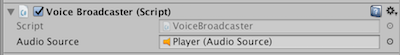

# Voice over IP with the Unity SDK

This recipe covers adding voice over IP (VoIP) to a SpatialOS Unity SDK multiplayer game.

You can use the [Unity Starter Project](https://github.com/spatialos/StarterProject/tree/master) as the starting point for this recipe.

## Background: how it works

The goal here is to:

* record audio from a player's microphone
* synchronise the audio with SpatialOS, so other clients can get it
* receive the audio on other clients, and play it

Audio sound is a stream of samples (usually represented as an array of floats). Compressed audio formats (such as MP3)
are more involved, but uncompressed audio can be written as an array of samples. Audio clips also have a frequency parameter,
which controls how many samples should be played within 1 second [Hz]. The audio can be directed to multiple channels (for example,
to achieve stereo sound).

### Designing this

It might be intuitive to want to store the audio in a [property (SpatialOS documentation)](https://docs.improbable.io/reference/13.0/shared/glossary#property): but this actually
means synchronising a large amount of data.

A better approach is to send the audio as part of an [event (SpatialOS documentation)](https://docs.improbable.io/reference/13.0/shared/glossary#event). This means that:

* the audio data is only sent once
* the audio data doesn't need to be stored
* only nearby clients will receive the event

> Specifically, only clients that have a player 'checked out' will receive the event, which means that players will only
be able to hear other players who are within a certain radius around them.

> You also have to pay attention to the location of the scene's
[Audio Listener](https://docs.unity3d.com/Manual/class-AudioListener.html), which is usually attached to the
Main Camera: it needs to be within the range of the AudioSource to be able to hear it.

> In a brand new Starter Project, the Player GameObjects are static at `(-9999,-9999,-9999)`
(which is the default position for Spatial-instanced GameObjects). This happens because they don't have a
script that syncs the GameObjects' position with their entity's Position component. The location of the
MainCamera is `(0,0,0)`, so you won't hear the AudioSources unless you move the camera closer to the Player
GameObjects.

### What we'll do

In this tutorial, sending audio is explicitly turned on by the player, rather than sending it all the time. You could use any trigger
you like; in this example, it's the space bar. Pressing the space bar will trigger a `SendAudio` event, and releasing it will
trigger a `StopSendingAudio` event.

Overview of how we're going to do this:

1. [Create the component in schema](#1-create-the-audiotransmission-component).
2. [Add the new component to player entities](#2-add-the-audiotransmission-component-to-player-entities).
3. [Add configuration parameters](#3-add-configuration-parameters).
4. [Create a script that records audio when player presses space](#4-create-the-script-to-record-audio).
5. [Adapt that script to send the audio data in an event](#5-adapt-that-script-to-send-the-audio-data-in-an-event).
6. [Create a script that plays audio](#6-create-the-script-to-play-audio).
7. [Adapt that script to receive the audio event](#7-adapt-that-script-to-receive-the-audio-event).

## 1. Create the `AudioTransmission` component

First, you need to create a component to deal with the audio. This component contains two events:

* one that will send audio, with includes the array of samples
* one that will stop sending audio

To do this:

1. In the schema directory, in a folder called `Audio`, create a file `AudioTransmission.schema` with the following contents:

    ```
    package improbable.audio;

    type SendAudio {
        list<float> samples = 1;
    }

    type StopSendingAudio {}

    component AudioTransmission {
        id = 1101;
        event SendAudio send_audio;
        event StopSendingAudio stop_sending_audio;
    }
    ```

    > You can change the line `package improbable.audio;` to a package name of your
    choice, but don't forget to change the import statements later on in the tutorial too.
2. Change the ID of the entity state (1101 in this example) so it's unique inside your project.
3. Run `spatial worker codegen`.

## 2. Add the `AudioTransmission` component to player entities

Wherever in your project you create the entity template for your player, add the `AudioTransmission` component:

1. Import the correct schema package (eg `using Improbable.Audio;`).
2. Add the component to the player entity template (eg `.AddComponent(new AudioTransmission.Data(), CommonRequirementSets.SpecificClientOnly(clientWorkerId))`).

> You'll need to pass in the client worker ID yourself.

## 3. Add configuration parameters

There are a few parameters needed by both the scripts you'll create in the next few steps: audio frequency,
length of the audio clip, and the number of transmission channels.

Put these parameters somewhere that both the relevant scripts can access them. For example, the [PiratesTutorial project]
(https://github.com/spatialos/PiratesTutorial/tree/master) has a script that contains global settings for the project ([take a look]
(https://github.com/spatialos/PiratesTutorial/blob/master/workers/unity/Assets/Gamelogic/Global/SimulationSettings.cs))

You need to add the following:

```csharp
public static readonly int Frequency = 44100;
public static readonly int MaxAudioClipSamples = 100 * Frequency;
public static readonly int AudioTransmissionChannels = 1;
```

## 4. Create the script to record audio

In this section, you'll add a script that just *records* audio in Unity. You'll send this audio in an event in the step
after.

> If you just want to get the full script,
[click here to download it](../../assets/recipes/voip/FinishedVoiceInputHandler.cs),
and skip section 5 below.

Create a new script, `VoiceInputHandler.cs`, and add it to the player prefab.

```csharp
<!-- using directive to import the configuration parameters from step 3 -->
using Improbable.Audio;
using Improbable.Collections;
using Improbable.Unity;
using Improbable.Unity.Visualizer;
using UnityEngine;

namespace Assets.Gamelogic.Audio
{
    // Only enable on clients
    [WorkerType(WorkerPlatform.UnityClient)]
    public class VoiceInputHandler : MonoBehaviour
    {
        // An empty AudioClip that we'll write to when the player triggers it
        private AudioClip clipToTransmit;
        // Set as the last point in the AudioClip that we sent data for
        private int lastSampleOffset;

        private bool isMicOn;
        private bool keyPressed;

        private void Update(){
            if (Input.GetKeyDown(KeyCode.Space) && !keyPressed) {
                TransmitAudio();
                keyPressed = true;
            }
            if (Input.GetKeyUp(KeyCode.Space) && keyPressed) {
                StopTransmittingAudio();
                keyPressed = false;
            }
        }

        private void FixedUpdate()
        {
            // At the moment, do nothing
        }

        private void TransmitAudio()
        {
            if (!isMicOn)
            {
                // Start recording from the default microphone
                clipToTransmit = Microphone.Start(null, true, 10, SimulationSettings.Frequency);
                // Reset the offset to 0, as we're starting the clip again
                lastSampleOffset = 0;
                isMicOn = true;
            }
        }

        private void StopTransmittingAudio()
        {
            if (isMicOn)
            {
                isMicOn = false;
                // Stop recording from the default microphone
                Microphone.End(null);
            }
        }
    }
}
```

What's going on here?

* `Update()` checks for the player's input.
* `TransmitAudio()`, triggered when the player presses space, starts recording to an audio clip.
* `StopTransmittingAudio()`, triggered when the player stops pressing space, stops recording.

The AudioClip `clipToTransmit` is overwritten when you start recording again.

## 5. Adapt that script to send the audio data in an event

In order for other clients to receive the audio, you need to send it through. For reasons described
above, the best way to do this is using events.

To do that, adapt the `VoiceInputHandler` script as follows:

0. At the top of the class, add an `AudioTransmission.Writer`:

    ```csharp
    // ... CODE ... //
    public class VoiceInputHandler : MonoBehaviour
        {
        // This script will write to the AudioTransmission component
        [Require]
        private AudioTransmission.Writer AudioTransmissionWriter;
        // ... CODE ... //
    ```

    This writer allows you to trigger the `SendAudio` and `StopSendingAudio` events.
1. In `FixedUpdate()`, add the following code:

    ```csharp
    private void FixedUpdate()
    {
        if (isMicOn)
        {
            // Check where the microphone is at in the sample list
            int currentMicSamplePosition = Microphone.GetPosition(null);
            // Find out how many samples we need to send in this update
            int samplesToTransmit = CalculateSampleTransmissionCount(currentMicSamplePosition);
            if (samplesToTransmit > 0)
            {
                // Send the samples, and update the offset
                TransmitSamples(samplesToTransmit);
                lastSampleOffset = currentMicSamplePosition;
            }
        }
    }
    ```

    This works out how many samples to send, and sends them. But it relies on some extra functions, so you need to add
    those in too.
2. Add a new function `CalculateSampleTransmissionCount`:

    ```csharp
    private int CalculateSampleTransmissionCount(int currentMicrophoneSample)
    {
        // Work out how many samples to send in this transmission
        int sampleCountToTransmit = currentMicrophoneSample - lastSampleOffset;
        if (sampleCountToTransmit < 0) // lastSampleOffset overflew the microphone buffer.
        {
            sampleCountToTransmit = (clipToTransmit.samples - lastSampleOffset) + currentMicrophoneSample;
        }
        return sampleCountToTransmit;
    }
    ```

    This uses the last offset and the current microphone position to work out how many audio samples to send.
3. Add a new function `TransmitSamples`:

    ```csharp
    private void TransmitSamples(int sampleCountToTransmit)
    {
        float[] samplesToTransmit = new float[sampleCountToTransmit * clipToTransmit.channels];
        clipToTransmit.GetData(samplesToTransmit, lastSampleOffset);
        AudioTransmissionWriter.Send(new AudioTransmission.Update().AddSendAudio(new SendAudio(new List<float>(samplesToTransmit))));
    }
    ```

    This gets the correct number of audio samples from the clip, and sends them in the `SendAudio` event.
4. In `StopTransmittingAudio`, add a new line that sends the `StopSendingAudio` event.

    When you're done, the function should look like this:

    ```csharp
    private void StopTransmittingAudio()
    {
        if (isMicOn)
        {
            isMicOn = false;
            // Stop recording from the default microphone
            Microphone.End(null);
            // Send the StopSendingAudio event
            AudioTransmissionWriter.Send(new AudioTransmission.Update().AddStopSendingAudio(new StopSendingAudio()));
        }
    }
    ```

This script now records audio when the user triggers it, and sends it in a component event; but at the moment, nothing
does anything with that event.

## 6. Create the script to play audio

In this section, you'll add a script that *plays* audio in Unity, but doesn't receive the event yet.

> If you just want to get the full script,
[click here to download it](../../assets/recipes/voip/FinishedVoiceBroadcaster.cs),
finish the rest of this section, then skip section 7 below.

Create a new script, `VoiceBroadcaster.cs`, and add it to the player prefab:

```csharp
<!-- using directive to import the configuration parameters from step 3 -->
using Improbable.Audio;
using Improbable.Unity;
using Improbable.Unity.Visualizer;
using UnityEngine;

namespace Assets.Gamelogic.Audio
{
    [RequireComponent(typeof(AudioSource))]

    // Only enable on clients
    [WorkerType(WorkerPlatform.UnityClient)]
    public class VoiceBroadcaster : MonoBehaviour
    {
        // An AudioSource that we'll play audio from
        [SerializeField] private AudioSource audioSource;
        // Keep track of the last sample in the audio played
        private int lastSamplePlayed;

        void OnEnable()
        {
            audioSource = gameObject.GetComponent<AudioSource>();
        }

        void OnDisable()
        {
            // Nothing yet
        }

        void UpdateSoundSamples(SendAudio sound)
        {
            // If the clip isn't playing, it needs initialising
            if (!audioSource.isPlaying)
            {
                InitialiseAudioSource();
            }

            // Add the new audio data at the set offset
            audioSource.clip.SetData(sound.samples.ToArray(), lastSamplePlayed);

            // If the clip isn't already playing, set it off
            if (!audioSource.isPlaying)
            {
                audioSource.PlayDelayed(0.1f);
            }

            // If audio clip buffer overflowed, we wrap around from the start
            lastSamplePlayed = (lastSamplePlayed + sound.samples.Count) % SimulationSettings.MaxAudioClipSamples;
        }

        private void InitialiseAudioSource()
        {
            // Reset the lastSample tracker
            lastSamplePlayed = 0;
            // Create a new, blank audio clip for the voice input to be written to
            audioSource.clip = AudioClip.Create("TransmittedAudio", SimulationSettings.MaxAudioClipSamples, SimulationSettings.AudioTransmissionChannels, SimulationSettings.Frequency, false);
        }

        private void ResetSoundSamples(StopSendingAudio obj)
        {
            // When the StopSendingAudio event comes through, stop playing the clip, and delete it
            audioSource.Stop();
            audioSource.clip = null;
        }
    }
}
```

What's going on here?

* `OnEnable()` gets the AudioSource component to add the sound to.
* `UpdateSoundSamples()` calls `InitialiseAudioSource()` if needed, sets up the audio to be played, plays it,
and updates the offset of where it got to.
* `InitialiseAudioSource()` resets the offset, and creates a new clip to add the audio to.
* `ResetSoundSamples` stops playing the audio clip and deletes it.

You also need to:

1. Add a new `Audio Source` component to the player prefab.

    (This lets you play an `Audio Clip`.)

2. Make sure the AudioClip is `None` (because the correct clip will be added when you receive audio).
3. Uncheck the `Play On Awake` option (because you don’t want the clip to play automatically OnAwake).
4. Set `Spatial Blend` to `1`.
5. If you like, expand `3D Sound Settings` and change what the audio dropoff will be.

    For example, if you want to limit it so that other players within 50 metres of each otehr can hear each other,
    set `Max Distance` to `50`.
6. Drag the Audio Source into the Audio Source gap in the `VoiceBroadcaster` component:

    

## 7. Adapt that script to receive the audio event

The last piece of the puzzle: watching for the events, and playing the sound they contain.

To do this, adapt `VoiceBroadcaster` as follows:

0. At the top of the class, add an `AudioTransmission.Reader`:

    ```csharp
    // ... CODE ... //
    public class VoiceBroadcaster : MonoBehaviour
        {
        // This script will read from the AudioTransmission component
        [Require]
        private AudioTransmission.Reader AudioTransmissionReader;
        // ... CODE ... //
    ```

    This reader allows you to watch for the `SendAudio` and `StopSendingAudio` events.
1. In `OnEnable`, register callbacks for `SendAudio` and `StopSendingAudio` events:

    ```csharp
    void OnEnable()
    {
        audioSource = gameObject.GetComponentIfUnassigned<AudioSource>(audioSource);

        // Register callbacks for `SendAudio` and `StopSendingAudio` events
        AudioTransmissionReader.SendAudioTriggered.Add(UpdateSoundSamples);
        AudioTransmissionReader.StopSendingAudioTriggered.Add(ResetSoundSamples);
    }
    ```
2. In `OnDisable`, de-register those callbacks:

    ```csharp
    void OnDisable()
    {
        // De-register callbacks for `SendAudio` and `StopSendingAudio` events
        AudioTransmissionReader.SendAudioTriggered.Remove(UpdateSoundSamples);
        AudioTransmissionReader.StopSendingAudioTriggered.Remove(ResetSoundSamples);
    }
    ```
3. At the top of `UpdateSoundSamples`, check for write access:

    ```csharp
    void UpdateSoundSamples(SendAudio sound)
        {
            // Don't do anything if this is on the current player (which we have write access to)
            if (AudioTransmissionReader.Authority == Authority.Authoritative)
            {
                return;
            }
    // ... CODE ... //
    ```
    This is an easy way to check if the events are coming from your own player, so you don't play your own player's
    voice back to them.

## Build

Now that's all done, you can test it out locally to see if it's working.

1. Build the project.

    Given the changes you've made, you'll need to build prefabs and build worker code for local development.

    For a handy reference, see [What to build when](../../develop/build.md).
2. [Run a local deployment](../../develop/deploy.md).
3. Connect a couple of clients.

If it all went well, your clients should be able to hear each other talking while they hold down the space bar!
